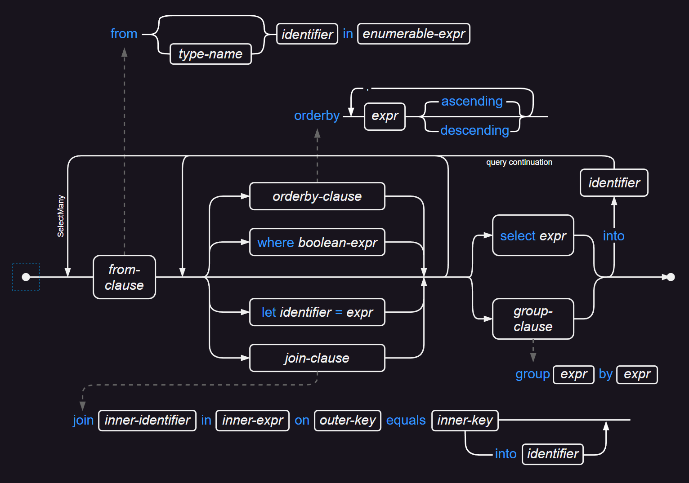

## C# 规范摘要 

### 1. 基本概念

#### 1.1. 程序结构

C# 中的组织结构中包括程序、命名空间、类型、成员和程序集（`*.exe` 或 `*.dll`）。程序集包含中间语言（IL）指令的可执行代码和元数据符号信息。加载程序集时，CLR 公共语言运行时的 JIT 即时编译器将 IL 代码编译为本机代码。


```csharp
using System;
namespace MyNamespace{
    interface IMyInterface;
    delegate void MyDelegate();
    enum MyEnum;
    struct MyStruct;   // MyNamespace.MyStruct
    namespace NestedNamespace{
        struct MyStruct;  // MyNamespace.NestedNamespace.MyStruct
    }
    class MyClass{
        class MyInnnerClass;
        static void Main(string[] args){ // EnterPoint 
            //Your program starts here...
            Console.WriteLine("Hello world!");
        }
    }
}
```

> 入口函数 **Main**

`Main` 可选包含 `string[] args`。程序名称不被视为 `args` 数组的首元，但它是 `Environment.GetCommandLineArgs()` 首元。

```csharp
class Program
{
    static void Main(string[] args)
    {
        if (args.Length > 0)
            Console.WriteLine("args[0] = " + args[0]);
        var env_args = Environment.GetCommandLineArgs();
        Console.WriteLine("env_args[0] = " + env_args[0]);   // maybe  Program.dll
    }
}
```

有效的 `Main` 函数签名：

```csharp
public static void Main();
public static int Main();
public static void Main(string[] args);
public static int Main(string[] args);
// 异步 Main
public static async Task Main();
public static async Task<int> Main();
public static async Task Main(string[] args);
public static async Task<int> Main(string[] args);
```

> **顶级语句**

编译器为顶级语句自动生成 `Main`。

```csharp
global using System;
Console.WriteLine("Hello World! {0}", Environment.GetCommandLineArgs()[0]);
```

顶级语句中可以使用 `await` 和 `return`，编译器为其生成正确的 `Main`。

```csharp
static void $<Main>(string[] args){}                // 非异步无返回
static int $<Main>(string[] args){}                 // 包含 return
static async Task $<Main>(string[] args){}          // 包含 await
static async Task<int> $<Main>(string[] args){}     // 包含 await 和 return
```

>---
#### 1.3. 词汇元素

> **标准关键字**

| token                                                                                                                                                                                                                    | description        |
| :----------------------------------------------------------------------------------------------------------------------------------------------------------------------------------------------------------------------- | :----------------- |
| `void`,`bool`,`char`,`string`,`object`,`dynamic`<br>`sbyte`,`short`,`int`,`long`,`byte`,`ushort`,`uint`,`ulong`<br>`nint`,`nuint`,`float`,`double`,`decimal`,<br>`enum`,`struct`,`class`,`record`,`interface`,`delegate` | 类型声明           |
| `null`,`true`,`false`                                                                                                                                                                                                    | 文本值             |
| `namespace`,`using`,`global`,`using static`,`extern alias`                                                                                                                                                               | 命名空间           |
| `where`,`new`,`default`,`notnull`,`unmanaged`,`allows ref struct`                                                                                                                                                        | 泛型约束           |
| `private`,`protected`,`public`,`internal`,`file`                                                                                                                                                                         | 访问性限制         |
| `abstract`,`override`,`virtual`,`sealed`,`event`,`record`,`async`,`require`<br>`const`,`volatile`,`readonly`,`event`,`extern`,`unsafe`,<br>`in`(逆变),`new`(成员),`out`(协变),`scoped`(作用域)                           | 声明修饰符         |
| `ref`,`out`,`ref readonly`,`in`,`params`                                                                                                                                                                                 | 参数修饰符         |
| `base`,`this`                                                                                                                                                                                                            | 访问关键字         |
| `add`,`remove`,`get`,`set`,`value`,`field`,`init`                                                                                                                                                                        | 访问器             |
| `operator`,`explicit`,`implicit`                                                                                                                                                                                         | 用户定义运算和转换 |
| `new`,`stackalloc`,`default`,`sizeof`,`typeof`,`nameof`,<br>`is`,`as`,`await`,`with`                                                                                                                                     | 表达式             |
| `var`,`is`,`switch`,`and`,`or`,`not`                                                                                                                                                                                     | 模式匹配与类型推断 |
| `while`,`do`,`for`,`foreach`                                                                                                                                                                                             | 迭代语句           |
| `if`,`else`,`switch`,`case`,`default`,`when`                                                                                                                                                                             | 条件语句           |
| `goto`,`continue`,`break`,`return`                                                                                                                                                                                       | 跳转语句           |
| `throw`,`try`,`catch`,`finally`,`when`                                                                                                                                                                                   | 异常处理           |
| `checked`,`unchecked`                                                                                                                                                                                                    | 溢出检查           |
| `using`,`lock`,`fixed`,`yield`                                                                                                                                                                                           | 其他语句           |
| `extension`                                                                                                                                                                                                              | 成员拓展           |
| `from`,`where`,`select`,`group`,`into`,`orderby`,`join`,<br>`let`,`in`,`on`,`equals`,`by`,`ascending`,`descending`                                                                                                       | 查询关键字         |

> **操作符**

```csharp
{    }    [    ]    (    )    .    ->   ,    :    ;  
+    -    *    /    %    &    |    ^    !    ~    =   
+=   -=   *=   /=   %=   &=   |=   ^=   ~=   ?    ??     
<    <=   >    >=   !=   ==   ++   --   &&   ||   ??=
..   ?.   ?[]  >>   <<   >>=  <<=  >>>  >>>= 
```

>---
#### 1.4. 类型定义

C# 是强类型语言，包含值类型（*stack*）和引用类型（*heap*）。值类型包括简单类型、枚举、结构、元组和可空值类型等；引用类型包括类、接口、数组和委托类型等。托管对象在托管堆上分配内存，变量只保留对象引用。CLR 自动执行内存管理和垃圾回收。

> NET 内置类型

| 内置类型  | 描述                 | 相应的 NET 类型  |
| :-------- | :------------------- | :--------------- |
| `bool`    | 布尔类型             | `System.Boolean` |
| `char`    | UTF-16 码位          | `System.Char`    |
| `byte`    | 8 位无符号整数       | `System.Byte`    |
| `short`   | 16 位有符号整数      | `System.Int16`   |
| `int`     | 32 位有符号整数      | `System.Int32`   |
| `long`    | 64 位有符号整数      | `System.Int64`   |
| `sbyte`   | 8 位有符号整数       | `System.SByte`   |
| `ushort`  | 16 位无符号整数      | `System.UInt16`  |
| `uint`    | 32 位无符号整数      | `System.UInt32`  |
| `ulong`   | 64 位无符号整数      | `System.UInt64`  |
| `nint`    | 本机大小的有符号整数 | `System.IntPtr`  |
| `nuint`   | 本机大小的无符号整数 | `System.UIntPtr` |
| `float`   | 32 位单精度浮点类型  | `System.Single`  |
| `double`  | 64 位双精度浮点类型  | `System.Double`  |
| `decimal` | 十进制浮点类型       | `System.Decimal` |
| `object`  | 类型系统基类         | `System.Object`  |
| `string`  | 字符串类型           | `System.String`  |

> 用户定义类型

用户定义类型：`class`,`struct`,`interface`,`enum`,`delegate`,`record struct`,`record class`。

```csharp
class MyClass;
struct MyStruct;
interface IMyInterface;
delegate void Func();
enum MyEnum;
record  MyRecordClass;
record struct MyRecordStruct;
```

用户定义类型可以具有成员，成员可以是静态或实例成员：

| Type        | Members                                                                  |
| :---------- | :----------------------------------------------------------------------- |
| `interface` | 静态字段、常量、方法、属性、索引器、事件、静态构造函数、运算符、嵌套类型 |
| `class`     | 字段、常量、方法、属性、索引器、事件、构造函数、运算符、终结器、嵌套类型 |
| `struct`    | 字段、常量、方法、属性、索引器、事件、构造函数、运算符、嵌套类型         |
| `record`    | 记录可以是 `record class` 或 `record struct`                             |
| `delegate`  | 引用任意数目方法的数据结构，派生自 `System.Delegate`                     |
| `enum`      | 一组具有基础整型命名常量的值类型                                         |
| 嵌套类型    | 任意的用户定义类型                                                       |

> 非托管类型

非托管类型：`sbyte`、`byte`、`short`、`ushort`、`int`、`uint`、`long`、`ulong`、`nint`、`nuint`、`char`、`float`、`double`、`decimal`、`bool`、枚举类型、指针类型、非托管结构类型。

非托管类型使用 `unmanaged` 约束限定：“非指针、不可为 null 的非托管类型”。

```csharp
public struct S<T> where T : unmanaged;
```

> 通用类型系统

NET 类型系统支持继承。所有类型（除了指针和 `ref struct`）都是直接或间接从 `object` 继承的，这样的统一类型层次结构称为通用类型系统（CTS）。*装箱和拆箱* 提供值类型和引用类型之间互相转换的桥梁。

装箱是值类型到引用类型的隐式转换，拆箱是从引用类型提取值到值类型的显式转换。装箱和拆箱比直接赋值操作消耗更多的系统资源。可以利用 `is` 测试装箱类型。

```csharp
string str = "Hello World";
object obj = str;     // implicit
string s_str = (string)str;  

int num = 10010;
obj = num;      // implicit boxing
if(obj is int)
    int i = (int)box  // unboxing
```

>---
#### 1.5. 访问性限制

命名空间和类型拥有成员。类型的成员在定义中声明或从基类型继承。基类的所有成员（除构造函数、终结器外）成为派生类型的成员，基类成员的可访问性限制派生类型对其的可见性。`new` 修饰成员隐藏同名继承。

```csharp
class Base {
    public int Value;
}
class Derived : Base {
    public new double Value { get; set; }   // 隐藏 base.Value
}
```

成员可访问性由自身和包含类型的可访问性结合确定，命名空间访问不受限制。成员的可访问性可以是：

  - `private`：私有，仅限于包含类型。
  - `protected`：受保护，限于包含类型、派生类型。
  - `public`：公共，访问不受限制。
  - `internal`：仅限于当前程序集。
  - `private protected`：仅限于包含类型、当前程序集的派生类型。
  - `protected internal`：仅限于当前程序集、包容类型、派生类型。
  - `file`：当前编译单元可见，仅修饰顶级类型。

当成员声明不包括任何访问限定符时，声明位置上下文决定可访问性：
| 成员所属    | 默认访问性 | 可声明访问性                                                                            |
| :---------- | :--------- | :-------------------------------------------------------------------------------------- |
| 顶级类型    | `internal` | `internal`、`public`                                                                    |
| `interface` | `public`   | `public`、`internal`、`protected`、`protected internal`、`private`、`private protected` |
| `class`     | `private`  | `public`、`internal`、`protected`、`protected internal`、`private`、`private protected` |
| `struct`    | `private`  | `public`、`internal`、`private`                                                         |
| `enum`      | `public`   | 无法添加访问限定符                                                                      |

```csharp
namespace N {
    file class F;        // 文件范围   
    internal struct S;   // 程序集范围
    public class C{      // 全局范围
        private int uid;        // 私有，包含类型可见 
        protected void _func(); // 当前包含类型或派生
    }
}
```

>---
#### 变量

C# 定义了 8 种变量：静态变量、实例变量、数组元素、值参数、输入参数、引用参数、输出参数和局部变量。`default` 表达式用于零初始化变量。`ref` 创建变量引用。支持弃元 `_`。

`bool`、`char`、`byte`、`sbyte`、`short`、`ushort`、`int`、`uint` 及其对应枚举、`float`、`nint`、`unint` 和引用类型的读取和写入是原子的；`long`、`ulong`、`double`、`decimal` 和用户定义类型的读写不能保证为原子性。

```csharp
class Sample
{
    static int x;  // 静态变量 
    private int y; // 实例变量
    void Fun(
        int[] v,   // v[0] 数组元素
        int a,     // 值参数
        in int b,  // 输入参数
        ref int c, // 引用参数
        out int d) // 输出参数
    {
        int i = 10;  // 局部变量
        d = a + c++ + b;
    }
}
```

`var` 隐式声明局部变量，编译器类型推断。

```csharp
var rt = func();     
var q = from e in arr
        where e > rt
        orderby e ascending
        select e;
```

可以使用 `var` 作为 `out` 参数传递。当无法重载决策例如发生歧义时，需要指定参数类型。

```csharp
class Sample
{
    static void Fun(out int num) => num  = default;
    static void Fun(out string mess) => mess = default;
    static void Main(string[] args)
    {
        Fun(out var num);      // 隐式声明，歧义
        Fun(out string mess);  // 显式输入类型
    }
}
```

---
### 2. 命名空间

命名空间 `namespace` 对程序元素进行逻辑分组。类型可以定义类、结构、记录、接口、枚举、委托等。每个程序元素在其名称空间单一定义。`global::` 表示全局。

```csharp
class A;                 // A; global::A
namespace X {            // X; global::X
    class B {            // X.B; global::X.B
        class C;         // X.B.C
    }
}
namespace X.Y {          // X.Y
    class D<S, T> {      // X.Y.D<,>
        class E;         // X.Y.D<,>.E
        class E<U>;      // X.Y.D<,>.E<>
    }
}
```

>---
#### 2.1. using

`using` 指令引入命名空间；`using static` 静态导入；`using Id = Type` 创建别名；`global` 表示全局引入。

```csharp
global using System;                      // 全局引入
global using Log = System.Console;        // 创建全局别名
using Generic = System.Collections.Generic; 
using static System.Math;     // 静态导入

Generic::List<int> arr = [-2, 0, 2, 4, 6, 8, 10, 12];
var divRem = from e in arr
             where e > 0
             select ILogB(e);
Log.WriteLine(string.Join(",", divRem)); // 1,2,2,3,3,3
```

`using` 还支持创建其他类型的别名：元组类型、指针类型、数组类型、可空值类型等。

```csharp
using Vector = (double x, double y);   // 元组别名，全局
using unsafe Pfunc = delegate*<(double x, double y), double>;   // 函数指针别名
static double Magnitude(Vector v) => Math.Sqrt(v.x * v.x + v.y * v.y);

unsafe
{
    // 委托调用
    Func<Vector, double> f = Magnitude;
    f(new Vector(3, 4));  // 5
    // 指针调用
    Pfunc m = &Magnitude;
    m(new Vector(3, 4));   // 5
}
```

>---
#### 2.2. extern alias

`extern alias` 外部引用程序集别名，以区别多个程序集中具有相同完全限定名称的类型。在项目设置中导入 `grid.dll` 和 `grid20.dll` 的引用并创建别名为 “GridV1” 和 “GridV2”：

```csharp
extern alias GridV1;  
extern alias GridV2;
// using 别名创建
using Sample_V1 = GridV1::Namespace.Sample;
using Sample_V2 = GridV2::Namespace.Sample;
```

---
### 4. 简单值类型

| Type                           | Description             |
| :----------------------------- | :---------------------- |
| `bool`                         | 布尔，`true` 和 `false` |
| `char`                         | 字符，Unicode-16 码位   |
| `sbyte`,`short`,`int`,`long`   | 有符号整数              |
| `byte`,`ushort`,`uint`,`ulong` | 无符号整数              |
| `nint`,`nuint`                 | 本机大小整数            |
| `float`,`double`               | 标准浮点数              |
| `decimal`                      | 十进制浮点数            |
| `enum <id>: <int>`             | 枚举                    |
| `(T1,T2,...Tn)`                | 元组                    |

> **字符字面值**

```csharp
// 字面值
char Ch = 'H';     // UTF16
char Ch_x = '\x65';         // \x 十六进制转义
char Ch_u = '\u00ff';       // \u hhhh 十六进制转义
char Ch_U = '\U000000FF';   // \U HHHHHHHH 十六进制转义
// 转义字符
'\'','\"','\\','\0','\a','\b','\f','\n','\r','\t','\v'
'\e'    // ESC  
```

> **整数字面值**

```csharp
// 后缀
0u,0U    		// 无符号整数
0l,0L    		// long
// 其他进制表示
0b1010,0B0101          // 二进制
0x123abc,0X987DEF      // 十六进制 
// 分隔符
1_2__3___4____5_____6______7_______8________9;   // 支持任意数目的数字分隔符
```

> **浮点字面值**

```csharp
3.14f,2.71F           // float
0.1,3.14d,2.71D  	  // double
3.14m,2.71M           // decimal
1.2345E15,9.8e2;      // E计数法
```

`decimal` 表示 128 位十进制数，可以精确表示 0.1，与标准浮点类型仅支持强制转换，过大过小运算会引发溢出异常，标准浮点运算不会产生异常。

```csharp
float f = 3.1415f;
decimal df = (decimal)f;    // 强制转换
```

>---
#### 4.2. Enum

枚举为 `int`，与其基础类型之间存在显式转换。其他整数类型可以是 `byte`、`sbyte`、`short`、`ushort`、`int`、`uint`、`long`、`ulong`。

```csharp
public enum Season : byte
{
    Unknown = 0,
    Spring = 1, Summer, Autumn, Winter
}
public static class EnumExt
{
    public static T ToEnum<T>(this int eVal) where T : Enum => (T)Enum.ToObject(typeof(T), eVal);
    public static bool IsEnum_t<T>(this int eVal) where T : Enum => Enum.IsDefined(typeof(T), eVal);
    static void Main()
    {
        var e = 1.ToEnum<Season>();   // Summer
        bool ok = (-1).IsEnum_t<Season>();  // False
        Season s = (Season)1;     // 强制转换
    }
}
```

>---
#### 4.3. ValueTuple

元组定义为 `(T1 t1, ... , Tn tn)`，n ≥ 2，元素名 `t1, t2, ..., tn` 或 <code>Item<em> n</em></code>（默认）。

```csharp
using Point = (int x, int y);

Point p1 = (1, 2);      // 元组表达式
Point p2 = new (1, 2);
Point p3 = ValueTuple.Create(1, 2);
Point p4 = new ValueTuple<int, int>(1, 2);  

Console.WriteLine(p1.Item1);  // 默认，等价于 p.x
Console.WriteLine(p1.y);     
```

元组可用于模拟多值返回，支持弃元 `_`。

```csharp
static (int, int, int) GetRandomPoint() {
    Random rand = new Random(DateTime.Now.Millisecond);
    return (rand.Next(-128, 128), rand.Next(-128, 128), rand.Next(-128, 128));
}

var (X, Y, _) = GetRandomPoint();   // 析构元组
Console.WriteLine("The Point2D = ({0},{1})", X, Y);
```

> **元组解构**

在 `struct`、`class`、`record`、`interface` 中声明解构函数 `Deconstruct`，拥有至少两个 `out` 参数。主构造函数记录默认生成一个 `Deconstruct` 方法。

```csharp
// 解构位置记录
record Person(string firstName, string lastName);  // Deconstruct 隐式生成
var (fname, lname) = new Person("Hello", "World");

// 为 class 定义解构函数
class Person(string FirstName, string LastName) {
    public void Deconstruct(out string firstName, out string lastName)
        => (firstName, lastName) = (FirstName, LastName);
}
var (fname, lname) = new Person("Hello", "World"); // 元组解构
```

`Deconstruct` 可以是扩展方法。

```csharp
public static void Deconstruct(this Person p, out string fName,  out string lName) 
    => (fName, lName) = (FirstName, LastName);  
```

遍历 `Dictionary` 时，每个元素都是 `KeyValuePair<TKey,TValue>`，内置解构函数。

```csharp
Dictionary<string, int> snapshotCommitMap = new(StringComparer.OrdinalIgnoreCase)
{
    ["https://github.com/dotnet/docs"] = 16_465,
    ["https://github.com/dotnet/runtime"] = 114_223,
    ["https://github.com/dotnet/installer"] = 22_436,
    ["https://github.com/dotnet/roslyn"] = 79_484,
    ["https://github.com/dotnet/aspnetcore"] = 48_386
};
foreach (var (repo, commitCount) in snapshotCommitMap)
    Console.WriteLine($"The {repo} repository had {commitCount:N0} commits as of November 10th, 2021.");
```


---
### 5. 字符串类型

`string` 表示一串不可变 Unicode 码位序列。

```csharp
string str = "Hello " + "World!";    // 拼接
for (int i = 0; i < str.Length; i++)
  Console.Write(str[i] + " ");
```

>---
#### 5.1. 内插字符串

`$` 内插字符串中的内插表达式（`{expr}`）替换为表达式结果的字符串形式。`{{` 和 `}}` 表示为 `"{"` 和 `"}"`。

```csharp
$"{<interpolationExpression>[,<alignment>][:<formatString>]}"
// - interpolationExpression     生成需要设置格式的结果的表达式
// - alignment                   常数，定义对齐和宽度，- 表示左对齐
// - formatString                受表达式结果类型支持的格式字符串

$"|{"Left",-7}|{"Right",7}|";  // |Left   |  Right|
$"{{{Math.PI,20}}}";           // {   3.141592653589793}
$"{{{Math.PI,20:F3}}}";        // {               3.142}
string message = $"The usage policy for {safetyScore} is {
    safetyScore switch
    {
        > 90 => "Unlimited usage",
        > 80 => "General usage, with daily safety check",
        > 70 => "Issues must be addressed within 1 week",
        > 50 => "Issues must be addressed within 1 day",
        _ => "Issues must be addressed before continued use",
    }}";
```

>---
#### 5.2. 逐字字符串

`@` 逐字字符串按原义表示，`""` 表示 `"`。

```csharp
@"c:\documents\files\u0066.txt";  
"c:\\documents\\files\\u0066.txt";
// c:\documents\files\u0066.txt

$@"{{{Math.PI,20}}} is ""default formatting of the pi number""";
// {   3.141592653589793} is "default formatting of the pi number"
```

>---
#### 5.3. 原始字符串

原始字符串首尾由 `"""` (至少三个) 作为引导序列。多行字符串的引导序列单独一行，尾引导序列的左侧决定了整体字符串的行缩进位置。

```csharp
var line = """This is a single line""";
var multi = """
    This is a multi-line
        string literal with the second line indented.
""";
Console.WriteLine(multi);
/* 
    This is a multi-line
        string literal with the second line indented.
|<--- 行缩进位置
*/
```

原始字符串支持内插，表达式 `{}` 数目由 `$` 数目决定。

```csharp
string value = "text";
var str =
    $$"""
    {
        "Summary": {{value}},
        "length": {{value.Length}}
    }
    """;
/* OUTPUT
{
    "Summary": text,
    "length": 4
}
*/
```

>---
####  5.4. UTF-8 字符串

C# 字符串以 UTF16 存储。UTF8 字符串以 `u8` 作为后缀，存储为 `ReadOnlySpan<byte>` 对象，不支持内插。

```csharp
// u8 to u16
ReadOnlySpan<byte> strU8 = @"Hello world!"u8;
string strU16 = Encoding.UTF8.GetString(strU8);
// u16 to u8
string str = "Hello world!";
ReadOnlySpan<byte> bytes = Encoding.UTF8.GetBytes(str);
// u8 + u8
ReadOnlySpan<byte> s = "Hello"u8 + " World"u8;
```

---
### 6. 数组类型

数组是单一类型元素的编号序列。多维数组的每个维度都有一个相关联的长度。

```csharp
// 几种声明数组的形式
int[] arr1 = new int[10];        // 零初始化
int[] arr2 = { 0, 1, 2, 3 };     // 初始化器
int[] arr3 = new int[] { 1, 2, 3 };
int[] arr4 = new int[3] { 1, 2, 3 };
int[] arr5 = new[] { 1, 2, 3 };
int[] arr6 = [10, 20, 30];       // 集合表达式
// 多维数组的声明
int[] a1 = new int[10];          // 一维数组
int[,] a2 = new int[10, 5];      // 二维数组
int[,,] a3 = new int[10, 5, 2];  // 三维数组
// 匿名类型的数组
var arr = new[] {
    new{ name = "Hello", Id = 1 },
    new{ name = "World", Id = 2 },
    new{ name = "Empty", Id = 3 },
};
```

> **交错数组**

交错数组的元素类型可以是数组类型。

```csharp
int[][] pascals = 
{
    new int[] {1},
    new int[] {1, 1},
    new int[] {1, 2, 1},
    new int[] {1, 3, 3, 1}
};
```

> **数组和泛型集合接口**

单维数组 `T[]` 实现了 `IList<T>` 和 `IReadOnlyList<T>` 接口。若 `S` 到 `T` 存在引用隐式转换，则 `S[]` 也可以隐式转换（协变）为 `IList<T>` 或 `IReadOnlyList<T>`。

```csharp
string[] hi = { "H", "e", "l", "l", "o" };
IList<object> o = hi;   // 协变 string -> object
```

---
### 7. 结构类型

结构成员可以是常量、字段、方法、属性、事件、索引器、运算符、构造函数或嵌套类型。结构可以实现接口但不支持继承。默认生成一个公共无参实例构造函数；数据成员具有初始值时，必须显示提供一个实例构造函数。

```csharp
public struct Coords(double x, double y)   // 主构造函数
{
    public double X => x;
    public double Y => y;
    // 重写 System.ValueType.ToString
    public override string ToString() => $"({X}, {Y})";   
} 
```

>---
#### 7.1. readonly struct

`readonly` 只读结构表明对象值不可变，数据成员只读限定。

```csharp
readonly struct Sample(string first, string last)
{
    public readonly string FirstName = first;
    public readonly string LastName = last;
    public readonly string Name => FirstName + " " + LastName;
}
```

>---
#### 7.2. ref struct

`ref struct` 引用结构在执行堆栈上分配，有以下限制：
  - 不能是数组或元组元素，可以实现接口，作为泛型的类型参数（`allows ref struct`）。
  - 不能是类或非 `ref struct` 成员类型。
  - 在异步方法和迭代器中，访问局部变量 *ref-like* 不能跨 `await` 边界。

`ref` 字段只在 `ref struct`，默认为 `null`。`ref` 字段不能引用 `ref struct`。`readonly` 限定 `ref` 字段：
- `readonly ref` 引用只读。
- `ref readonly` 引用对象值只读。
- `readonly ref readonly` 引用和值只读。

```csharp
ref struct RS(ref int rv)
{
    private ref int Value = ref rv;
    public ref int GetValue()
    {
        if (System.Runtime.CompilerServices.Unsafe.IsNullRef(ref Value))   // 检查空引用
            throw new InvalidOperationException();
        return ref Value;
    }
}
```

>---
#### 7.3. 固定大小的缓冲区

在结构中，`fixed` 创建固定大小缓冲区，数组类型为 `bool`、`byte`、`char`、`short`、`int`、`long`、`sbyte`、`ushort`、`uint`、`ulong`、`float` 或 `double`。
  
```csharp
internal struct Buffer {
    public unsafe fixed int Data[10];    // sizeof(int) * 10
}
```

与固定缓冲区不同的是，`stackalloc` 数组在 CLR 中自动启用缓冲区溢出检测功能。

```csharp
unsafe {
    int* pSafe = stackalloc int[10];
    for (int i = 0; i < 100; i++)
        *(pSafe + i) = i;             // 缓冲区溢出检查

    Buffer buf = default;
    for (int i = 0; i < 100; i++)
        *(buf.Data + i) = i;          // 不执行溢出检查，存在堆栈溢出风险
}
```

>---
#### 7.4. 内联数组

内联数组是 *N* 个具有唯一字段（非指针）的非记录结构组成的连续块，支持范围和索引运算。内联数组具有类似于固定大小缓冲区的性能特征。

```csharp
[System.Runtime.CompilerServices.InlineArray(10)]    // C#12，内联数组
public struct Buffer<T> {
    private T Elem;
}
// 类似于固定缓冲区
public struct _Buffer{
    public unsafe fixed int buffer[10];  // 类似于 Buffer<int>
}

var buffer = new Buffer<int>();
for (int i = 0; i < 10; i++)
    buffer[i] = i;   // use like a array
```

---
### 8. 类类型

`class` 可以包含数据成员（常量和字段）、函数成员（方法、属性、事件、索引器、运算符、构造函数和终结器）和嵌套类型成员，支持单一继承。

预定义类类型在 C# 中具有特殊含义：
- `System.Object`：最终基类。
- `System.String`：字符串类型。
- `System.ValueType`：值类型基类。
- `System.Enum`：枚举基类。
- `System.Array`：数组基类。
- `System.Delegate`：委托基类。
- `System.Exception`：异常基类。
- `System.Attribute`：特性基类。

```csharp
class MyClass {
    // 构造函数
    static MyClass() { }     // 静态构造函数
    public MyClass() { S_OnDestroy = static delegate { Console.WriteLine("MyClass Destroyed"); }; }
    // 数据类
    event OnDestroy S_OnDestroy;              // 事件
    public const string Version = "0.0.1";    // 常量
    private readonly static MyClass s_default = new MyClass();   // 字段，静态
    // 函数类
    public static MyClass Default => s_default;      // 属性
    public int this[int index] => index;             // 索引器
    public Data CreateData(byte[] data, int id) => new Data(data, id);   // 实例方法
    public static Data DefaultData() => new Data();  // 静态方法
    ~MyClass() => S_OnDestroy?.Invoke();             // 终结器
    // 运算符
    public static bool operator ==(MyClass left, MyClass right) => left.Equals(right);
    public static bool operator !=(MyClass left, MyClass right) => !left.Equals(right);
    // 嵌套类型
    delegate void OnDestroy();               // 委托
    public enum Day { workDay, weekDay }     // 枚举
    public interface INested { }             // 接口
    sealed class NestedClass : INested { }   // 嵌入类
    struct NestedStruct : INested { }        // 嵌入结构
    public readonly record struct Data(byte[] data, int gui);   // 嵌入记录
}
class Sample {
    static void Main(string[] args) {
        MyClass.Data d1 = MyClass.Default.CreateData("Hello"u8.ToArray(), "Hello".GetHashCode());
    }
}
```

>---
#### 8.1. 抽象与封装

`abstract` 抽象实体无法直接实例化，由派生实现；`virtual` 虚方法可以被重写（`override`）；`sealed` 定义密封实体。

```csharp
abstract class BaseSample {    
    public abstract void Debug(string mess);
    public virtual void Error(string mess) => Debug(mess);
}
internal class Sample : BaseSample {     
    // 抽象实现
    public override void Debug(string mess) => Console.WriteLine(mess);
    // 重写并密封
    public sealed override void Error(string mess) => base.Error("ERROR : " + mess);
}
```

>---
#### 8.2. 静态类

`static` 静态类无法实例化，可以声明扩展方法。

```csharp
public static class EnumExt {   
    // 扩展方法
    public static T? ToEnum<T>(this int eVal) where T : Enum
        => (T)Enum.ToObject(typeof(T), eVal);  // int 转换为 enum
    public static bool IsEnum_t<T>(this int eVal) where T : Enum
        => Enum.IsDefined(typeof(T), eVal);    // 检查 enum 是否关联整数值
}
```

---
### 11. 委托类型

委托可用于封装一组方法调用列表。实例方法的调用实体由实例和该实例方法组成；静态方法由方法本身构成。编译器将委托的调用映射到 `System.Delegate` 或 `System.MulticastDelegate` 的调用，方法组按绑定顺序依次调用。

在构造委托时，编译器会为委托类型生成：
- `Invoke` 方法，与委托签名相同，用于同步调用；
- `BeginInvoke` 和 `EndInvoke`（NET Framework），用于异步调用：
  - `BeginInvoke` 除具有 `Invoke` 相同位置的参数外，还有两个额外的参数（`System.AsyncCallback` 和 `System.Object`）。返回 `System.IAsyncResult`。
  - `EndInvoke` 返回类型和委托的返回类型相同。委托签名中包含输出参数 `out`，则在 `EndInvoke` 中包含这些 `out` 参数；它还有一个额外的和 `BeginInvoke` 方法的返回值类型相同的参数 `System.IAsyncResult`。

```csharp
// 委托的定义
delegate void SampleDelegate(int action);
// 编译器为委托类型生成
sealed class SampleDelegate : System.MulticastDelegate
{
    public SampleDelegate(object obj, nint method);
    public virtual void Invoke(int action);
    public virtual IAsyncResult BeginInvoke(int action, AsyncCallback callback, object obj);
    public virtual void EndInvoke(IAsyncResult asyncResult);
}
```

预定义的委托类型包含 `System.Action`、`System.Func`、`System.Predicate` 。委托通过 `+` / `+=` 组合其他委托对象或方法；`-` / `-=` 用于删除组件（优先匹配最后一个），无法删除 Lambda 表达式或匿名方法。

```csharp
void Print(string mess) => Console.WriteLine("Function : " + mess);

Action<string> MessagePrint = null;
MessagePrint += Print;  // add 方法
MessagePrint += delegate (string mess){  // add 匿名方法
    Console.WriteLine("Delegate : " + mess);
};
MessagePrint += message => Console.WriteLine("Lambda : " + message);   // add lambda 表达式

// 委托调用
MessagePrint?.Invoke("Hello World!"); // 等价：MessagePrint("Hello World!"); 
```

> **委托异步调用** (NET Framework)

在异步模式下，委托调用方继续执行而不等待委托返回。`BeginInvoke` 和 `EndInvoke` 执行委托异步调用。异步委托可以抛出异常，并通过 `EndInvoke` 传播到调用方。

```csharp
// 预定义
SampleDelegate dele = delegate (int x)
{
    Thread.Sleep(1000);
    Console.WriteLine(x);
};
delegate void SampleDelegate(int action);
```

通过两种方式来等待异步计算结果：
- 一是通过调用返回的结果对象 `System.IAsyncResult`，通过 `EndInvoke` 检查结果值以获取方法调用的当前状态，并在完成计算时返回结果。

    ```csharp
    var rt = dele.BeginInvoke(10010, null, dele);
    dele.EndInvoke(rt);  // maybe have a return
    ```

- 二是通过传递给 `BeginInvoke` 的 `System.AsyncCallback` 作为异步回调。传递回调委托的值与 `BeginInvoke` 返回的值相同。

    ```csharp
    dele.BeginInvoke(10010, (rt) => dele.EndInvoke(rt), dele);
    ```

>---
#### 11.1. 匿名函数

匿名函数可以转换为兼容的委托或表达式树类型，包括 `delegate` 匿名方法表达式和 Lambda 函数。支持 `static`、`async`、`scoped` 参数修饰。支持闭包，参数可指定弃元 `_`。

```csharp
// delegate 匿名方法表达式
var f = async? delegate [( <parameters>? )] { <statements> };

var fun = static delegate (scoped ref int x) { return x + 1; };        
Func<int, int> fun2 = static delegate { return 1 + 1; };        // static
var fun3 = async delegate (int sec){ await Task.Delay(sec); };  // async

// Lambda 表达式
var f = async? <return_type>? ( input_parameters? ) => expression / { <statements> };

Func<int, int> Square = x => x * x;
var Sum = static int (ref int x, int y = 0) => x + y;  // 指定返回，默认参数
var Iterator = async (IAsyncEnumerable<int> arr) => {
    await foreach (var item in arr)
        use(item);
};
```

---
### 9. 类型成员

#### 9.1. 常量


```csharp
using Vector = (double x, double y);
class Sample {
    const double MATH_PI = 3.1415926535;
    static readonly Vector Origin = (0, 0);   // 只读静态，类似于常量
}
```

>---
#### 9.2. 字段

字段在调用对象或类型之前初始化。`volatile` 限定易变；`readonly` 限定只读，仅在初始化器、构造函数或 `init` 中设定值；`required` 指定必填字段；`ref` 声明引用字段，仅在 `ref struct` 中声明。

```csharp
class Sample
{
    readonly static int UID;        // 静态字段，只读
    public required string Name;    // 必填字段
    volatile int value;             // 易变字段
    ref struct RefSample {
        ref Sample RS;              // 引用字段
    }
}
```

`required` 必填成员在创建实例时执行初始化。具有 `required` 类型不满足 `new()` 约束。


```csharp
class Student
{
    public required string Name;   
    public required int Age;
}
Student p = new() { Name = "Tom", Age = 12 }; // 初始化设定项
```

>---
#### 9.3. 方法 

方法支持重载和继承。
- 异步方法的返回类型是 `Task`、`Task<R>`、`ValueTask`、`ValueTask<R>`，启动异步的 `async` 方法可以返回 `void`。
- 可以 `return ref/ref readonly`。结构的 `readonly` 方法无法修改 `this` 状态。

```csharp
class Sample
{
    public int value;
    struct RefSample(Sample s)
    {
        public int GetValue() => s.value;                 // 副本返回
        public ref int GetRefValue() => ref s.value;      // 变量引用返回
        public ref readonly int GetRefReadonlyValue() => ref s.value;  // 只读变量引用返回
    }
        // readonly 方法
        public readonly int GetROValue() {
            //this.s_value = 100;  // err
            return s.value;
        }
}
```

> **方法参数**

方法参数可以是值传递或引用传递。引用参数不用于异步或迭代器方法。

```csharp
void FunA(int v, string s);          // 值传递
void FunB(in int v, ref int v2, ref readonly int v3, out int v4,);   // 引用传递
```

`params` 参数可以是数组或集合类型：`Span<T>`、`ReadOnlySpan<T>`、`IEnumerable<T>`、`IReadOnlyCollection<T>`、`IReadOnlyList<T>`、`ICollection<T>`、`IList<T>`。用户定义类型需要包含一个 `Add` 方法。

```csharp
class List<T>(params System.Collections.Generic.List<T> values) : IEnumerable<T>
{
    private System.Collections.Generic.List<T> datas = values;
    public IEnumerator<T> GetEnumerator() => datas.GetEnumerator();
    public void Add(T v) => datas.Add(v);
    IEnumerator IEnumerable.GetEnumerator() => GetEnumerator();
}
class Sample
{
    static void PrintList<T>(params List<T> args)
    {
        if (args != null)
            Console.WriteLine(string.Join(',', args));
    }
    static void Main(string[] args)
    {
        PrintList(1, 2, 3, 4, 5);
    }
}
```

- TODO 

<!-- 按引用传递 *ref-likes* 参数的安全转义范围可以设置为 `scoped` 或 `[UnscopedRef]`，限定引用参数的作用域范围为 *current method*、*calling method* 或 *return only*。例如 `scoped ref value` 参数无法通过 `return ref` 返回给调用方，它的安全转义限定为 *current method*。 

```csharp
ref readonly int GetValue(ref int rv, scoped ref int srv)
{
    // return ref srv;   // 作用域限定为当前方法
    return ref rv;
}
``` -->

可选参数具有默认值，置于一般参数之后。`OptionalAttribute` 特性参数可选且无需默认值；`DefaultParameterValueAttribute` 为 `OptionalAttribute` 参数提供默认值。

```csharp
void FunA(int reqV, string? opStr = "", int opV = default) { }
void FunB(int reqV, [Optional] string? optStr, [Optional, DefaultParameterValue("DEFAULT_PARAM_VALUE")] string? defaultOptStr)
{
    Console.WriteLine($"optional str is null: {optStr == null}");
    // Output: optional str is null: True
    Console.WriteLine($"default optional str is : {defaultOptStr}");
    // Output: default optional str is : DEFAULT_PARAM_VALUE
}
```

位置参数按顺序传递；命名参数任意顺序传递，位于位置实参之后。

```csharp
void Fun(string s1, int i, string s2) { }

// 位置参数
Fun("Hello", 10086, "World");
// 命名参数
Fun(i: 10086, s1: "Hello", s2: "World");
Fun(s1: "Hello", s2: "World", i: 10086);
Fun(s2: "World", s1: "Hello", i: 10086);   
```

> **方法重载**

方法支持重载，编译器利用重载决策来匹配最优。对于方法签名，`object` 和 `dynamic` 等价，`T[]` 和 `params T[]` 等价。

```csharp
void Fun(int num);
void Fun(ref int num);
// void Fun(in int num);         // 与 ref 不构成重载
void Fun(int num, string str); 
void Fun(int[] arr);
// void Fun(params int[] arr);   // 与 int[] 不构成重载
```

`OverloadResolutionPriority` 指定重载解析中成员的优先级。默认优先级为 0。

```csharp
class Sample
{
    // 重载
    public static void Fun(string str) => Console.WriteLine("Fun(str) : " + str);
    [OverloadResolutionPriority(priority: 1)]  // 提高优先级
    public static void Fun(object obj) => Console.WriteLine($"Fun(obj) : " + obj);
}

Sample.Fun("Hi");  // Fun(obj) : Hi
```

> **方法继承**

```csharp
abstract class Base
{
    public abstract void FunA(string s);   // 纯虚方法
    public virtual void FunB(string s)     // 虚方法
        => Console.WriteLine("Base: " + s);
}
class Derived : Base
{
    // 抽象实现
    public override void FunA(string s) => base.FunB(s);
    // 密封重写
    public sealed override void FunB(string s)
        => Console.WriteLine("Derived: " + s);
}
```

> **外部方法**

`extern` 引用外部方法。例如导入 `Interop` 服务非托管代码。

```csharp
using System.Runtime.InteropServices;
class ExternTest
{
    [DllImport("User32.dll", CharSet = CharSet.Unicode)]
    public static extern int MessageBox(IntPtr h, string m, string c, int type);

    static int Main()
    {
        string? myString;
        do
        {
            Console.Write("Enter your message: ");
            myString = Console.ReadLine();
        } while (string.IsNullOrEmpty(myString));
        return MessageBox((IntPtr)0, myString, "My Message Box", 0);
    }
}
```

> **局部函数**

在函数范围内声明局部函数，无法重载。局部方法可以是 `async`、`unsafe`、`static`、`extern static`。`Conditional` 特性标记的局部方法只能是 `static`。

```csharp
static string GetText(string path, string filename)
{
    var reader = File.OpenText($"{appendPathSeparator(path)}{filename}");
    var text = reader.ReadToEnd();
    return text;

    static string appendPathSeparator(string filepath)   // 局部函数
        => filepath.EndsWith(@"\") ? filepath : filepath + @"\";
}
```

非静态的局部函数和匿名函数、Lambda 表达式中支持闭包。

```csharp
class Sample
{
    static Func<int> GetCounter(int delta)
    {
        int count = 0 - delta;
        int counter() => count += delta;
        return counter;
    }
    static void Main(string[] args)
    {
        var c = Sample.GetCounter(2);
        for (int i = 0; i < 10; i++)
            Console.Write(c.Invoke() + ",");   // 0,2,4,6,8,10,12,14,16,18
    }
}
```

> **扩展方法**

扩展方法在顶级静态类中声明；值类型 `this` 可以限定为 `in` / `ref`，`struct` 约束的 `this` 可以限定为 `ref`。

```csharp
public static class Ext
{
    // 返回变量的类型名称
    [return: MaybeNull]
    public static string TypeName<T>(this T type) => type?.GetType().Name;
    // 返回实参变量的标识符
    public static string Identifier<T>(this T parameter,
        [CallerArgumentExpression("parameter")] string parameterName = "unknown")
        => parameterName.ToString();
}

int number = 0;
Console.WriteLine(100.TypeName());        // Int32
Console.WriteLine(number.Identifier());   // number
```

> **异步方法**

TODO


>---
#### 9.4. 属性

属性可以具有访问器 `get`、`set` / `init`（仅实例），其中 `init` 仅调用一次，支持继承。自动实现的访问器，编译器生成后台隐藏关联字段。支持 `ref`、`readonly`、`required` 属性。

访问器可以具有比属性更强的访问限制。`value` 指代 `set` 赋值，`field` 指代默认关联字段。

```csharp
class Person
{
    public string? Name { get; init => field = value?.Trim() ?? ""; } = "";   // 初始值设定
    public int Age { get; set => field = value > 0 ? value : 0; } 
}
```

只读 `get` 属性可在构造函数中初始化；`init` 属性在初始化器、`with`、构造函数、或其他 `init` 初始化。

```csharp
Person p = new() { Name = "   Hello", Age = 10 };  // 初始化器
```

> **`ref`**

`ref` 属性按引用返回，不支持自动实现。

```csharp
class Sample
{
    int _value;
    public ref int Value => ref _value;
}
```

> **`readonly`**

`readonly` 属性（仅结构）或 `readonly get` 禁止修改 `this` 的状态。`init` 不受 `readonly` 限制。

```csharp
struct Sample
{
    public readonly int UID { 
        get; 
        private init => field = this.GetHashCode();
    }
    public int Counter { 
        readonly get => field; 
        set => field = (field = value) < 100 ? field : 0; 
    }
}
```

> **`required`**

`required` 属性在对象初始化时设定值。派生无法取消基类 `required` 限定，但可以添加 `required` 限定。

```csharp
class Base
{
    public virtual required string Name { get; init => field = "Base"; }
    public virtual int ID { get; set; }
}
class Derived : Base
{
    public override required string Name { get; init => field = "Derived"; }
    public override required int ID { get; set; }  // 额外附加 required 限定
}
```

>---
#### 9.5. 索引器

索引器可以像数组一样进行索引，支持重载和继承。后台生成关联 `Item` 属性，可由 `IndexerName` 更改。支持 `ref` 或 `readonly` 限定。`ref` 索引器无 `set` / `init`。

```csharp
struct Sample<T>(T[] arr)
{
    [IndexerName("__Item")]
    public ref T this[int i] => ref arr[i];
    // readonly                     this 只读
    // ref readonly                 返回元素只读
    // readonly ref readonly        this 只读，返回元素只读

    [IndexerName("__Item")]  
    public string this[string s]   // 重载
    {
        get => throw new NotImplementedException();
        set => throw new NotImplementedException();
    }
}
```

> **索引和范围的隐式支持**

定义类型中包含 `int Length {get;}` 和 `this[int]`，且无 `this[System.Index]` 和 `this[System.Range]` 时，类型对象则隐式支持索引运算。包含 `public TResult[] Slice(int start, int length)`，则隐式支持范围运算。

```csharp
class NumberArray(params int[] Numbers)
{
    // 支持索引 ^
    public int Length => Numbers.Length;
    public int this[int index] => Numbers[index];  
    // 支持范围 .. ；不要显式调用
    public int[] Slice(int start, int length) => Numbers[start..(start + length)];
}

var arr = new NumberArray(1, 2, 3, 4, 5, 6);
_ = arr[^1]; // 6
_ = string.Join(",", arr[1..4]);  // 2,3,4
```

>---
#### 9.6. 事件

事件是 *sender* 能够向所有相关组件广播已发生事情的一种方式。任意的组件都可以订阅（`+=`）和取消（`-=`）事件。*sender* 决定如何引发事件，订阅者确定对事件发生后做出何种响应。

事件建立在委托基础之上。事件的触发只能由包含实体内部引发。字段事件自动合成 `remove` 和 `add` 访问器。

```csharp
class Sample
{
    // public event EventHandler<string> MyEvent;  // 字段形式
    private EventHandler<string> myEvent;
    public event EventHandler<string> MyEvent    // 访问器形式
    {
        add => myEvent += value;
        remove => myEvent -= value;
    }
    // 内部引发
    public void Greeting(string mess) 
        => myEvent?.Invoke(this, mess);
}

Sample s = new Sample();
s.MyEvent += (o, e) => Console.WriteLine($"{o} MyEvent Invoke >>> {e}");
s.Greeting("Hello, World"); // Sample MyEvent Invoke >>> Hello, World
```

> **异步事件订阅**

事件订阅异步方法时，只能订阅 `async void` 方法。

```csharp
class Worker
{
    public EventHandler<string> StartWorking;
    public void Greeting(string mess) => StartWorking?.Invoke(this, mess);

    public static async Task DoWorkAsync(string mess)
       => await Task.Run(() => Console.WriteLine(mess));

    static void Main(string[] args)
    {
        Worker worker = new Worker();
        worker.StartWorking += async (sender, mess) =>    // async void
        {
            try {
                await DoWorkAsync(mess);
            }
            catch (Exception e) {
                Console.WriteLine($"Async task failure: {e.ToString()}");
            }
        };

        worker.Greeting("Hello");
        worker.Greeting("World");
        Thread.Sleep(1000); 
    }
}
```

> *委托与事件的区别*

委托和事件均通过调用仅在运行时绑定的方法组来进行组件之间的通信，都支持单播和多播方式。程序设计基于方法回调时常使用委托；程序在不调用任何订阅方并完成其所有工作时使用事件。

只有包含事件的类型才能调用事件，以外的类型只能订阅或取消事件监听器。委托通常作为参数传递。事件监听器通常具有较长的生存期，事件源可能会在程序的整个生存期内引发事件；而许多基于委托的设计，用作方法的参数进行传递，在返回该方法后不再使用此委托。

>---
#### 9.7. 运算符

类或结构可声明重载运算符。运算符至少有一个参数是包含类型 `T` 或 `T?`。可重载的运算符有：

- 算数运算符：一元 `++`、`--`、`+`、`-` 和二元 `*`、`/`、`%`、`+`、`-` 算术运算符。
- 逻辑运算符：一元 `!` 和二元 `&`、`|`、`^`。
- 比较运算符：二元 `<` 和 `>`、`<=` 和 `>=`、`==` 和 `!=`。
- 位运算：一元 `~` 和二元 `&`、`|`、`^`。
- 移位运算符：二元 `<<`、`>>`、`>>>`，C#11 之前右操作数必须为 `int`，C#11 开始右侧操作数可以是任意类型。
- 一元 `true` 和 `false` 运算符，返回 `bool` 类型。若用户类型同时定义了 `&` 或 `|` 运算符重载，则可以使用相应的条件逻辑运算符 `&&` 或 `||`。

```csharp
readonly record struct Point(int X, int Y)
{
    // 一元运算符重载
    public static Point operator +(Point p) => new(+p.X, +p.Y);
    public static Point operator -(Point p) => new(-p.X, -p.Y);
    // 二元运算符重载
    public static Point operator +(Point l, Point r) => new(l.X + r.X, l.Y + r.Y);
    public static Point operator -(Point l, Point r) => new(l.X - r.X, l.Y - r.Y);
}
```

> *`checked` 用户定义算数运算符*

可以使用 `checked` 关键字定义算数运算符的溢出检查版本，同时需要定义非 `checked` 版本。

```csharp
readonly record struct Point(int X, int Y)
{
    public static Point operator checked +(Point l, Point r) => checked(new Point(l.X + l.X, r.Y + r.Y));
    public static Point operator +(Point l, Point r) => new(l.X + r.X, l.Y + r.Y);
}
```

> **用户定义类型转换**

`operator` 和 `implicit` 或 `explicit` 分别用于定义隐式转换或显式转换。无法定义从接口类型之间的用户定义转换。如果两个类型之间存在预定义的转换，则忽略这些类型之间的任何用户定义的转换。

```csharp
struct Point
{
    public int X;
    public int Y;
    // 可以隐式转换为元组
    public static implicit operator (int X, int Y)(Point p) => (p.X, p.Y);   
    // 定义强制转换元组为 Point
    public static explicit operator Point((int X, int Y) p) => new() { X = p.X, Y = p.Y };  
}


Point p = (Point)(1, 2);   // 元组 to Point
(int, int) val = p;        // Point to 元组
```

>---
#### 9.8. 构造函数

实例构造函数初始化类型实例状态，支持重载但无法继承；静态构造函数初始化类型状态。构造派生类时从 `object` 开始依次调用基类的实例构造函数和静态构造函数（仅调用一次）。未声明实例构造函数的类型默认具有一个公共无参构造函数，用于实例化类型对象。

实例构造函数可以显式引用 `this` 或 `base` 的实例构造函数。
 
```csharp
class Sample
{
    static Sample() => Console.WriteLine("Static Sample");
    public Sample() => Console.WriteLine("Sample()");
    public Sample(string str) : base() { }   
}
```

> **主构造函数**

可以在类、结构和记录中声明主构造函数。位置参数位于声明类型的整个主体中，编译器将非记录的主构造函数的参数自动实现为私有字段。对于记录类型，位置参数合成为自动实现公共属性，`record` 为 `{ get; init; }`，`record struct` 为 `{ get; set; }`。

```csharp
var sr = new SampleRecord(10, "Hello");
Console.WriteLine(sr.Name);

var sc = new SampleClass(99);
Console.WriteLine(sc.val);

record SampleRecord(int val, string Name)
{
    public int val { get; set; } = val;
}
class SampleClass(int val)
{
    public int val { get; } = val;
}
```

> **复制构造函数**

C# 记录类型为对象隐式提供复制构造函数。`with` 表达式自动调用它的复制构造函数。可以显式创建复制构造函数。

```csharp
record Sample(int[] Arr)
{
    // 显式定义复制构造函数
    protected Sample(Sample s)
    {
        Arr = new int[s.Arr.Length];
        Array.Copy(s.Arr, Arr, Arr.Length);
    }
}

Sample sa = new ([1, 2, 3, 4, 5]);
Sample sa_copy = sa with {};    
```

> **静态构造函数**

静态构造函数可以在 `class`、`struct`、`record`、`interface` 中定义，无法直接调用，在首次访问类型时被调用，仅调用一次。接口静态构造函数在首次使用接口任何静态成员时被调用。

静态构造函数中引发异常时，类型在应用程序域的生存期内将保持未初始化，后续任意调用都会引发 `TypeInitializationException`。

```csharp
class Sample:ISample
{
    static Sample() => Console.WriteLine("Sample");
}
interface ISample
{
    static ISample() => Console.WriteLine("ISample");
    static int Value;
}

ISample s = new Sample();  // Sample
ISample.Value = 10086;  // ISample
```

>---
#### 9.9. 终结器

终结器在类中定义，不能继承，由垃圾回收器调用。当任何代码不再可能使用实例时，该实例才有资格进行终结。终结器可以在实例符合终结条件后的任何时间执行，在任何线程上执行。当实例终结时，将按从派生顺序调用该实例继承链中的终结器。

垃圾回收器检查应用程序不再使用的对象：如果它认为某个对象符合终止条件，则调用终结器（如果有），并回收用来存储此对象的内存。可以通过调用 `GC.Collect` 强制进行垃圾回收。

```csharp
class Destroyer
{
    public override string ToString() => GetType().Name;
    ~Destroyer() => Console.WriteLine($"The {ToString()} finalizer is executing.");
}
```

拥有终结器的类型，编译器会为其构造一个 `Finalize()` 方法，并隐式调用 `object` 基类上的 `Finalize()`。程序无法重写或直接调用它。终结器用于在垃圾回收器收集类实例时执行任何必要的最终清理操作。

```csharp
public class Destroyer
{
    public override string ToString() => GetType().Name;
    ~Destroyer() => Console.WriteLine($"The {ToString()} finalizer is executing.");

    // 对终结器的调用会隐式转换为
    protected override void Finalize(){
        try{
            // cleanup statements
            Console.WriteLine($"The {ToString()} finalizer is executing.");
        }finally{
            base.Finalize();
        }
    }
}
```

>---
#### 9.10. 保留成员名称

> *为属性保留的成员名*

对于 `T` 类型的属性 `P`，保留成员签名：

```csharp
T P { get; set; }
T get_P();
void set_P(T value);
```

> *为事件保留的成员名*

对于委托类型为 `D` 的事件 `E`，保留成员签名：

```csharp
void add_E(D handler);
void remove_E(D handler);
```

> *为索引保留的成员名*

对于参数列表为 `PList` 的类型为 `T` 的索引器，保留成员签名：

```csharp
T get_Item(PList);
void set_Item(PList, T value);
```

编译器也会为索引器生成一个特殊名称的属性成员：

```csharp
T Item[PList];
```

> *为终结器保留的成员名*

对于包含终结器的类型，保留成员签名：

```csharp
void Finalize();
```

>---
#### 9.11. 分部声明

类型声明可以跨越多个编译单元进行分部声明。使用 `partial` 修饰符声明 `class`、`struct`、`interface` 为分部类型，分部类型中可声明分部成员（事件、实例构造函数、方法、属性、嵌套类型）。

两个分部方法的签名和泛型约束（若泛型分部方法）必须匹配。对于无访问限定无返回且无 `out` 参数的分部方法可以不提供实现；如果未提供该实现，编译时删除分部方法以及所有调用。实现分部方法定义前需要先声明其分部原型。

```csharp
// Customer1.cs
public partial class Customer
{
    private List<int> orders;
    public partial void SubmitOrder(int orderSubmitted);   // 分部方法原型
}
// Customer2.cs
public partial class Customer
{
    public partial void SubmitOrder(int orderSubmitted) => orders.Add(orderSubmitted);
    public bool HasOutstandingOrders() => orders.Count > 0;
}
```

接口中的无访问无返回的分部方法定义声明，隐式 `private`。提供访问限定则需要提供接口方法的默认实现。

```csharp
// file1.cs
partial interface ISample
{
    partial void Fun();  // private，可以不提供实现
    public partial void Fun(int a);
}
// file2.cs
partial interface ISample
{
    public partial void Fun(int a) => Fun();
}
```

>---
#### 9.12. 扩展成员声明

在顶级静态类中可以声明扩展方法（`this`）或扩展成员（`extension`），扩展成员可以是索引器、静态或实例属性和方法、运算符。

```csharp
public static class PersonExt
{
    extension(Person person)  // 支持 ref, in, ref readonly 和 scoped/[UnscopedRef] 
    {
        public string Name => person.FirstName + " " + person.LastName;
    }
    public static void Print(this Person person)
        => Console.WriteLine(person.Name);
}
public record Person(string FirstName, string LastName);
```

为泛型类型声明扩展成员：

```csharp
public static class ArrayExt
{
    extension<T>(Array<T> arr)
    {
        public int Length => arr.array.Count;
        public void Add(T v) => arr.array.Add(v);
    }
    public static void Print<T>(this Array<T> array)
        => Console.WriteLine(string.Join(",", array.array));
}

public class Array<T>(params List<T> values)
{
    internal List<T> array = values;
}
```


---
### 10. 接口类型

`interface` 定义了一个协议，实现接口的类型必须遵循它的协议，包含方法、属性、事件、索引器，也可以包含静态构造函数、静态成员、常量、运算符、嵌套类型等。接口支持多继承。

```csharp
interface ISample
{
    // 实例成员
    void FunA();
    int Value { get; set; }
    event Action MEvent;
    int this[int index] { get; set; }
    // 静态成员
    static ISample() { Console.WriteLine("Static ISample"); }
    static int GUI => 10010;
    static Action StaticEvent;
    const string TypeName = nameof(ISample);
    static ISample operator ++(ISample s) {
        s.Value++;
        return s;
    }
    // 嵌套类型
    delegate void OnInvoke();
    class Nested;
    interface INestedSample;
}
class Sample : ISample
{
    public int this[int index] { get; set; }
    public int Value { get; set; }
    public event Action MEvent;
    public void FunA() { ... }
}
```

>---
#### 10.1. 接口实现

派生实体可以隐式或显式接口方式实现接口。显式实现方法无法修改访问限定，隐式实现方法可以限定为更高级别的访问限定。隐式实现方法可以额外限定为 `sealed`、`abstract` 或 `virtual` 等，

```csharp
interface ISample
{
    internal void FunA();
    void FunB();
}
class Sample : ISample
{
    public virtual void FunA() { /* ... */ }  // 隐式实现，提升可访问限制为 public
    async void ISample.FunB() { /* ... */ }   // 显式接口实现，声明为异步方法
}
```

派生类可以重写接口虚方法并更改接口映射关系。

```csharp
interface ISample {
    void Fun();
}
class Sample  : ISample {
    public virtual void Fun() => Console.WriteLine("Sample Fun");   // 虚实现
}
class Derived : Sample {
    public override void Fun() => Console.WriteLine("Derived Fun"); // 更改映射
    static void Main(string[] args) {
        Sample s = new Sample();
        Derived d = new Derived();
        ISample Is = s;
        ISample Id = d;
        s.Fun();    // Sample Fun
        d.Fun();    // Derived Fun
        Is.Fun();   // Sample Fun
        Id.Fun();   // Derived Fun
    }
}
```

对于多继承接口，出现歧义的同名方法，需要指定方法的接口类型。

```csharp
interface ICounter
{
    void Count(int c);
    int Value { get; set; }
    void Fun();
}
interface IList
{
    int Count { get; set; }
    int Value { get; set; }
    void Fun();
}
interface IListCounter : ICounter, IList;

class Sample
{
    public void Test(IListCounter x)
    {
        x.Value = 100;  // err；歧义
        x.Fun();        // err；歧义

        x.Count(1);
        x.Count = 1;    // err；被隐藏
        ((IList)x).Count = 1;
        ((ICounter)x).Count(1);
    }
}
```

可以通过显式接口方式消除歧义，这类方法成员只能通过接口对象本身调用。

```csharp
interface IDebug{
    void Print(string mess);
}
interface IError{
    void Print(string mess);
}
class Sample : IDebug, IError
{
    // 显式接口实现
    void IDebug.Print(string mess) => Console.WriteLine("DEBUG : " + mess);
    void IError.Print(string mess) => Console.WriteLine("ERROR : " + mess);

    static void Main(){
        Sample logger = new Sample();
        string mess = "Hello World";
        ((IDebug)logger).Print(mess);   // call IDebug.Print
        ((IError)logger).Print(mess);   // call IError.Print
        /* Output
         DEBUG : Hello World
         ERROR : Hello World
        */
    }
}
```

若接口方法存在可变参数，隐式实现方式中 `params` 可省略；若接口方法最后一个参数是数组，隐式实现方式中可以添加 `params` 修饰。显式接口实现不能更改参数修饰限定。

```csharp
interface ISample
{
    void Fun(params int[] arr);
    void FunB(int[] arr);
}
class Sample : ISample
{
    // 默认实现
    public void Fun(int[] arr) { }          // 忽略 params  
    public void FunB(params int[] arr) { }  // 添加 params
    // 显式接口实现
    void ISample.Fun(params int[] arr) { }     
    void ISample.FunB(int[] arr) { }
}
```

隐式实现接口的属性和索引器可以定义额外的访问器。

```csharp
interface ISample
{
    int Value { get; }
    string Name { get; }
}
class Sample : ISample
{
    public int Value { get; set; }  // 隐式实现，额外的 set 访问器
    string ISample.Name { get; /* set; // err */ }
}
```

对于泛型接口或泛型方法，接口实现需要约束匹配或兼容，隐式实现无法满足约束时只能以显式接口方式实现。

```csharp
interface ISample<X, Y, Z>
{
    void FunA<T>(T t) where T : X?;
    void FunB<T>(T t) where T : Y;
    void FunC<T>(T t) where T : Z;
}

class C : ISample<object, C, string>
{
    public void FunA<T>(T t) { }  // Ok，where T:object，默认约束行为
    public void FunB<T>(T t) where T : C { }  // Ok，约束匹配
//  public void FunC<T>(T t) where T : string { } // Err，string 不是有效的约束
    void ISample<object, C, string>.FunC<T>(T t) { }  // 只能显式接口实现
}
```

>---
#### 10.2. 接口成员默认实现

接口可为成员定义默认实现，相当于显式接口实现，派生实体可以不提供这类成员的具体实现。

```csharp
interface ISample
{
    void FunA();
    void FunB() => Console.WriteLine("ISample.FunB");  // 默认实现
}
class Sample : ISample  // 可以不提供 ISample.FunB 的实现
{
    public void FunA() => Console.WriteLine("Sample.FunA");
    static void Main(string[] args)
    {
        Sample s = new Sample();
        s.FunA();       // Sample.FunA

        ISample s2 = s; 
        s2.FunA();      // Sample.FunA
        s2.FunB();      // ISample.FunB
        // 接口实例访问显式实现的成员
    }
}
```

派生实体可以重定义默认实现（非 `sealed` 或 `private`）的接口成员，以改变原有映射关系：
- 派生接口可以通过显式接口方式为基接口方法重定义或提供默认实现，或重声明为抽象 `abstract`。
- 派生类型可以通过显式接口方式或隐式方式重定义，并改变派生类型与基接口的映射关系。

```csharp
interface ISampleA
{
    void FunA();
    void FunB() => Console.WriteLine("ISampleA.FunB");  // 默认实现
    void FunC() => Console.WriteLine("ISampleA.FunC");  // 默认实现
}
interface ISampleB : ISampleA
{
    void ISampleA.FunA() => Console.WriteLine("ISampleB.FunA");  // 提供 FunA 的默认实现
    abstract void ISampleA.FunB();   // 重声明为 abstract
}
class Sample : ISampleA, ISampleB
{
    public void FunB() => Console.WriteLine("Sample.FunB");  
    static void Main(string[] args)
    {
        Sample s = new Sample();

        ISampleA sa = s;
        sa.FunA();      // ISampleB.FunA
        sa.FunB();      // Sample.FunB
        sa.FunC();      // ISampleA.FunC

        ISampleB sb = s;
        sb.FunA();      // ISampleB.FunA
        sb.FunB();      // Sample.FunB
        sb.FunC();      // ISampleA.FunC
    }
}
```

未实现的接口成员是隐式 `public abstract`，可以指定其他访问修饰符，其中 `private`、`virtual`、`sealed` 修饰的成员必须具有默认实现。默认实现的非私有成员，隐式 `virtual`。`sealed`、`private` 接口成员无法被派生实体重定义或改变接口映射关系，即使是在派生类中提供隐式实现。

```csharp
interface ISampleA
{
    void FunA();
    private void FunInline() => Console.WriteLine("ISampleA.FunInline");
    sealed void FunB() => Console.WriteLine("ISampleA.FunB");  // 默认实现, 密封
    virtual void FunC() => FunInline(); 
}
interface ISampleB : ISampleA
{
    //void ISampleA.FunB() { }   // err, 无法通过显式实现改变继承的接口映射
    new void FunB();  // new 隐藏 ISampleA.FunB 并成为 ISampleB 的成员
}
class Sample : ISampleA, ISampleB
{
    public void FunA() => Console.WriteLine("Sample.FunA");
    // 实现 ISampleB.FunB，ISampleA.FunB 只能通过 ISampleA 访问
    public void FunB() => Console.WriteLine("Sample.FunB");  
    static void Main(string[] args)
    {
        Sample s = new Sample();
        ISampleA sa = s;
        sa.FunA();      // Sample.FunA
        sa.FunB();      // ISampleA.FunB
        sa.FunC();      // ISampleA.FunInline

        ISampleB sb = s;
        sb.FunA();      // Sample.FunA
        sb.FunB();      // Sample.FunB
        sb.FunC();      // ISampleA.FunInline
    }
}
```

>---
#### 10.3. 接口重映射

显式方式实现的接口无法在派生类中重映射，除非在派生类中添加到 *class_base* 中，重写方法以建立派生类与接口的新映射关系。 

```csharp
interface ISample {
    void Fun();
}
class Base : ISample {
    void ISample.Fun() => Console.WriteLine("Base.Fun");
    class DerivedA : Base, ISample {  // 添加到 class_base
        public void Fun() => Console.WriteLine("DerivedA.Fun");  // 接口重新映射
    }
    class DerivedB : Base {
        public void Fun() => Console.WriteLine("DerivedB.Fun");
    }
    static void Main(string[] args) {
        ISample b = new Base();
        ISample da = new DerivedA();
        ISample db = new DerivedB();
        b.Fun();   // Base.Fun
        da.Fun();  // DerivedA.Fun    
        db.Fun();  // Base.Fun, 没有建立 DerivedB 与 ISample 的映射关系
    }
}
```

>---
#### 10.4. 接口的静态抽象和虚拟成员

从 C#11 开始，接口可以声明 `static abstract` 和 `static virtual` 静态函数类成员。`sealed` 静态成员提供默认实现。

```csharp
interface ISample
{
    static abstract void Func();
    static abstract event Action E;
    static abstract object Proper { get; set; }
}
interface ISample<T> where T : ISample<T>
{
    static abstract void Func();
    static abstract event Action E;
    static abstract T P { get; set; }
    static abstract object Proper { get; set; }
    static abstract T operator +(T l, T r);
    static abstract bool operator ==(T l, T r);
    static abstract bool operator !=(T l, T r);
    static abstract implicit operator T(string s);
    static abstract explicit operator string(T t);
}
```

接口指定静态抽象成员，派生实体提供显式或隐式实现，静态 `virtual` 成员具有默认实现。显式实现静态成员只能通过受接口约束的类型参数进行访问，隐式实现静态成员可以通过派生类型直接访问。

```csharp
interface ISample
{
    static sealed void Fun() => Console.WriteLine("Implemented");
    static abstract void FunA();
    static abstract void FunB();
    static virtual void FunC() => Console.WriteLine("Static ISample.FunC");  
}
class Sample : ISample
{
    public static void FunA() => Console.WriteLine("Static Sample.FunA");
    static void ISample.FunB() => Console.WriteLine("Sample: Static ISample.FunB");
    static void Test<T>() where T : ISample {
        Sample.FunA();   // 隐式实现，直接访问
        // 通过类型参数访问接口成员
        T.FunA();    // Static Sample.FunA
        T.FunB();    // Sample: Static ISample.FunB
        T.FunC();    // Static ISample.FunC
    }
    // public static void FunC() => Console.WriteLine("Static Sample.FunC");  // 隐式重定义
    // Sample.FunC();   // 隐式方式实现的静态虚成员可以直接通过派生类型访问
}
```

派生接口同样可以提供默认实现或抽象化基接口静态虚成员。

```csharp
interface ISample
{
    static abstract void FunA();
    static abstract void FunB();
    static virtual void FunC() => Console.WriteLine("Static ISample.FunC");
}
interface IDerivedSample: ISample
{
    static void ISample.FunA() => Console.WriteLine("IDerivedSample : Static ISample.FunA");  // 提供默认实现
    static abstract void ISample.FunC();  // 重声明为 static abstract
}
```

接口中声明的静态虚方法没有类似于类中声明的 `virtual` 或 `abstract` 实例方法的运行时调度机制。编译器使用编译时的类型信息，调用基类型的静态方法。`static virtual` 和 `static abstract` 方法几乎完全是在泛型接口中声明的。

```csharp
interface ISample<T> where T : ISample<T>, new()
{
    static virtual T Value { get; } = new T();
    static abstract T operator ++(T t);
}

struct Sample : ISample<Sample>
{
    public int Value { get; set; } = 0;
    public Sample(int value) => Value = value;

    // 显式实现，无法从 Sample 访问, 只能通过类型参数调用
    static Sample ISample<Sample>.operator ++(Sample s) 
    {
        s.Value++;
        return s;
    }
    void Increment<T>(ref T t) where T : ISample<T>, new() => t++;
    static void Main(string[] args)
    {
        Sample s = new Sample(99);
        s.Increment(ref s);
        Console.WriteLine(s.Value);  // 100
    }
}
```


---
### 12. 记录类型

记录 `record` 是一个用于封装数据的类型，包含 `record class` 引用类型和 `record struct` 值类型两种类型。记录只能从其他记录继承。

记录定义中可以包含主构造函数，以构造位置记录，位置参数不能是 `ref`、`out`，可以是 `in` 或 `params`。同时根据位置参数自动生成一个解构函数 `Deconstruct`，为位置参数自动生成同名属性：
- 对于 `record class`，生成 `get/init` 公共属性。
- 对于 `record struct`，生成 `get/set` 公共属性。
- 对于 `readonly record struct`，生成 `get/init` 公共属性。

```csharp
public record Person(string FirstName, string LastName);
// 相当于
public record Person{
    public string FirstName { get; init; }
    public string LastName { get; init; }
    // 自动生成，可以声明方法重载或重定义 Deconstruct
    public void Deconstruct(out string firstName, out string lastName) 
        => (firstName, lastName) = (FirstName, LastName);
}
```

>---
#### 12.1. 位置记录中的解构函数

为了支持将 `record` 解构成元组，可以添加解构函数 `Deconstruct`。

```csharp
var (first, last) = new Person("Hello", "World");
var (firstName, _, Number) = new Person("Hello", "World") { PhoneNumber = "5566-6655" };

record Person(string FirstName, string LastName)
{
    public string PhoneNumber { get; set; } = "";
    // 重定义
    public void Deconstruct(out string firstName, out string lastName) 
        => (firstName, lastName) = (FirstName, LastName);
    // 重载
    public void Deconstruct(out string firstName, out string lastName, out string PhoneNumber)
    {
        firstName = FirstName;
        lastName = LastName;
        PhoneNumber = this.PhoneNumber;
    }
}
```

>---
#### 12.2. 记录相等性

对于 `record` 类型，如果两个对象是相同类型且存储相同的值，则这两个对象相等。

```csharp
class Sample
{
    public record Person(string FirstName, string LastName, string[] PhoneNumbers);

    static void Main()
    {
        var phoneNumbers = new string[2];
        Person person1 = new("Nancy", "Davolio", phoneNumbers);
        Person person2 = new("Nancy", "Davolio", phoneNumbers);

        Console.WriteLine(person1 == person2); // output: True
        person1.PhoneNumbers[0] = "555-1234";
        Console.WriteLine(person1 == person2); // output: True
        Console.WriteLine(ReferenceEquals(person1, person2)); // output: False
    }
}
```

为实现值相等性，编译器为记录类型 `R` 合成了几种方法：
  - `Object.Equals(Object)` 的替代，无法重定义。
  - 运算符 `==` 和 `!=` 的替代，无法重定义。
  - 合成 `Equals(R? other)`，此方法实现 `IEquatable<T>`。可以重定义，但应该同时提供 `GetHashCode` 的实现。
  - `Object.GetHashCode()` 的替代，可以重定义。
  - 提供返回 `Type` 的 `EqualityContract` 只读属性的实现，可以显式声明此属性。由于在默认实现的 `GetHashCode` 方法中调用了 `EqualityContract`，因此不建议在此属性中调用 `GetHashCode` 方法。  

```csharp
record Person(string FirstName, string LastName) : IEquatable<Person>
{
    public string PhoneNumber { get; set; } = "";
    protected virtual Type EqualityContract => this.GetType();
    public override int GetHashCode()
    {
        Console.WriteLine("Use GetHashCode");
        return unchecked((EqualityComparer<Type>.Default.GetHashCode(EqualityContract) * -1521134295
               + EqualityComparer<string>.Default.GetHashCode(FirstName)) * -1521134295
               + EqualityComparer<string>.Default.GetHashCode(LastName));
    }
    public virtual bool Equals(Person? other)
    {
        Console.WriteLine("Use Equals");
        return (object)other != null
                && EqualityContract == other.EqualityContract
                && EqualityComparer<string>.Default.Equals(FirstName, other.FirstName)
                && EqualityComparer<string>.Default.Equals(LastName, other.LastName);
    }
    protected Person(Person origin)  // 复制构造函数
    {
        Console.WriteLine("Use Clone");
        (FirstName, LastName) = origin;
        PhoneNumber = origin.PhoneNumber;
    }
}

Person p1 = new("Hello", "World");
Person pClone = p1;
pClone.PhoneNumber = "6666-5555";
Console.WriteLine(p1);
Console.WriteLine(Object.ReferenceEquals(p1, pClone));   // true

var p2 = p1 with { PhoneNumber = "5566-6655" };          // with 调用复制构造函数
Console.WriteLine(p2);
Console.WriteLine(Object.ReferenceEquals(p1, p2));      // false

var p3 = p1 with { };               // with 调用复制构造函数
Console.WriteLine(p3 == p1);        // 调用 Person.Equals, true
Console.WriteLine(Object.ReferenceEquals(p1, p3));      // false

/*
Person { FirstName = Hello, LastName = World, PhoneNumber = 6666-5555 }
True
Use Clone
Person { FirstName = Hello, LastName = World, PhoneNumber = 5566-6655 }
False
Use Clone
Use Equals
Use EqualityContract at Equals
Use EqualityContract at Equals
True
False
*/
```

>---

#### 12.3. 记录复制与克隆

`with` 表达式中可以更改记录数据成员的值，属性必须包含 `init` 或 `set` 访问器。`with` 表达式的结果是一个浅拷贝副本，这意味着对于引用属性，只复制引用。

```csharp
public record Person(string FirstName, string LastName) {
    public string[] PhoneNumbers { get; init; }
}

Person person1 = new("Nancy", "Davolio") { PhoneNumbers = new string[1] };
Console.WriteLine(person1);
// output: Person { FirstName = Nancy, LastName = Davolio, PhoneNumbers = System.String[] }

Person person2 = person1 with { FirstName = "John" };
Console.WriteLine(person2);
// output: Person { FirstName = John, LastName = Davolio, PhoneNumbers = System.String[] }
Console.WriteLine(person1 == person2);  // false

person2 = person1 with { PhoneNumbers = new string[1] };
Console.WriteLine(person2);
// output: Person { FirstName = Nancy, LastName = Davolio, PhoneNumbers = System.String[] }
Console.WriteLine(person1 == person2);   // false

person2 = person1 with { };
Console.WriteLine(person1 == person2);   // true
```

记录类型包含两个复制函数成员：
- 编译器合成的默认复制构造函数 `recordType(recordType origin)`，可显式定义；
- 编译器合成的公共无参实例方法 `Clone`，无法重定义。

复制构造函数的目的是将状态从目标源对象复制到正在创建的新实例。当使用 `with` 表达式时，编译器将创建调用克隆方法的代码，`Clone` 方法返回由复制构造函数初始化的新记录。

```csharp
record Person(string FirstName, string LastName)
{
    [CompilerGenerated]
    protected Person(Person original)  // 默认生成
    {
        FirstName = original.FirstName;
        LastName = original.LastName;
    }
    [CompilerGenerated]
    public virtual Person Clone() => new Person(this);    // 编译器生成，无法重定义
}
```

>---
#### 12.4. 记录格式化

记录类型具有编译器生成的 `ToString` 方法，格式化输出公共属性和字段的名称和值：`<record type name> { <property name> = <value>, ...}`，`<value>` 输出的字符串是相应类型的 `ToString()`。

为了实现此功能，编译器在记录类型中合成了一个 `PrintMembers` 方法和一个 `ToString` 替代。

```csharp
public record struct Point(int x, int y)
{
    [CompilerGenerated]
    public override readonly string ToString()
    {
        StringBuilder stringBuilder = new StringBuilder();
        stringBuilder.Append("Point");
        stringBuilder.Append(" { ");
        if (PrintMembers(stringBuilder))
            stringBuilder.Append(' ');
        stringBuilder.Append('}');
        return stringBuilder.ToString();
    }

    [CompilerGenerated]
    private readonly bool PrintMembers(StringBuilder builder)
    {
        builder.Append("x = ");
        builder.Append(x.ToString());
        builder.Append(", y = ");
        builder.Append(y.ToString());
        return true;
    }
}

Console.WriteLine(new Point(0,0));  // Point { x = 0, y = 0 }
```

> *自定义 ToString*

```csharp
public record struct Point(int x, int y)
{
    public static implicit operator Point((int, int) p) => new Point(p.Item1, p.Item2);
    public override string ToString() => $"({this.x},{this.y})";
}
public readonly record struct PointArray(params Point[] points)
{
    public override string ToString()
    {
        StringBuilder sb = new StringBuilder();
        if (points.Length > 0)
        {
            sb = new StringBuilder(points[0].ToString());
            foreach (Point p in points[1..points.Length])
                sb.Append("," + p.ToString());
        }
        return sb.ToString();
    }
}

PointArray X = new((0, 0), (1, 1), (2, 2), (3, 3), (4, 4));
Console.WriteLine(X);   // Output: (0,0),(1,1),(2,2),(3,3),(4,4)
```

> *自定义 PrintMembers*

```csharp
public record struct Point(int x, int y)
{
    public static implicit operator Point((int, int) p) => new Point(p.Item1, p.Item2);
    public override string ToString() => $"({this.x},{this.y})";
}
public readonly record struct PointArray(params Point[] points)
{
    public readonly int Length => points.Length;
    private bool PrintMembers(StringBuilder sb)
    {
        if (points.Length == 0)
            return false;
        else
        {
            sb.Append($"points = {{ {points[0].ToString()}");
            foreach (Point p in points[1..points.Length])
                sb.Append(", " + p.ToString());
            sb.Append(" }");
            return true;
        }
    }
}

PointArray X = new((0, 0), (1, 1), (2, 2), (3, 3), (4, 4));
Console.WriteLine(X);   
// Output: PointArray { points = { (0,0), (1,1), (2,2), (3,3), (4,4) } }
```

>---
#### 12.5. 记录继承

一条记录可以从另一条记录继承。要使两个记录变量相等，运行时类型和值必须相等。包含变量的类型可能不同，但相等性测试依赖于实际对象的运行时类型，而不是声明的变量类型。

派生记录的合成 `PrintMembers` 方法调用基 `base.PrintMembers()`。派生记录也会重新合成基记录的 `EqualityContract`、`GetHashCode`、`Deconstruct` 方法。 

```csharp
class Sample
{
    public abstract record Person(string FirstName, string LastName);
    public record Teacher(string FirstName, string LastName, int Grade)
        : Person(FirstName, LastName);
    public record Student(string FirstName, string LastName, int Grade)
        : Person(FirstName, LastName);

    public static void Main()
    {
        Person teacher = new Teacher("Nancy", "Davolio", 3);
        Console.WriteLine(teacher);
        // output: Teacher { FirstName = Nancy, LastName = Davolio, Grade = 3 }

        /* 相等性测试 */
        Person student = new Student("Nancy", "Davolio", 3);
        Console.WriteLine(teacher == student);       // output: False
        Student student2 = new Student("Nancy", "Davolio", 3);
        Console.WriteLine(student2 == student);      // output: True

        /* with 表达式 */
        Person clone_teacher = teacher with { FirstName = "Tom" }; 
        Teacher teacher2 = (Teacher)teacher with { Grade = 6 };
        Console.WriteLine(teacher2);
        // output: Teacher { FirstName = Nancy, LastName = Davolio, Grade = 6 }

        /* 解构函数 */
        var (first, second) = (Teacher)teacher;          // 支持基记录的解构函数
        var (first2, second2, grade) = (Teacher)teacher; // 在 Teacher 重新生成的解构函数
    }
}
```

---
### 13. 动态类型

`dynamic` 类型可以引用任何对象，并在运行时进行动态绑定，任何非法操作在运行时失败并引发异常，编译时不进行静态解析或类型检查。

在大多数情况下，`dynamic` 与 `object` 对象的行为类似。由于 `dynamic` 和 `object` 之间存在隐式转换，两者在函数参数上被认为是等效的。类型推断的结果更倾向于 `dynamic`。动态类型无法使用索引和范围运算。

```csharp
using System;
class ExampleClass
{
    static dynamic _field;
    dynamic Prop { get; set; }
    public dynamic ExampleMethod(dynamic d)
    {
        dynamic local = "Local variable";
        int two = 2;
        return d is int ? local : two;
    }
    
    static void Main(string[] args)
    {
        ExampleClass ec = new ExampleClass();
        Console.WriteLine(ec.ExampleMethod(10));         // Local variable
        Console.WriteLine(ec.ExampleMethod("value"));    // 2
        /* The following line causes a compiler error because ExampleMethod takes only one argument. */
        //Console.WriteLine(ec.ExampleMethod(10, 4));

        dynamic dynamic_ec = new ExampleClass();
        Console.WriteLine(dynamic_ec.ExampleMethod(10)); // Local variable
        /* Because dynamic_ec is dynamic, the following call to ExampleMethod
           with two arguments does not produce an error at compile time.
           However, it does cause a run-time error. */
        //Console.WriteLine(dynamic_ec.ExampleMethod(10, 4));
    }
}
```

> **CIL 中的动态类型**

在 CIL 中，`dynamic` 实际上是 `System.Object`，它的声明和 `object` 没有任何区别。调用动态类型的成员时，编译器首先为其声明一个 `System.Runtime.CompilerServices.CallSite<T>` 变量。

例如调用 `ToString()`，首先实例化 `CallSite<Func<CallSite,object,string>>` 类型。另外还会动态定义一个方法，该方法可通过参数 `(CallSite site, object dynamicTarget, string result)` 进行调用。`site` 表示调用点本身；`dynamicTarget` 是动态类型对象；`result` 是 `ToString()`。`CallSite<T>` 对象由 `CallSite.Create()` 工厂方法构造。得到 `CallSite<T>` 实例后，最后调用 `CallSite<T>.Target()` 来映射到实际调用的成员。

在执行时，框架会在底层用反射来查找成员并验证签名是否匹配。然后，CLR 生成一个表达式树，它代表由调用点定义的动态表达式。表达式树编译好后，就得到了和本来应由编译器生成的结果相似的 CIL。这些 CIL 代码在调用点缓存下来，并通过一个委托调用来实际地触发调用。由于 CIL 现已缓存于调用点，所以任何后续调用不会再产生反射和编译的开销。


```csharp
// C# 调用
class Sample
{
    static void Main(string[] args)
    {
        dynamic dy = 0;
        string str = dy.ToString();
    }
}
// CIL To C#
internal class Sample
{
	[CompilerGenerated]
	private static class o__0   // 生成一个动态绑定关联对象
	{
        public static CallSite<Func<CallSite, object, object>> p__0;
        public static CallSite<Func<CallSite, object, string>> p__1;
	}

	[System.Runtime.CompilerServices.NullableContext(1)]
	private static void Main(string[] args)
	{
        object dy = 0;   // 被视为 `object` 的 `dynamic dy = 0;`
        if (o__0.p__1 == null)
        {
            o__0.p__1 = CallSite<Func<CallSite, object, string>>
                .Create(Binder.Convert(CSharpBinderFlags.None, typeof(string), typeof(Sample)));
        }
        Func<CallSite, object, string> target = o__0.p__1.Target;
        CallSite<Func<CallSite, object, string>> p__ = o__0.p__1;
        if (o__0.p__0 == null)
        {
            o__0.p__0 = CallSite<Func<CallSite, object, object>>
            .Create(Binder.InvokeMember(CSharpBinderFlags.None, "ToString", null, typeof(Sample),
                    new CSharpArgumentInfo[1] { CSharpArgumentInfo.Create(CSharpArgumentInfoFlags.None, null) }));
        }
        string str = target(p__, o__0.p__0.Target(o__0.p__0, dy));  // 调用 CallSite<T>.Target
	}
}
```

---
### 14. 可空值类型

可空值类型 `T?` 表示其基础值类型 `T` 的所有值及额外的 `null` 值，默认为 `null`。任何可空值类型都是泛型 `System.Nullable<T>` 的实例。当 `t.HasValue` 为 `false` 时，`v.Value` 为 `null` 值。

```csharp
int num = 0;
int? n_num = num;  // 包装

int? nullNumble = 10010;
// num = (int)nullNumble;     // 可能出现 null 引用异常
num = nullNumble ?? default;  // 展开
Console.WriteLine(num);       // 10010
```

对于可为空值类型的一元或二元运算，至少存在一个 `null` 时，结果也为 `null`。对于比较运算符，如果一个或全部两个操作数都为 `null`，则结果为 `false`。`null == null` 返回 `true`。

可以使用 `is` 类型测试或 `Nullable<T>.HasValue` 检查是否为空。也可以使用空合并操作符 `??` 将可空类型转换为基础类型。

```csharp
void NullCheck<T>(T? n) where T : struct
{
    // 几种空判定
    if (n != null)
        Console.WriteLine("The input is " + n.Value);
    if (n is int temp)
        Console.WriteLine("The input is " + temp);
    if (n.HasValue)
        Console.WriteLine("The input is " + n.Value);
    Console.WriteLine("The input is " + (n ?? default(T)));
}
```

> *确定可空值类型*

```csharp
bool IsNullable(Type type) => Nullable.GetUnderlyingType(type) != null;

Console.WriteLine($"int? is {(IsNullable(typeof(int?)) ? "nullable" : "non nullable")} value type");
Console.WriteLine($"int is {(IsNullable(typeof(int)) ? "nullable" : "non-nullable")} value type");
// Output:
// int? is nullable value type
// int is non-nullable value type
```

> **可空引用类型**

在可为空的感知上下文中使用可空引用类型、`null` 静态分析警告和空包容运算符（`!`）是可选的语言功能。在可空感知上下文中：
  - 引用类型 `T` 变量必须用非 `null` 值进行初始化，不能为其分配可能为 `null` 的值。
  - 引用类型 `T?` 变量可以用 `null` 进行初始化，也可以分配 `null`，但在取消引用之前必须进行非空检查。
  - 类型为 `T?` 的变量 `m` 在应用空包容运算符时被认为是非空的，如 `m!` 被视为 `m` 是非空的。

类型为 `T` 的变量和类型为 `T?` 的变量由相同的 NET 类型表示。可空引用类型不是新的类类型，而是对现有引用类型的注释。编译器使用这些注释来查找代码中潜在的 `null` 引用错误。不可空引用类型和可空引用类型在运行时没有区别。

可以通过两种方式控制可为空的上下文：在项目级别添加 `<Nullable>enable</Nullable>` 设置；或使用预处理指令 `#nullable enable`。

---
### 15. 匿名类型

匿名类型将一组只读属性封装到单个对象中，支持 `with` 表达式。用来初始化属性的表达式不能是 `null`、匿名函数或指针类型。匿名类型是派生自 `object` 的 `class` 类型。匿名类型的成员由初始设定项 `new {p1 = e1, p2 = e2, ... , pv = ev }` 推断得出。

```csharp
var v = new { Amount = 108, Message = "Hello" };
Console.WriteLine(v.Amount + v.Message);
var v2 = v with { Amount = 256 };
```

如果程序集中的多个匿名对象指定了相同顺序、相同类型和名称的属性序列，那么这些对象视为相同匿名类型的实例。

```csharp
var p1 = new { Name = "Lawnmower", Price = 495.00 };
var p2 = new { Name = "Shovel", Price = 26.95 };
p1 = p2;
```

匿名类型通常用在查询表达式的 `select` 子句中：

```csharp
var productQuery =
    from prod in products
    select new { prod.Color, prod.Price };

foreach (var v in productQuery)
    Console.WriteLine("Color={0}, Price={1}", v.Color, v.Price);
```

声明以匿名类型为元素的数组：

```csharp
var anonArray = new[] { new { name = "apple", diam = 4 }, new { name = "grape", diam = 1 }};
```

---
### 16. 泛型构造

泛型类型表示一个未绑定的构造类型，使用不同的类型参数为其构造形成许多不同类型的 “蓝图”。泛型类型的实体可以是类、结构、接口、方法和委托等。

```csharp
abstract class GenericSample
{
    // 泛型方法
    public abstract T GetGenericValue<T>();
    // 泛型类
    class GenericClass<T>;
    // 泛型结构
    struct GenericStruct<T>;
    // 泛型接口
    interface IGenericInterface<T>;
    // 泛型委托
    delegate void GenericDelegate<T>();
    // 泛型记录
    record GenericRecordClass<T>;
    record struct GenericRecordStruct<T>;
}
```

在泛型类型中的嵌套类型即使不直接指定类型参数，嵌套类型也被认为是泛型构造类型。

```csharp
class Sample<T>
{
    public class Nested;
}
class Sample: Sample<int>.Nested;
```

>---
#### 16.1. 封闭类型和开放类型

所有类型都可以分为开放式类型或封闭式类型，类型参数定义开放式类型。在运行时，泛型类型的代码在实例化后的封闭式构造类型的上下文中执行，每个类型形参都绑定到特定的运行时类型。开放式类型仅在编译时出现。

每个封闭式构造类型都有自己的静态变量集。开放式类型在运行时不存在，因此没有与开放式类型关联的静态变量。类型参数纯粹是编译时构造，在运行时，每个类型参数都绑定到它指定的运行时类型。

```csharp
record struct Generic<T>(string Field);   // 泛型记录

Generic<string> g_string = new Generic<string>();
g_string.Field = "A string";
Console.WriteLine("Generic.Field           = \"{0}\"", g_string.Field);
Console.WriteLine("g_string.GetType() = {0}", g_string.GetType().FullName);
/*
Generic.Field           = "A string"
g_string.GetType() = Generic`1[[System.String, System.Private.CoreLib, Version=8.0.0.0, Culture=neutral, PublicKeyToken=7cec85d7bea7798e]]
*/
```

>---
#### 16.2. 类型约束

`where` 指定类型约束，默认为 `object` 约束。对于每个 `where` 子句，根据每个约束检查类型形参对应的类型实参。

```csharp
interface ISample<T, K> 
    where T : class    // 引用类型约束
    where K : struct;  // 结构类型约束
```

可以指定的约束有：

```csharp
interface ISample1<T> where T : struct;     // 不可为 null 的值类型
interface ISample2<T> where T : class;      // 不可为 null 的引用类型
interface ISample3<T> where T : class?;     // 可为 null 的引用类型
interface ISample4<T> where T : notnull;    // 不可为 null 的类型
interface ISample5<T> where T : unmanaged;  // 不可为 null 的非托管类型
interface ISample6<T> where T : new();      // 具有可访问的无参构造函数的类型
interface ISample7<T> where T : Base;       // 指定的基类或其派生类型
interface ISample8<T> where T : Base?;      // 可为 null 的指定基类或其派生类型
interface ISample9<T> where T : IBase;      // 指定的接口或实现接口的类型
interface ISample10<T> where T : IBase?;    // 可为 null 的指定接口或实现接口的类型
interface ISample11<T, U> where T : U;      // 指定 T 是 U 或 U 的派生类型
interface ISample12<T> where T : allows ref struct;   // 允许 T 是 ref struct 类型

class Base;
interface IBase;
```

`struct`、`class`、`unmanaged`、`notnull`、`default` 约束不能组合或重复，且必须先在约束列表中指定。`new()` 不能和 `unmanaged` 和 `struct` 一起使用。`new()` 或 `allows ref struct` 是约束列表中的最后一个， 

> default 约束

在泛型方法的 `T?` 含义中，引用类型 `T?` 和值类型 `T?` 会产生歧义。值类型 `T?` 与 `System.Nullable<T>` 等价；引用类型 `T?` 在 `#nullable enable` 上下文表示 `null` 是有效值。

由于重写方法不能包含约束，当基类或接口声明一个方法的两个重载（一个指定 `struct` 约束，另一个未指定约束引用或值类型约束）时，未指定 `default` 约束的派生类重写或显式接口实现的方法会产生歧义，`default` 约束用于解决歧义。

```csharp
class Base {
    public virtual void Func<T>(T? t) { }
}
interface ISample {
    void Func<T>(T? t);     // T? 被认为是 Nullable<T>
}
class Derived : Base, ISample
{
    // 找不到合适的方法重写
    public override void Func<T>(T? t) /*where T : default*/ { }  // Err
    void ISample.Func<T>(T? t) /*where T : default*/ { }    // Err
}
```  
  
>---
#### 16.3. 约束继承

对于泛型类型的类型参数和它们的约束，都不会被派生类继承。派生泛型的类型参数是其泛型基类的类型参数，因此类型参数必须具有等同或更强于基类的约束。 

```csharp
class A;
class B : A;

class A<T>;
class B<T> : A<T> where T : A;
class C<T> : B<T> /* where T : B*/;    
// 类型参数的约束不被继承，可以声明约束为同等或更强的限制
```

派生实现或重写的泛型方法会继承基类或接口的泛型约束，无法指定或更改约束。除非是 `class` 或 `struct` 约束。

```csharp
class Sample
{
    public virtual void FunA<T>() where T : Sample { }
    public virtual void FunB<T>() where T : struct { }
}
class Derived : Sample
{
    public override void FunA<T>() /* where T : Sample */  // okay
        => base.FunA<T>(); 
    public override void FunB<T>() where T : struct        // okay
        => base.FunB<T>();
}
```

>---
#### 16.4. 协变与逆变

借助泛型类型参数的协变（`out`）和逆变（`in`），可以使用派生程度比目标构造类型更高（协变）或更低（逆变）的类型实参构造泛型类型。协变和逆变类型参数仅限于泛型接口和委托类型，仅适用于引用类型。

逆变类型参数一般用作方法或委托的参数类型，协变类型参数用作方法或委托的返回类型。

```csharp
delegate TResult GenericDelegate<in T, out TResult>(T arg);
interface IGeneric<in T, out TResult> {
    TResult GetResult(T arg);
}
```

协变和逆变能够实现类型参数的隐式引用转换。

```csharp
class VariantSample
{
    delegate A DCovariant<out A>();             // 协变泛型委托
    delegate void DContravariant<in A>(A a);    // 逆变泛型委托

    interface ICovariant<out A> { }             // 协变泛型接口
    interface IContravariant<in A> { }          // 逆变泛型接口

    class Base;
    class Derived : Base;
    class Sample<T> : ICovariant<T>, IContravariant<T>;
    static T SampleFunc<T>() => default;
    static void SampleFunc<T>(T t) { }

    static void Main(string[] args)
    {
        // 泛型接口
        ICovariant<Base> I_B = new Sample<Derived>();       // Derived 协变 Base
        IContravariant<Derived> I_D2 = new Sample<Base>();  // Base 逆变 Derived 

        // 泛型委托中
        DCovariant<Base> D_B = SampleFunc<Derived>;         // Derived 协变 Base
        DContravariant<Derived> D_D2 = SampleFunc<Base>;    // Base 逆变 Derived
    }
}
```

派生接口不会继承基接口的变体特性，必须使用 `in` 和 `out` 来指定派生接口是否支持变体。无法更改原有基接口的变体类别。

```csharp
interface ICovariant<out T> { }
interface IInvariant<T> : ICovariant<T> { }        // 不支持变体
interface IExtCovariant<out T> : ICovariant<T> { } // 支持变体
// interface IExtContravariant<in T> : ICovariant<T> { }   // Err
interface IInvariant2<T> : ICovariant<T>, IContravariant<T> { }  // 无法声明逆变或协变
```

实现变体泛型接口时，变体有时可能会导致多义性，应避免这样的多义性。编译器不会产生错误，但未指定将在运行时选择调用哪个接口实现。

```csharp
class Animal;
class Dog : Animal;
class Cat : Animal;
interface ICovariant<out T> { void Do(); }
class Pets : ICovariant<Cat>, ICovariant<Dog>
{
    void ICovariant<Dog>.Do() => Console.WriteLine("Dog");
    void ICovariant<Cat>.Do() => Console.WriteLine("Cat");
    public static void Main()
    {
        ICovariant<Animal> pets = new Pets();
        pets.Do();  // Cat ? Dog ? 
    }
}
```

> ***数组的协变***

数组的协变使派生程度更大的类型的数组能够隐式转换为派生程度更小的类型的数组。

```csharp
IEnumerable<object> e = new List<string>();
IEnumerable<object>[] enumerables = new List<string>[] { }; // 数组的协变
```

---
### 17. 指针类型

在不安全的上下文 `unsafe` 中，可使用指针、分配和释放内存块。调用需要指针的本机函数时，需使用不安全代码。在某些情况下，通过移除数组绑定检查，不安全代码可提高应用程序的性能。

指针不受垃圾收集器的跟踪。指针类型是一种单独的类型。不从 `object` 继承。允许在不同指针类型之间、指针与整型之间进行转换。`void*` 表示指向未知类型的指针，无法在这类指针上执行任何指针算术运算。`void*` 类型指针可以强制转换为任何其他指针类型。

```csharp
unsafe {
    int* p;         // 指向整数的指针。
    int** p;        // 指向整数指针的指针。
    int*[] p;       // 指向整数指针的一维数组。
    char* p;        // 指向字符的指针。
    void* p;        // 指向未知类型的指针。

    int* p1, p2, p3;    // Ok
    int *p1, *p2, *p3;  // illegal in C#

    int num = 10086;
    int* p = &num;               // 取址
    Console.WriteLine(*p);  // 间接操作 
}
```

指针类型不能用作类型参数，不能用作动态绑定操作的子表达式的类型，不能用作扩展方法的 `this` 参数，不能是匿名类型的元素类型。但是可以是 `volatile`、`dynamic`。

```csharp
unsafe class Sampple
{
    volatile void* p;
    dynamic* pd;
}
```

指针类型可以作为 `in`、`ref`、`out` 的参数传递，但是可能会导致未定义行为。指针可能被设置为指向一个局部变量或固定变量，而该变量在返回时不再存在。

```csharp
class Sample
{
    static int value = 20;
    unsafe static void F(out int* pi1, ref int* pi2)
    {
        int i = 10;
        pi1 = &i;       // return address of local variable
        fixed (int* pj = &value)
            pi2 = pj;   // return address that will soon not be fixed
    }
    static void newFunInStack()
    {
        int i = 60;
    }
    static void Main()
    {
        int i = 15;
        unsafe
        {
            int* px1;
            int* px2 = &i;
            F(out px1, ref px2);
            newFunInStack();
            int v1 = *px1; // undefined
            Console.WriteLine(v1);   // 60, not 10
            int v2 = *px2; // undefined
            Console.WriteLine(v2);   // 20
        }
    }
}
```

>---
#### 17.1. 指针操作

在不安全的上下文中，有几种方式可用于操作所有 **非函数指针的指针类型**：

| Operator                    | Description                                                                          |
| :-------------------------- | :----------------------------------------------------------------------------------- |
| `&`                         | 取址运算符                                                                           |
| `*`                         | 间接操作符，访问指针指向的值                                                         |
| `[]`                        | 索引数组指针，`p[i]` 等价于 `*(p + i)`，访问越界行为未定义                           |
| `->`                        | 成员访问，`p->M` 等价于 `(*p).M`                                                     |
| `++`,`--`                   | 指针自增自减                                                                         |
| `+`,`-`                     | 指针与整数算术。指针相减返回它们之间的相对偏移量；指针与整数算术返回指针偏移后的地址 |
| `==`,`!=`,`<=`,`>=`,`<`,`>` | 指针比较，高位地址的指针大于低位地址的指针                                           |
| `stackalloc` 表达式         | 赋值给指针类型或 `Span<T>` 和 `ReadOnlySpan<T>`                                      |
| `fixed`                     | 语句块内限制可移动变量，固定地址                                                     |

`pt ± n` 相当于 `(T*)((N)pt ± n*sizeof(T)`，结果是指针类型。`pt_x - pt_y` 相当于 `((long)(pt_x) - (long)(pt_y)) / sizeof(T)`，结果是 `long`。

```csharp
class Sample
{
    static unsafe void Main()
    {
        int* values = stackalloc int[20];
        int* p = &values[1];
        int* q = &values[15];
        Console.WriteLine($"p - q = {p - q}");  // -14
        Console.WriteLine($"q - p = {q - p}");  // 14
    }
}
```

>---
#### 17.2. 固定与可移动变量

地址运算符 `&` 和固定 `fixed` 语句将变量分为两类：固定变量和可移动变量：
- 固定变量驻留在不受垃圾收集器操作影响的存储位置（包括局部变量、值形参和通过解引用指针创建的变量）。
- 可移动变量驻留在由垃圾收集器重新定位或处理的存储位置中（包括对象中的字段、数组元素、引用传递的参数）。

`&` 运算符允许不受限制地获取固定变量的地址。由于可移动变量会被垃圾回收器重新定位或处理，因此只能通过固定语句获得可移动变量的地址，并且该地址仅在该固定语句的持续时间内有效。

```csharp
static unsafe void Fun(int len, int[] arr){
    int * plen = &len; // 固定变量
    fixed (int* p = arr)  // 可移动变量
    {
        int * pArr = p;
        for (int i = 0;i < len; i++)
            Console.WriteLine(pArr[i]); ;
    }
}

Fun(10, [0, 1, 2, 3, 4, 5, 6, 7, 8, 9]);
```

>---
#### 17.3. fixed 语句

在不安全的上下文中，`fixed` 语句用于 “固定” 一个可移动的变量，使其地址在语句块中保持不变。`fixed` 固定指针只读，无法作为引用（`ref`、`ref readonly`、`in`、`out`）参数传递。

`fixed` 语句可防止垃圾回收器重新定位可移动变量。初始化固定指针的对象可以是数组、变量、具有 `ref [readonly]? T GetPinnableReference()` 的可访问方法或扩展方法的类型、`System.Span<T>` 或 `System.ReadOnlySpan<T>`）、字符串、固定大小的缓冲区。

> 使用数组

```csharp
unsafe
{
    int[] arr = [10, 20, 30, 40, 50];
    fixed (int* p = arr)
    {
        int index = 0;
        foreach (int i in arr)
        {
            p[index] = i * i; 
            index++;
        }
        Console.WriteLine(string.Join(", ", arr));
        // Output: 100, 400, 900, 1600, 2500
    }
}
```

> 使用变量的地址

```csharp
unsafe
{
    int[] numbers = { 10, 20, 30 };
    fixed (int* toFirst = &numbers[0], toLast = &numbers[^1])
        Console.WriteLine(toLast - toFirst);  // output: 2
}
```

> 使用实现名为 `GetPinnableReference` 的方法的类型实例

```csharp
NumberArray arr = new(1, 2, 3, 4, 5, 6);
unsafe
{
    fixed(int* p = arr)
        for(int i = 0;i< 6; i++)
            Console.WriteLine(p[i]);
}
record NumberArray(params int[] arr)
{
    public ref int GetPinnableReference() => ref arr[0];
}
```

> 使用字符串

```csharp
ToUpper("Hello, World"); // Output: HELLO, WORLD

unsafe static void ToUpper(string str)
{
    fixed(char* f = str)
    {
        int index = 0;
        foreach (char c in str)
            f[index] = char.ToUpper(f[index++]);
    }
    Console.WriteLine(str);
}
```

--- 
### 18. 函数指针

C# 提供委托类型来定义安全函数指针对象。调用委托时，对其 `Invoke` 方法进行虚方法调用，该虚拟调用使用 IL 指令 `callvirt`。`delegate*` 语法声明函数指针。编译器将使用 IL 指令 `calli` 指令来调用函数。在性能关键的代码路径中，`calli` 调用效率更高。

```csharp
// 委托定义参数
public static T Combine<T>(Func<T, T, T> combinator, T left, T right) => combinator(left, right);
// 函数指针定义参数
public static T UnsafeCombine<T>(delegate*<T, T, T> combinator, T left, T right) => combinator(left, right);
```

函数指针仅支持对静态方法取址运算，支持比较和相等运算，并具有普通指针类型的所有限制。

```csharp
unsafe
{
    // 本地静态方法
    static int Abs(int val) => Math.Abs(val);
    // 函数指针声明和调用
    delegate*<int, int> pAbs = &Abs;
    Console.WriteLine(pAbs(-999));  // 999

}
```

> **函数指针语法**

```ANTLR
delegate* calling_convention_specifier? <parameter_list, return_type> 

calling_convention_specifier? : 可选的调用约定说明符, 默认为 managed
    managed : 默认调用约定
    unmanaged [ Calling_convertion <,Calling_convertion ...>? ] : 指定特定的非托管调用约定, 一到若干个进行组合
    unmanaged : 非托管调用约定, 未显式指定调用约定类别, 则使用运行时平台默认语法

Calling_convertion : 调用约定
    Cdecl : 调用方清理堆栈
    stdcall : 被调用方清理堆栈, 这是从托管代码调用非托管函数的默认约定
    Thiscall : 指定方法调用的第一个参数是 this 指针, 该指针存储在寄存器 ECX 中
    Fastcall : 调用约定指定在寄存器中传递函数的参数 (如果可能), NET 可能不支持 
    MemberFunction : 指示调用函数变体
    SuppressGCTransition : 指示抑制 GC 转换作为调用约定的一部分
```


```csharp
unsafe delegate* managed<ref int, int> pManagedFun; // managed 调用，默认行为
unsafe delegate* unmanaged<int, int> pUnmanagedFun;  // 默认 unmanaged 调用，取决于平台 
```

可以为 `unmanaged` 非托管调用指定特定的约定类别：

```csharp
using System.Runtime.CompilerServices;

// 非托管调用约定类别
CallConvCdecl Cdecl;
CallConvFastcall Fastcall;
CallConvStdcall Stdcall;
CallConvThiscall Thiscall;
CallConvMemberFunction MemberFunction;
CallConvSuppressGCTransition SuppressGCTransition;

unsafe
{
    // Cdecl 映射到 CallConvCdecl
    delegate* unmanaged[Cdecl]<int, int> pFunCdecl;

    // Stdcall 映射到 CallConvStdcall
    // SuppressGCTransition 映射到 CallConvSuppressGCTransition
    delegate* unmanaged[Stdcall, SuppressGCTransition]<int, int> pFunStdcall;
}
```

*调用约定* 定义为函数指针类型签名的一部分。函数指针类型之间的转换是基于它们的签名（包括调用约定）完成的。

```csharp
unsafe class Example
{
    void Conversions()
    {
        delegate*<int, int, int> p1 = ...;
        delegate* managed<int, int, int> p2 = ...;
        delegate* unmanaged<int, int, int> p3 = ...;

        p1 = p2; // okay : p1, p2 具有相同的签名 
        Console.WriteLine(p2 == p1); // True
        p2 = p3; // error : 调用约定不兼容
    }
}
```

>---
#### 18.1. 调用约定的元数据表示

调用约定通过签名中的 *CallKind* 标志和签名开头的零个或多个 `modopts` 的组合在元数据中的方法签名中进行编码。ECMA-335 *CallKind* 标志中声明了以下元素。C# 中支持除 `varargs` 以外的其他类型：

```ANTLR
CallKind
   : default
   | unmanaged cdecl
   | unmanaged fastcall
   | unmanaged thiscall
   | unmanaged stdcall
   | varargs
   ;
```

> 从 `calling_conventions_specifier` 映射到 `CallKind`

`managed` 调用约定映射到 *CallKind* `default` 。这是任何非 `UnmanagedCallersOnlyAttribute` 限定的方法的默认行为。

```csharp
unsafe class Sample
{
    static void WriteLine(string mess) => Console.WriteLine(mess);
    public static delegate* managed<string, void> pWriteLine = &WriteLine;
}
```

限定为 `UnmanagedCallersOnlyAttribute` 的任何方法均可从 *Native* 代码中直接调用。例如作为回调函数传递给本机函数。C# 支持 4 种非托管 *CallKind*：`Cdecl`、`Thiscall`、`Stdcall` 和 `Fastcall`。有效的 *CallKind* 组合的集合依赖于平台。

```csharp
unsafe class Sample
{
    public static delegate* unmanaged[Cdecl]<int, int> pFun;
    // Target will be invoked using the cdecl calling convention
    [UnmanagedCallersOnly(CallConvs = new Type[] { typeof(CallConvCdecl) })]
    public static int Fun(int val) => val;
    [DllImport("NativeLibrary", EntryPoint = "NativePointer")]
    internal static extern void NativeMethod(delegate* unmanaged[Cdecl]<int, int> pFun);
    static void Main()
    {
        pFun = &Fun;
        Console.WriteLine(pFun(1000));       // Calling in C#
        NativeMethod(pFun);   // or Callback of Native Method 
    }
}
```


>---
#### 18.2. UnmanagedCallersOnly

`UnmanagedCallersOnly` 是 CLR 使用的一个特性，用来指示一个方法应该用特定的调用约定来调用。编译器对该特性有以下支持和限制：
- C# 中无法直接调用。只能通过获取一个指向该方法的函数指针，然后调用该指针。
- 无法应用于普通静态方法以外的任何程序元素，无法应用于泛型。
- 如果方法具有托管类型的参数或返回类型，则会产生错误。
- 无法转换为委托类型。

如果没有指定 *CallKind*，则视为非托管默认调用约定 `CallConvStdcall`。

```csharp
unsafe class Sample
{
    public static delegate* unmanaged <int, int> pFun;>
    [UnmanagedCallersOnly()]
    public static int Fun(int val) => val;
    static void Main()
    {
        pFun = &Fun;
        Console.WriteLine(pFun(10010)); 
    }
}
```

如果指定了一种类型 *CallKind*，该类型应为 `CallConvCdecl`、`CallConvThiscall`、`CallConvStdcall` 或 `CallConvFastcall` 中的一个。
  - `CallConvCdecl` 指示调用方清理堆栈。这允许调用带有 `varargs` 的函数。
  - `CallConvThiscall` 指示使用 `ThisCall` 调用约定时，方法调用的第一个参数是 `this` 指针，该指针存储在寄存器 `ECX` 中。方法调用的其他参数将推送到堆栈上。此调用约定用于对从非托管 DLL 导出的类调用方法。
  - `CallConvStdcall` 指示被调用方清除堆栈。这是从托管代码调用非托管函数的默认约定。
  - `CallConvFastcall` 指示使用 `Fastcall` 调用约定时，指定函数的参数在可能的情况下通过寄存器传递。`CallConvFastcall` 调用在当前 `NET` 不受支持。

```csharp
unsafe class Sample
{
    public static delegate* unmanaged[Cdecl]<int, int> pFun;
    [UnmanagedCallersOnly(CallConvs = new[] {typeof(CallConvCdecl) })]
    public static int Fun(int val) => val;
    static void Main()
    {
        pFun = &Fun;
        Console.WriteLine(pFun(10010));
    }
}
```

支持 `CallConvCdecl`、`CallConvThiscall`、`CallConvStdcall`、`CallConvFastcall` 之一和 `MemberFunction`、`SuppressGCTransition` 之一进行组合。仅使用 `MemberFunction` 或 `SuppressGCTransition` 的 *CallKind* 将被视为非托管默认调用约定。
  - `SuppressGCTransition` 指示方法应禁止 GC 转换作为调用约定的一部分。该方法只能在非托管代码中使用。 
  - `MemberFunction` 指示所使用的调用约定是成员函数变体。

```csharp
unsafe class Sample
{
    public static delegate* unmanaged[Cdecl, MemberFunction]<int, int> pFun;
    [UnmanagedCallersOnly(CallConvs = new[] { typeof(CallConvCdecl), typeof(CallConvMemberFunction) })]
    public static int Fun(int val) => val;
    static void Main()
    {
        pFun = &Fun;
        Console.WriteLine(pFun(10010));
    }
}
```

>---
#### 18.3. UnmanagedCallConv

`UnmanagedCallConv` 指定在 NET 中调用非托管代码 P/Invoke 方法（本机函数）所需的调用约定。这些方法的调用约定为 `managed`。

当此特性应用于带有 `DllImport` 的方法，其中 `CallingConvention` 设置为 `Winapi` 时，NET 运行时将使用 `UnmanagedCallConv.CallConvs` 来确定 P/Invoke 的调用约定。非 `DllImport` 或 `CallingConvention` 设置为 `Winapi` 以外的其他内容的方法，忽略此特性。

```csharp
unsafe class Sample
{
    public static delegate*<int, int> pFun;
    public static delegate*<int, int> pFun2;

    // Target will be invoked using the stdcall calling convention
    [UnmanagedCallConv(CallConvs = new Type[] { typeof(CallConvStdcall) })]
    [DllImport("NativeLibrary", EntryPoint = "native_function_stdcall")]
    // 上述特性组合等效于 [DllImport("NativeLibrary", EntryPoint = "native_function_stdcall", CallingConvention = CallingConvention.StdCall)]
    internal static extern int NativeFunction(int arg);

    // Target will be invoked using the stdcall calling convention and with the GC transition suppressed
    [UnmanagedCallConv(CallConvs = new Type[] { typeof(CallConvStdcall), typeof(CallConvSuppressGCTransition) })]
    [DllImport("NativeLibrary", EntryPoint = "native_function_stdcall", CallingConvention = CallingConvention.Winapi)]
    internal static extern int NativeFunction_NoGCTransition(int arg);

    static void Main()
    {
        pFun = &NativeFunction;
        pFun2 = &NativeFunction_NoGCTransition;

        pFun(10010);
        pFun2(10086);
    }
}
```


---
### 19. 表达式与运算符

> **静态绑定和动态绑定**

*绑定（Binding）* 是根据表达式的类型或值（参数、操作数、接收方）来确定一个操作含义的过程。例如，方法调用的绑定是根据接收方和参数的类型确定的。运算符的绑定是根据其操作数的类型确定的。操作的绑定通常是在编译时根据其子表达式的编译时类型确定的。这被称为 *静态绑定*。

如果表达式是动态表达式（包含有 `dynamic` 类型），这表明它参与的任何绑定都应该基于运行时类型。这种操作的绑定被延迟到程序运行期间执行该操作的时间。这被称为 *动态绑定*。当一个操作被动态绑定时，编译器通常不会执行类型检查。`in` 参数不能用于动态绑定的表达式。动态对象可以是具有不同类型系统的其他编程语言中的对象。

```csharp
object  o = 5;
dynamic d = 5;

Console.WriteLine(5);  // static  binding to Console.WriteLine(int)     编译时选择重载
Console.WriteLine(o);  // static  binding to Console.WriteLine(object)  编译时选择重载
Console.WriteLine(d);  // dynamic binding to Console.WriteLine(int)     运行时选择重载
```

> **运算符与优先级**

| **Category**                | **Operators**                                                                                                                                       |
| --------------------------- | --------------------------------------------------------------------------------------------------------------------------------------------------- |
| 基本表达式                  | `x.y` `x?.y` `f(x)` `a[x]` `a?[x]` `x++` `x--` `x!` `new` `typeof` `default` `checked` `unchecked` `delegate` `stackalloc` `nameof` `sizeof` `x->y` |
| 一元                        | `+x` `-x` `!x` `~x` `++x` `--x` `(T)x` `await x` `&x` `*x` `true` `false`                                                                           |
| 索引与范围                  | `^n` `a..b`                                                                                                                                         |
| `switch` 和 `with` 表达式   | `switch {...}` `with {...}`                                                                                                                         |
| 乘法                        | `x * y` `x / y` `x % y`                                                                                                                             |
| 加法                        | `x + y` `x - y`                                                                                                                                     |
| 移位                        | `x << y` `x >> y` `x >>> y`                                                                                                                         |
| 关系和类型测试              | `x < y` `x > y` `x <= y` `x >= y` `is` `as`                                                                                                         |
| 相等                        | `x == y` `x != y`                                                                                                                                   |
| 布尔逻辑或按位运算          | `x & y` `x ^ y` `x \| y`                                                                                                                            |
| 条件逻辑                    | `x && y` `x \|\| y`                                                                                                                                 |
| 空合并运算或 `throw` 表达式 | `x ?? y`  `throw x`                                                                                                                                 |
| 条件运算符                  | `?:`                                                                                                                                                |
| 赋值与 Lambda 声明          | `x = y` `x = ref y` `x *= y` `x /= y ` `x %= y` `x += y` `x -= y` `x <<= y` `x >>= y` `x >>>= y` `x &= y` `x ^= y` `x \|= y` `=>`                   |


---
#### 19.1. 空条件访问

`x?.y`,`x?[y]` 在 `x` 非 `null` 时访问执行后续操作，返回类型为表达式 `y` 或数组元素类型 `T` 的可空类型；否则返回 `null`。

```csharp
double SumNumbers(List<double[]> setsOfNumbers, int indexOfSetToSum)
    => setsOfNumbers?[indexOfSetToSum]?.Sum() ?? double.NaN;   // ?? 空合并在 null 返回右操作数

var sum = SumNumbers(null, 0);
Console.WriteLine(sum);  // NaN
```

`null` 条件访问 `?.` 和 `?[]` 支持空条件分配。例如当 `customer?.Order = GetCurrentOrder()` 不为空时，计算右侧并赋值。

```csharp
customer?.Order = GetCurrentOrder();
// 相当于
if(customer is not null)
    customer.Order = GetCurrentOrder();

arr?[index] = value;
// 相当于
if(arr is not null)
    arr[index] = value;
```

>---
#### 19.2. 初始化器

初始化器分为对象初始化器和集合初始化器。

```csharp
// 对象初始化器
Sample s1 = new Sample { x = 1, y = 2 };
Sample s2 = new() { x = 1 };

// 集合初始化器
Dictionary<string, int> Persons = new Dictionary<string, int>
{
    ["Tom"] = 10,
    ["Mary"] = 13,
    ["Hello"] = 5,
    ["World"] = 12
};
int[] arr = new int[] { 1, 2, 3, 4, 5, 6 };
int[] arr2 = new[] { 1, 2, 3, 4, 5, 6 };
int[] arr3 = { 1, 2, 3, 4, 5, 6 };    // 数组初始化器

class Sample
{
    public int x { get; set; }
    public int y { get; set; }
}
```

`required` 字段或属性，强制调用方在创建对象时必须设置初始化值。

```csharp
var person = new Person { FirstName = "Joe", LastName = "Doe" };
public class Person
{
    public required string FirstName { get; set; }
    public required string LastName;
}
```

具有 `init` 访问器的属性，可以在构造函数或对象初始值设定项中设置它们的值。

```csharp
var person = new Person { FirstName = "Joe", LastName = "Doe" };
public class Person
{
    public string? FirstName { get; init; }
    public string? LastName { get; init; }
}
```

集合初始化器指定集合的元素，集合对象必须是实现 `IEnumerable` 的类型，且包含一个可访问的 `Add` 实例方法或扩展方法。

```csharp
// 用户定义集合类型
SampleList<int> arr = new SampleList<int> { 1, 2, 3, 4, 5 };
class SampleList<T> : IEnumerable<T>
{
    List<T> list = new List<T>(80);
    public void Add(T val) => list.Add(val);
    public IEnumerator<T> GetEnumerator() => list.AsEnumerable().GetEnumerator();
    IEnumerator IEnumerable.GetEnumerator() => list.GetEnumerator();
}
```

>---
#### 19.3. typeof

`typeof` 用于获取类型相应的 `System.Type` 对象。操作数可以是类型名称、未绑定类型名称、`void` 等。`System.Type` 与 `System.Reflection` 中的类能够用来获取有关加载的程序集、`Type` 对象关联类型等的相关信息。

```csharp
class Sample<T>   // T 假设为 int
{
    public static void PrintTypes()
    {
        Type[] t = {
            typeof(int),                     // System.Int32
            typeof(System.Int32),            // System.Int32
            typeof(string),                  // System.String
            typeof(double[]),                // System.Double[]
            typeof(void),                    // System.Void
            typeof(T),                       // System.Int32
            typeof(Sample<T>),               // Sample`1[System.Int32]
            typeof(Sample<Sample<T>>),       // Sample`1[Sample`1[System.Int32]]
            typeof(Sample<>)                 // Sample`1[T] 
        };
        for (int i = 0; i < t.Length; i++)
            Console.WriteLine(t[i]);
    }
}
```

`obj.GetType()` 方法也可以用来获取对象 `obj` 运行时类型的 `Type` 对象。

```csharp
object b = new Giraffe();
Console.WriteLine(b is Animal);                    // True
Console.WriteLine(b.GetType() == typeof(Animal));  // False
Console.WriteLine(b is Giraffe);                   // True
Console.WriteLine(b.GetType() == typeof(Giraffe)); // True

class Animal;
class Giraffe : Animal;
```

>---
#### 19.4. sizeof 

`sizeof` 返回给定类型的字节大小。对于所有其他类型，`sizeof` 结果是实现定义的。对于 `nint` 和 `nuint`、任意指针类型、任意托管类型、用户定义结构、可空值类型等没有预定义的大小，`sizeof` 只能在 `unsafe` 中使用。

```csharp
Sample<int>.PrintSizes();
struct Sample<T>()
{
    int value = 0;
    int value1 = 0;
    int value2 = 0;
    public unsafe static void PrintSizes()
    {
        int[] sizes = {
            sizeof(sbyte),    sizeof(sbyte?),   // 1,2
            sizeof(short),    sizeof(short?),   // 2,4
            sizeof(ushort),   sizeof(ushort?),  // 2,4
            sizeof(int),      sizeof(int?),     // 4,8
            sizeof(long),     sizeof(long?),    // 8,16
            sizeof(float),    sizeof(float?),   // 4,8
            sizeof(double),   sizeof(double?),  // 8,16
            sizeof(decimal),  sizeof(decimal?), // 16,24
            sizeof(bool),     sizeof(bool?),    // 1,2
            sizeof(char),     sizeof(char?),    // 2,4
            sizeof(AttributeTargets),    sizeof(AttributeTargets?),  // 4,8
            sizeof(nint),            sizeof(nint?),       // 8,16
            sizeof(dynamic),         sizeof(dynamic?),    // 8,8
            sizeof(object),          sizeof(object),      // 8,8
            sizeof(string),          sizeof(string),      // 8,8
            sizeof(int[]),           sizeof(int[]),       // 8,8
            sizeof(double[,]),       sizeof(double[,]),   // 8,8
            sizeof(Sample<T>),       sizeof(Sample<T>?),  // 12,16
            sizeof(Sample<T?>),      sizeof(Sample<T?>?), // 12,16
            sizeof(Sample<Sample<T>>),      // 12
            sizeof(void*),                  // 8
            sizeof(int*),              sizeof(int?*),     // 8,8
            sizeof(double*),           sizeof(double?*),  // 8,8
            sizeof(decimal*),          sizeof(decimal?*), // 8,8
            sizeof(string*),           sizeof(object*),   // 8,8
            sizeof(delegate* managed<int, void>),       // 8
            sizeof(delegate* unmanaged<int, void>)      // 8
        };
        for (int i = 0; i < sizes.Length; i++)
            Console.Write(sizes[i] + ",");
    }
}
```

>---
#### 19.5. nameof

`nameof` 以常量字符串的形式获取程序实体（可以是命名空间、类型、成员、变量、类型参数、标识符等程序实体，不能是动态类型表达式）的名称。`nameof` 为不求值表达式。

```csharp
using TestAlias = System.String;
class Program
{
    static void Main()
    {
        var point = (x: 3, y: 4);

        _ = nameof(System);                      // "System"
        _ = nameof(System.Collections.Generic);  // "Generic"
        _ = nameof(point);                       // "point"
        _ = nameof(point.x);                     // "x"
        _ = nameof(TestAlias);                   // "TestAlias"
        _ = nameof(List<int>);                   // "List"
        _ = nameof(List<>);                      // "List"
        _ = nameof(Program.InstanceMethod);      // "InstanceMethod"
        _ = nameof(Program.GenericMethod);       // "GenericMethod"
        _ = nameof(Program.NestedClass);         // "NestedClass"

        // Invalid
        // _ = nameof(List<T>);                  // T is not in scope
        // _ = nameof(GenericMethod<>);          // Empty type argument list
        // _ = nameof(GenericMethod<T>);         // T is not in scope
        // _ = nameof(int);                      // Keywords not permitted
        // _ = nameof(GenericMethod<Program>);   // Type arguments not permitted for method group
    }

    void InstanceMethod() { }
    void GenericMethod<T>()
    {
        _ = nameof(List<T>);       // "List"
        _ = nameof(T);             // "T"
    }
    class NestedClass : Program;
}
```

>---

#### 19.6. 空合并

`??` 和 `??=` 空合并运算符在左操作数为 `null` 时，返回右操作数。`??=` 的左操作数必须是右值。 

```csharp
int? num = null;
int val = num ?? default;
num ??= default;
```

可在包含 `?.` 和 `?[]` 的表达式中，当表达式结果为 `null` 时，可以使用 `??` 运算符来提供替代表达式用于求值。

```csharp
double SumNumbers(List<double[]> setsOfNumbers, int indexOfSetToSum)
    => setsOfNumbers?[indexOfSetToSum]?.Sum() ?? double.NaN;
```

可为 null 值类型转换为其基础类型时，`??` 可用于空检查并为基础类型提供默认值。

```csharp
int? num = null;
int _num = num ?? -1;
// 相当于
int _num = num.HasValue ? num.Value : -1;
```

>---
#### 19.7. 空包容

在可为空感知上下文中，使用 `null` 包容运算符来取消表达式或对象的 `null` 警告，运行时无作用。

```csharp
#nullable enable
var person_warning = new Person(null);  // Warning CS8625
var person1_no_warning = new Person(null!);
public class Person(string name) {
    public string Name => name ?? throw new ArgumentNullException(nameof(name));
}
```

> **NotNullWhen**

使用 `NotNullWhen` 属性告知编译器，当方法返回 `true` 时，`IsValid` 方法的参数不能是 `null`。

```csharp
#nullable enable
using System.Diagnostics.CodeAnalysis;
class Sample
{
    public static void Main()
    {
        Person? p = Find("John");
        if (IsValid(p))
            Console.WriteLine($"Found {p.Name}");
    }
    public static bool IsValid([NotNullWhen(true)] Person? person)
    //public static bool IsValid(Person? person)  // p.Name: Dereference of a possibly null reference
        => person is not null && person.Name is not null;
    public class Person(string name)
    {
        public string Name => name ?? throw new ArgumentNullException(nameof(name));
    }
    static Person? Find(string name) => name is not null ? new Person(name) : null;
}
```

>---
#### 19.8. checked, unchecked

`checked` 和 `unchecked` 表达式或语句用于控制整型算术和转换的溢出检查上下文。对于非常量表达式运算，默认为 `unchecked`。对于常量表达式运算，默认始终检查溢出。

```csharp
class Sample
{
    static readonly int x = 1000000;
    static readonly int y = 1000000;

    const int cx = 1000000;
    const int cy = 1000000;
    static void Main(string[] args)
    {
        var rt1 = checked(x * y);     // throw Overflow
        var rt2 = unchecked(x * y);   // rt = -727379968
        var rt3 = x * y;              // 取决于是否检查的默认值

        var rt4 = checked(cx * cy);   // 编译时错误，overflow
        var rt5 = unchecked(cx * cy); // rt = -727379968 
        var rt6 = cx * cy;            // 编译时错误，overflow
    }
}
```

>---
#### 19.9. stackalloc

`stackalloc T[E]` 表达式在堆栈上分配内存块，`T` 是非托管类型。未初始化的 `stackalloc` 内存块上的内容是未定义的。`stackalloc` 数组会自动启用缓冲区溢出检测功能。`stackalloc` 表达式的结果可以分配给 `System.Span<T>` 或 `System.ReadOnlySpan<T>` 和指针。

```csharp
// Memory uninitialized
Span<int> span1 = stackalloc int[3];
// Memory initialized
Span<int> span2 = stackalloc int[3] { -10, -15, -30 };
// Type int is inferred
Span<int> span3 = stackalloc[] { 11, 12, 13 };
// Error; result is int*, not allowed in a safe context
var span4 = stackalloc[] { 11, 12, 13 };
// Error; no conversion from Span<int> to Span<long>
Span<long> span5 = stackalloc[] { 11, 12, 13 };
// Converts 11 and 13, and returns Span<long> 
Span<long> span6 = stackalloc[] { 11, 12L, 13 };
// Converts all and returns Span<long>
Span<long> span7 = stackalloc long[] { 11, 12, 13 };
// Implicit conversion of Span<T>
ReadOnlySpan<int> span8 = stackalloc int[] { 10, 22, 30 };
// Implicit conversion of Span<T>
Widget<double> span9 = stackalloc double[] { 1.2, 5.6 };

public class Widget<T> {
    public static implicit operator Widget<T>(Span<double> sp) { return null; }
}
```

>---
#### 19.10. with

`with` 表达式用于创建记录、结构类型或匿名类型的浅拷贝副本，并附加修改的属性或字段。
 
```csharp
var Point = new { x = 1, y = 1 };
var Point_copy = Point with { x = 10 };

Sample s = new Sample("Ychao") { ID = 1 };
Sample s_copy = s with { Name = "Hello", ID = 2 };

record Sample(string name)
{
    public string Name { get; init; } = name;
    public int ID { get; set; }
}
``` 

>---
#### 19.11. await

`await` 运算符用于阻塞当前线程并等待封闭异步函数操作完成。操作数类型是 `Task`、`Task<TResult>`、`ValueTask`、`ValueTask<TResult>` 等。

```csharp
public class AwaitOperator
{
    public static async Task Main()
    {
        Task<int> downloading = DownloadDocsMainPageAsync();
        Console.WriteLine($"{nameof(Main)}: Launched downloading.");

        int bytesLoaded = await downloading;
        Console.WriteLine($"{nameof(Main)}: Downloaded {bytesLoaded} bytes.");
    }

    private static async Task<int> DownloadDocsMainPageAsync()
    {
        Console.WriteLine($"{nameof(DownloadDocsMainPageAsync)}: About to start downloading.");

        var client = new HttpClient();
        byte[] content = await client.GetByteArrayAsync("https://learn.microsoft.com/en-us/");

        Console.WriteLine($"{nameof(DownloadDocsMainPageAsync)}: Finished downloading.");
        return content.Length;
    }
}
// Output similar to:
// DownloadDocsMainPageAsync: About to start downloading.
// Main: Launched downloading.
// DownloadDocsMainPageAsync: Finished downloading.
// Main: Downloaded 27700 bytes.
```

`await expr` 中 `expr` 具有一个 `A GetAwaiter()` 可访问的非泛型实例或扩展方法，并且返回类型 `A` 必须满足：
- `A` 实现接口 `System.Runtime.CompilerServices.INotifyCompletion`。
- `A` 有一个可访问、可读的 `bool` 类型的实例属性 `IsCompleted`。
- `A` 有一个可访问的无参非泛型实例方法 `GetResult`。 

`GetAwaiter` 为当前等待的异步任务获取一个 `Awaiter`。`IsCompleted` 确定任务是否完成。`INotifyCompletion.OnCompleted` 为 `Task` 任务注册一个 `continuation` “延续” 的委托类型，并在 `Task` 任务完成后调用。`GetResult` 在任务完成后获得异步操作结果。

> **await 求值顺序**

对于表达式 `await E`：
- 计算 `(E).GetAwaiter()` 获取一个 `Awaiter` 类型的等待器 `A`。
- 通过检查 `(A).IsCompleted` 获取当前任务完成状态的 `bool` 值 `b`。
- 如果 `b` 为 `false`，则求值取决于 `A` 是否实现 `System.Runtime.CompilerServices.ICriticalNotifyCompletion` 接口。定义 `r` 为 `resumption` 恢复委托：
  - 当 `a` 未实现 `ICriticalNotifyCompletion` 接口，则求值 `((a) as INotifyCompletion).OnCompleted(r)`。
  - 当 `a` 实现了 `ICriticalNotifyCompletion` 接口，则求值 `((a) as ICriticalNotifyCompletion).UnsafeOnCompleted(r)`。
  - 然后暂停执行，并将控制权返回给当前异步方法的调用者。
- 立即调用（若 `b` 为 `true`）或稍后调用（`b` 为 `false`）恢复委托，以调用 `(a).GetResult()` 求值，若返回一个值，则它就是 `await` 表达式的结果，否则没有返回值。

方法 `OnCompleted` 和 `UnsafeOnCompleted` 的实现应该使恢复委托 `r` 最多被调用一次。否则，封闭异步函数的行为是未定义的。

>---
####  19.12. 算数运算符

一元 `++`、`--`、`+` 和 `-`。二元 `*`、`/`、`%`、`+` 和 `-` 运算符。

`ulong` 类型不支持一元 `-` 运算符。整数除法的结果为整数，并等于两数之商向零舍入后的结果。整数余数 `a % b` 的结果是 `a - (a / b) * b` 得出的值，非零余数的符号与左侧操作数的符号相同。

```csharp
// 增量或减量运算
int i = 3;
Console.WriteLine(i);   // output: 3
Console.WriteLine(i++); // output: 3    // use 在前，增量在后
Console.WriteLine(i);   // output: 4
Console.WriteLine(--i); // output: 3    // 增量在前，use 在后
Console.WriteLine(i);   // output: 3
```

>---
#### 19.13. 关系运算符

二元 `<`、`>`、`<=`、`>=`、`==`、`!=` 运算符。数值类型和枚举都支持关系运算符。任一操作数是 `NaN`，结果都是 `false`。非记录引用类型遵循引用相等性原则，值类型和记录遵循值相等性原则。

`Object.ReferenceEquals` 方法确定两个引用类型实例是否引用同一对象，比较值类型始终返回 `false`。`Object.Equals` 比较两个结构对象的值相等性。

```csharp
class Sample
{
    public int Num { get; set; }
    public string Str { get; set; }
    static void Main()
    {
        Sample a = new Sample() { Num = 1, Str = "Hi" };
        Sample b = new Sample() { Num = 1, Str = "Hi" };
        System.Console.WriteLine("ReferenceEquals(a, b) = {0}", object.ReferenceEquals(a, b)); 
        // Assign b to a.
        System.Console.WriteLine("ReferenceEquals(a, b = a) = {0}", object.ReferenceEquals(a, b = a));
        // OUTPUT：False, True
    }
}
```

> **用户定义类型相等性**

实现自定义类型比较，重写替代 `object.Equals(object)` 方法，大多数情况下，该方法应只调用 `System.IEquatable<T>` 接口 `Equals` 方法。
- 对于方法 `System.IEquatable<T>.Equals(T? other)` 应仅检查类中声明的字段。仅当要比较的变量的运行时类型相同时，才应将两个变量视为相等。
- 可选的重载 `==` 和 `!=` 运算符。
- 替代 `Object.GetHashCode`，以便具有值相等性的两个对象生成相同的哈希代码。
- 若要支持 “大于” 或 “小于” 定义，需实现 `IComparable<T>` 接口，并同时重载 `<` 和 `>` 运算符。


```csharp
// 类用户定义相等性
Point2D p1 = new Point2D(0, 100);
Point2D p2 = new Point2D(0, 200);
Console.WriteLine(p1 == p2);  // false
p2.Y = 100;
Console.WriteLine(p1 == p2);  // true

class Point2D(int x, int y) : IEquatable<Point2D>
{
    public int X { get; set; } = x;
    public int Y { get; set; } = y;
    public override bool Equals(object? obj) => this.Equals(obj as Point2D);

    public bool Equals(Point2D? other)
    {
        return
            object.ReferenceEquals(other, this)  // 比较引用相等性
            // 比较值相等性
            || other is not null   // 不和 null 比较
            && this.GetType() == other.GetType()  // 运行时类型相等
            && this.X == other.X     // 属性相等性 
            && this.Y == other.Y;
    }
    public override int GetHashCode() => (X, Y).GetHashCode();
    public static bool operator ==(Point2D lhs, Point2D rhs) => lhs?.Equals(rhs) ?? rhs is null;
    public static bool operator !=(Point2D lhs, Point2D rhs) => !(lhs == rhs);
}
```
```csharp
// 结构用户定义相等性
struct Point2D(int x, int y) : IEquatable<Point2D>
{
    public int X { get; private set; } = x;
    public int Y { get; private set; } = y;
    public override bool Equals(object? obj) => obj is Point2D other && this.Equals(other);
    public bool Equals(Point2D p) => X == p.X && Y == p.Y;
    public override int GetHashCode() => (X, Y).GetHashCode();
    public static bool operator ==(Point2D lhs, Point2D rhs) => lhs.Equals(rhs);
    public static bool operator !=(Point2D lhs, Point2D rhs) => !(lhs == rhs);
}
```

> **浮点值的相等性**

由于二进制计算机上的浮点算法不精确，因此浮点值（`double` 和 `float`）的相等比较会出现问题。若要被视为相等，两个 `double` 值必须表示相同的值。

由于值之间的精度差异，或者由于一个或两个值丢失精度，预期相同的浮点值通常不相等，因为它们的最小有效位数存在差异。调用 `Equals` 方法以确定两个值是否相等，或调用 `CompareTo` 方法以确定两个 `double` 值之间的关系，通常会产生意外的结果。

```csharp
double value1 = .333333333333333;
double value2 = 1.0/3;
Console.WriteLine("{0:R} = {1:R}: {2}", value1, value2, value1.Equals(value2));
// The example displays the following output:
//        0.333333333333333 = 0.33333333333333331: False
```

比较浮点值相等性，可以使用 `Math.Round` 方法使两个浮点值具有相同的精度。

```csharp
double value1 = .333333333333333;
double value2 = 1.0 / 3;
int precision = 7;
value1 = Math.Round(value1, precision);
value2 = Math.Round(value2, precision);
Console.WriteLine("{0:R} = {1:R}: {2}", value1, value2, value1.Equals(value2));

// The example displays the following output:
//        0.3333333 = 0.3333333: True
```

另一种方式是测试近似相等性而不是值相等性。这要求定义两个值可以相差但仍相等的绝对量，或者定义较小的值与较大值相差的相对量。

```csharp
using System;
public class Example
{
    public static void Main()
    {
        double one1 = .1 * 10;
        double one2 = 0;
        for (int ctr = 1; ctr <= 10; ctr++)
            one2 += .1;
        Console.WriteLine("{0:R} = {1:R}: {2}", one1, one2, one1.Equals(one2));
        Console.WriteLine("{0:R} is approximately equal to {1:R}: {2}",
                          one1, one2,
                          IsApproximatelyEqual(one1, one2, .000000001));
    }
    static bool IsApproximatelyEqual(double value1, double value2, double epsilon)
    {
        if (value1.Equals(value2))
            return true;
        if (Double.IsInfinity(value1) | Double.IsNaN(value1))
            return value1.Equals(value2);
        else if (Double.IsInfinity(value2) | Double.IsNaN(value2))
            return value1.Equals(value2);
        // Handle zero to avoid division by zero
        double divisor = Math.Max(value1, value2);
        if (divisor.Equals(0))
            divisor = Math.Min(value1, value2);
        return Math.Abs((value1 - value2) / divisor) <= epsilon;
    }
}
// The example displays the following output:
//       1 = 0.99999999999999989: False
//       1 is approximately equal to 0.99999999999999989: True
```

可以利用浮点格式的设计功能：两个浮点值的整数表示形式之间的差异指示分隔它们的可能浮点值的数量。例如，`0.0` 和 `double.Epsilon` 的二进制格式表示的整数之间的差值为 1。一般用于与零进行比较 `Math.Abs(val - 0.0) < double.Epsilon`

```csharp
public class Example
{
    public static void Main()
    {
        Console.WriteLine($"{Convert.ToString(BitConverter.DoubleToInt64Bits(double.Epsilon), 2)}".PadLeft(64, '0'));
        // '0'*63 + '1' = 1L, Epsilon 与 0.0 的二进制表示的整数仅相差 1
        double value1 = .1 * 10;
        double value2 = 0;
        for (int ctr = 0; ctr < 10; ctr++)
            value2 += .1;
        Console.WriteLine("{0:R} = {1:R}: {2}", value1, value2, HasMinimalDifference(value1, value2, 1));
    }
    public static bool HasMinimalDifference(double value1, double value2, int units = 1)
    {
        long lValue1 = BitConverter.DoubleToInt64Bits(value1);
        long lValue2 = BitConverter.DoubleToInt64Bits(value2);

        // 非零时符号位不同则返回 false, 此时要比较 +0 and -0.
        if ((lValue1 >> 63) != (lValue2 >> 63))
            return value1 == value2;  // 比较 +0.0 与 -0.0, true

        long diff = Math.Abs(lValue1 - lValue2);
        // 比较浮点二进制代表的整数的差值
        return diff <= (long)units;
    }
}
// The example displays the following output:
//     1 = 0.9999999999999999: True   
```

> **为 ref 变量创建引用相等性比较**

对两个 `ref` 变量使用 `==` 或 `!=`，对于值类型则比较值相等性，对于引用类型则比较引用相等性。若要检查两个 `ref` 值类型是否引用同一个对象，则比较它们的地址值。

```csharp
int number = 0;
int number2 = number;

ref int n1 = ref number;
ref int n2 = ref number2;

Console.WriteLine(n1 == n2);  // true
Console.WriteLine(n1.RefEquals(ref n2));  // false
n2 = ref number;
Console.WriteLine(n1.RefEquals(ref n2));  // true
n2 = ref n1;
Console.WriteLine(n1.RefEquals(ref n2));  // true

public static class ObjectExt
{
    public unsafe static bool RefEquals<T>(this scoped ref T obj, scoped ref T other) where T : struct
    {
        fixed (T* reft1 = &obj, reft2 = &other)
            return reft1 == reft2;
    }
    public unsafe static bool refsEquals<T>(this scoped ref T? obj, scoped ref T? other) where T : struct
    {
        fixed (T?* reft1 = &obj, reft2 = &other)
            return reft1 == reft2;
    }
}
```

>---
#### 19.14. is

`is` 运算支持类型测试和模式匹配。`E is T` 类型测试用于检查对象运行时类型是否与 `T` 兼容。`is` 首先测试 `E` 是否为空，然后测试 `E` 是否可以通过引用转换、装箱转换、拆箱转换、包装转换或拆包转换为类型 `T`。

```csharp
object b = new Base();
Console.WriteLine(b is Base);     // output: True
Console.WriteLine(b is Derived);  // output: False

object d = new Derived();
Console.WriteLine(d is Base);     // output: True
Console.WriteLine(d is Derived);  // output: True

class Base;
class Derived : Base;
```

检查 null 值：

```csharp
Trace.Assert(obj == null);                         // 相等性测试
Trace.Assert(object.ReferenceEquals(obj, null));   // ReferenceEquals
// is 表达式
Trace.Assert(obj is null);
Trace.Assert(obj is not object);
Trace.Assert(obj is not { });
```

>---

#### 19.15. as

`E as T` 尝试将 `E` 转换为给定的引用类型或可空值类型 `T`。`as` 表达式不会抛出异常，无法转换时结果为 `null`。

若 `E` 不是动态类型，`E as T` 等效于 `E is T ? (T)(E) : (T)null`。如果 `E` 是动态类型，`as` 运算不是动态绑定的，`E as T` 等效于 `E is T ? (T)(object)(E) : (T)null`。

```csharp
IEnumerable<int> numbers = new[] { 10, 20, 30 };
IList<int> indexable = numbers as IList<int>;
if (indexable != null)
    Console.WriteLine(indexable[0] + indexable[indexable.Count - 1]);  // output: 40
```

操作数 `T` 是类型参数时，它不能是无约束的，否则应使用强制转换表达式 `(T)E`。

```csharp
class Sample
{
    public string F(object o) 
        => o as string;  // OK, string is a reference type
    public T G<T>(object o) where T : Attribute
        => o as T;       // Ok, T has a class constraint
    public U H<U>(object o)
        => o as U;       // Error, U is unconstrained
}
```

>---
#### 19.16. 逻辑运算与条件逻辑运算

一元逻辑非 `!`。二元逻辑 `&`、`|` 和 `^`。二元条件逻辑 `&&` 和 `||`，支持短路原则，不支持 `bool?` 操作数。对于 `bool?` 操作数：

```csharp
true & true = true
false & false/null/true = false
null & null/true = null

false | false = false
true | false/null/true = true
null | null/false = null

!null = null
null ^ null/false/true = null
```

> **用户定义条件逻辑运算符**

若用户定义类型已包含 `|` 或 `&` 运算符重载，可以定义 `true` 和 `false` 的运算符重载以支持该类型条件逻辑运算 `||` 或 `&&`，要求 `true` 和 `false` 重载运算符的操作数和返回类型都是包含类型 `T`。

```csharp
public struct LaunchStatus(int status)
{
    public static readonly LaunchStatus Green = new LaunchStatus(0);
    public static readonly LaunchStatus Yellow = new LaunchStatus(1);
    public static readonly LaunchStatus Red = new LaunchStatus(2);
    private int Status = status;

    public static bool operator false(LaunchStatus x) => x == Red;
    public static bool operator true(LaunchStatus x) => x == Green || x == Yellow;

    public static LaunchStatus operator &(LaunchStatus x, LaunchStatus y)
    {
        if (x == Red || y == Red || (x == Yellow && y == Yellow))
            return Red;
        if (x == Yellow || y == Yellow)
            return Yellow;
        return Green;
    }
    public static bool operator ==(LaunchStatus x, LaunchStatus y) => x.Status == y.Status;
    public static bool operator !=(LaunchStatus x, LaunchStatus y) => !(x == y);
    public override bool Equals(object obj) => obj is LaunchStatus other && this == other;
    public override int GetHashCode() => status;
}
public class LaunchStatusTest
{
    public static void Main()
    {
        LaunchStatus okToLaunch = GetFuelLaunchStatus() && GetNavigationLaunchStatus();
        Console.WriteLine(okToLaunch ? "Ready to go!" : "Wait!");
    }
    /* output:
        Getting fuel launch status...
        Wait!
    */

    static LaunchStatus GetFuelLaunchStatus()
    {
        Console.WriteLine("Getting fuel launch status...");
        return LaunchStatus.Red;
    }
    static LaunchStatus GetNavigationLaunchStatus()
    {
        Console.WriteLine("Getting navigation launch status...");
        return LaunchStatus.Yellow;
    }
}
```

>---
#### 19.17. 条件运算符

条件运算符 `? :` 计算布尔表达式 `condition ? consequent : alternative`。`consequent` 和 `alternative` 必须可隐式转换为目标类型。

```csharp
var rand = new Random();
var condition = rand.NextDouble() > 0.5;

var x = condition ? 12 : (int?)null;
```

条件 `ref` 表达式可有条件地返回变量引用：`condition ? ref consequent : ref alternative`。`consequent` 和 `alternative` 的类型必须相同。

```csharp
static ref T RefConditional<T>(ref T t1, ref T t2, bool cond)
    => ref cond? ref t1: ref t2;
```

>---
#### 19.18. 位运算和移位运算

一元 `~` 按位求补。二进制按位 `&`、`|` 和 `^` 运算符。二进制移位 `<<`、`>>` 和 `>>>`（无符号逻辑右移，0 补位）运算符。位运算和移位运算永远不会导致溢出。


```csharp
uint a = 0b_1100_1111_0000_1100u;
uint b = 0b_1010_0101_1100_0011u;

// 位运算
ToString(~a, "~", a);          // 0011000011110011
ToString(a & b, "&", b, a);    // 1000010100000000
ToString(a | b, "|", b, a);    // 1110111111001111
ToString(a ^ b, "^", b, a);    // 0110101011001111

// 按位运算
ToString(a << 6, "<<", 6, a, false);     // 1100111100001100000000
ToString(a >> 6, ">>", 6, a, false);     //       1100111100
ToString(b >>> 10, ">>>", 10, b, false); //           101001

static void ToString(long value, string @operator, long rhs, long? lhs = null, bool rbase2 = true)
    => Console.WriteLine(
        $"\n{(lhs.HasValue ? lhs.Value.toString() : ""),+36}" +
              $"\n{@operator,-4}{rhs.toString(rbase2),32}\n  " +
              $"= {value.toString(),32}");
static class Ext
{
    public static string toString(this long val, bool base2 = true) => Convert.ToString((int)val, toBase: base2 ? 2 : 10);
}
```

>---
#### 19.19. 类型转换

转换使表达式隐式或显式转换为特定类型。用户可以自定义类型转换。隐式转换包括函数成员调用、强制转换表达式、赋值运算等。显式转换可在强制转换表达式（`(type)value`）中发生。

```csharp
int a = 123;
long b = a;      // implicit
int c = (int)b;  // explicit
```

`implicit`（隐式）和 `explicit`（显式）声明用户定义转换。定义转换的类型必须是该转换的源类型或目标类型。其中一个操作数必须是源类型。

```csharp
var p = (Point)(10, 1);
(double x, double y) P = new Point(1, 10);

class Point(double x, double y)
{
    public double X => x;
    public double Y => y;

    // 从 Point 到元组的隐式转换
    public static implicit operator (double x, double y)(Point p) => (p.X, p.Y);
    // 从 元组 到 Point 的显式转换
    public static explicit operator Point((double x, double y) p) => new Point(p.x, p.y);
}
```

>---
#### 19.20. 模式匹配

模式是一种语法形式，可以使用 `is` 表达式、`switch` 语句和 `switch` 表达式将输入表达式与任意数量的特征匹配。可以使用布尔逻辑关键字 `and`、`or` 和 `not` 组合模式。可使用弃元模式 `_` 来匹配任何表达式，包括 `null`。模式匹配类型：
  - 声明模式：用于检查表达式的运行时类型，在匹配成功结果分配给声明的变量。
  - 类型模式：用于检查表达式的运行时类型。
  - 常量模式：用于测试表达式结果是否等于指定常量。
  - 关系模式：用于将表达式结果与指定常量进行比较。
  - 逻辑模式：用于测试表达式是否与模式的逻辑组合匹配。
  - 属性模式：用于测试表达式的属性或字段是否与嵌套模式匹配。
  - 位置模式：用于解构表达式结果并测试结果值是否与嵌套模式匹配。
  - var 模式：用于匹配任何表达式并将其结果分配给声明的变量。
  - 列表模式：测试序列元素是否与相应的嵌套模式匹配。

```csharp
// is 模式匹配
bool rt_1 = E is <pattern>;
bool rt_2 = E is <pattern> e;
// switch 模式匹配
switch (<switch_on>)
{
    case <exp_1>:
    case <exp_2>: 
        // do...
        break; // return, goto
    default:
        // default do
        break;
}
// switch 表达式
var rt = <switch_on> switch
{
    case_1 => case_1_return,
    case_2 => case_2_return,
    //....cases
    _ => default_return
};
```

> **声明模式**

```csharp
bool b = source is T t;

I i = source switch {
    IA a => ia,        // case IA a: return ia  
    IB _ => ib,        // case IB _: return ib
    _ => (I)default,   // default
}
```

> **类型模式**

```csharp
bool b = source is T;

I i = source switch {
    IA => ia,          // case IA: return ia  
    IB => ib,          // case IB: return ib
    _ => (I)default,   // default
}
```

> **常量模式**

```csharp
input is not (null or "" or "\n")
var rt = input switch
{
    "\n" => "\\n",
    "" => "Empty",  
    null => "null",  
    string str => str,
};
```

> **关系模式**

在关系模式中，可使用关系运算符 `<`、`>`、`<=` 或 `>=` 中的任何一个。关系模式的右侧部分必须是常数表达式。

```csharp
static string Classify(double measurement) => measurement switch
{
    < -4.0 => "Too low",
    > 10.0 => "Too high",
    double.NaN => "Unknown",
    _ => "Acceptable",
};
```

> **逻辑模式**

可使用 `not`、`and` 和 `or` 模式连结符来创建逻辑模式。其中优先级为 `not` > `and` > `or`。

```csharp
static string Classify(double measurement) => measurement switch
{
    < -40.0 => "Too low",
    >= -40.0 and < 0 => "Low",
    >= 0 and < 10.0 => "Acceptable",
    >= 10.0 and < 20.0 => "High",
    >= 20.0 => "Too high",
    double.NaN => "Unknown",
};
```

> **属性模式**

可以使用属性模式将表达式的属性或字段与嵌套模式进行匹配。

```csharp
public record Order(int Items, decimal Cost);
public decimal CalculateDiscount(Order order) => order switch
{
    { Items: > 10, Cost: > 1000.00m } => 0.10m,
    { Items: > 5, Cost: > 500.00m } => 0.05m,
    { Cost: > 250.00m } => 0.02m,
    null => throw new ArgumentNullException(nameof(order), "Can't calculate discount on null order"),
    var someObject => 0m,
};
// 嵌套
public record Point(int X, int Y);
public record Segment(Point Start, Point End);
static bool IsAnyEndOnXAxis(Segment segment) 
    => segment is { Start: { Y: 0 } } or { End: { Y: 0 } };
// 扩展属性模式：等价行为
static bool IsAnyEndOnXAxis(Segment segment) 
    => segment is { Start.Y: 0 } or { End.Y: 0 };
```

> **位置模式**

可使用位置模式来解构表达式结果并将结果值与相应的嵌套模式匹配。

```csharp
static string Classify(Point point) => point switch
{
    (0, 0) => "Origin",
    ( > 0, 0) => "positive X",
    ( < 0, 0) => "negative X",
    (0, > 0) => "positive Y",
    (0, < 0) => "negative Y",
    _ => "Just a point",
};
record Point(int x, int y);
```

在位置模式中使用属性模式：

```csharp
var random = new Random(DateTime.Now.Microsecond);
int index = 0;
while (index < 100)
{
    index++;
    var input = new Vector2D(random.NextDouble() * 20 - 10, random.NextDouble() * 20 - 10);
    if (input is Vector2D(> 0, > 0) p)
    {
        if (IsInDomain(p))
            Console.WriteLine(p + " is in Domain"); // 第一象限与半径为 10 的圆的相交区域
    }
}
static bool IsInDomain(Vector2D point) => point is ( > 0, > 0) { magnitude: < 10 };
public record Vector2D(double X, double Y)
{
    public double magnitude => Math.Abs(unchecked(Math.Sqrt(X * X + Y * Y)));
    public override string ToString() => ($"{X:F2}", $"{Y:F2}").ToString();
}
```

> **var 模式**

可使用 `var` 模式来匹配任何表达式（包括 `null`），并将其结果分配给新的局部变量。

```csharp
static Point Transform(Point point) => point switch
{
    var (x, y) when x < y => new Point(-x, y),
    var (x, y) when x > y => new Point(x, -y),
    (int x, int y) => new Point(x, y),
};
public record Point(int X, int Y);
```

> **列表模式**

可以将数组或列表与模式的序列进行匹配。当每个嵌套模式与输入序列的相应元素匹配时，列表模式就会匹配。若要仅匹配输入序列开头和结尾的元素，可使用切片模式 `..` 匹配零个或多个元素。

```csharp
Console.WriteLine(new[] { 1, 2, 3, 4, 5 } is [> 0, > 0, ..]);  // True
Console.WriteLine(new[] { 1, 1 } is [_, _, ..]);               // True
Console.WriteLine(new[] { 0, 1, 2, 3, 4 } is [> 0, > 0, ..]);  // False
Console.WriteLine(new[] { 1 } is [1, 2, ..]);                  // False

Console.WriteLine(new[] { 1, 2, 3, 4 } is [.., > 0, > 0]);     // True
Console.WriteLine(new[] { 2, 4 } is [.., > 0, 2, 4]);          // False
Console.WriteLine(new[] { 2, 4 } is [.., 2, 4]);               // True

Console.WriteLine(new[] { 1, 2, 3, 4 } is [>= 0, .., 2 or 4]); // True
Console.WriteLine(new[] { 1, 0, 0, 1 } is [1, 0, .., 0, 1]);   // True
Console.WriteLine(new[] { 1, 0, 1 } is [1, 0, .., 0, 1]);      // False
```

可以在切片模式中嵌套子模式。

```csharp
void MatchMessage(string message)
{
    var result = message is ['a' or 'A', .. var s, 'a' or 'A']
        ? $"Message {message} matches; inner part is {s}."
        : $"Message {message} doesn't match.";
    Console.WriteLine(result);
}

MatchMessage("aBBA");  // output: Message aBBA matches; inner part is BB.
MatchMessage("apron");  // output: Message apron doesn't match.

void Validate(int[] numbers)
{
    var result = numbers is [< 0, .. { Length: >= 2 and <= 4 }, > 0] ? "valid" : "not valid";
    Console.WriteLine(result);
}

Validate(new[] { -1, 0, 1 });  // output: not valid
Validate(new[] { -1, 0, 0, 1 });  // output: valid
Validate(new[] { -1, 0, 2, 0, 1 });  // output: valid
```

>---
#### 19.21. 索引与范围运算符

索引和范围运算符可以在序列的访问器中使用：
- `^` 从末尾开始索引 `[^n] = [Length - n]`。
- `a..b` 表示 $[a,b)$ 范围的元素。`[a..]` 等效于 `[a..^0]`、`[..b]` 等效于 `[0..b]`、`[..]` 等效于 `[0..^0]`。

单维度数组、交错数组、`List<T>`、`String`、`Span<T>` 和 `ReadOnlySpan<T>` 等类型支持索引和范围。

```csharp
// ^ 末尾运算符
var xs = new int[] { 0, 10, 20, 30, 40 };
int last = xs[^1];  // [^0] 将超出索引范围
// .. 范围运算符
var rx = new int[] { 0, 100, 200, 300, 400 };
int halfIndex = rx.Length / 2;
var rx_LeftHalf = rx[..halfIndex];
var rx_RightHalf = rx[^(rx.Length - halfIndex)..];
Console.WriteLine("Left Half : " + string.Join(",", rx_LeftHalf));
Console.WriteLine("Right Half : " + string.Join(",", rx_RightHalf));
```

可以在集合的对象初始化表达式中使用索引运算符。

```csharp
record struct Buffer(int[] buffer);

Buffer b = new(new int[10])
{
    buffer =
    {
        [^1] = 0,
        [^2] = 1,
        [^3] = 2,
        [^4] = 3,
        [^5] = 4,
        [^6] = 5,
        [^7] = 6,
        [^8] = 7,
        [^9] = 8,
        [^10] = 9
    }   // [9,8,7,6,5,4,3,2,1,0]
};
```


> **索引和范围的类型支持**

表达式 `^0` 是 `Index` 类型，表达式 `a..b` 是 `Range` 类型。带 `Index` 或 `Range` 的索引器类型显式支持索引 `^n` 或范围 `a..b`。

```csharp
PointArray ps = new PointArray(
    new(0, 1), new(1, 2), new(2, 3), 
    new(3, 4), new(4, 5), new(5, 6));
Console.WriteLine("Last Point is " + ps[^1]);
// Last Point is (5, 6)
Console.WriteLine("The Points of range 1~4 are " + string.Join(",", ps[1..5]));
// The Points of range 1~4 are (1, 2),(2, 3),(3, 4),(4, 5)

readonly record struct Point(int x, int y)
{
    public override string ToString() => (x, y).ToString();
}
record struct PointArray(params Point[] ps)
{
    public Point this[Index i] => ps[i];
    public Point[] this[Range r] => ps[r];
}
```

> **索引和范围的隐式支持**

若某个类型具有一个名为 `int Length{ get;}` 或 `int Count{ get;}` 实例属性和一个 `T this[int index]` 实例索引器，并且没有仅以 `System.Index` 类型为索引的索引器时，该类型隐式支持索引运算。

若某个类型具有一个名为 `int Length{ get;}` 实例属性和一个 `public T[] Slice(int start, int length)` 实例方法，并且没有仅以 `System.Range` 为索引的索引器时，该类型隐式支持范围运算。

```csharp
PointArray ps = new PointArray(
    new(0, 1), new(1, 2), new(2, 3), 
    new(3, 4), new(4, 5), new(5, 6));
Console.WriteLine("Last Point is " + ps[^1]);
// Last Point is (5, 6)
Console.WriteLine("The Points of range 1~4 are " + string.Join(",", ps[1..5]));
// The Points of range 1~4 are (1, 2),(2, 3),(3, 4),(4, 5)

readonly record struct Point(int x, int y)
{
    public override string ToString() => (x, y).ToString();
}
record struct PointArray(params Point[] ps)
{
    public Point this[int i] => ps[i];
    public int Length => ps.Length;
    public Point[] Slice(int start, int length)
    {
        var _ps = new Point[length];
        Array.Copy(ps, start, _ps, 0, length);
        return _ps;
    }
}
```

>---
#### 19.22. 集合表达式

可以使用集合表达式来创建常见的集合值。集合表达式在 `[` 和 `]` 括号之间包含元素的序列。可以为一维数组类型、`System.Span<T>` 和 `System.ReadOnlySpan<T>`、支持集合初始化设定项的类型（例如 `System.Collections.Generic.List<T>` 等）使用集合表达式语法。展开运算符 `..` 在集合表达式中使用内联集合值。

```csharp
int[] left = [1, 2, 3, 4];
int[] right = [5, 6, 7, 8, 9];
int[] all = [.. left, .. right, 0];
Console.WriteLine(string.Join(",", all));  // 1,2,3,4,5,6,7,8,9,0
int[][] arr2 = [[10, 20, 30], [0], arr];      // 交错数组
Span<int> arr = [1, 2, 3, 4, 5];
ReadOnlySpan<int> arr2 = [.. arr, 6, 7, 8, 9];
```

集合表达式可转换为实现 `IEnumerable<T>`、`IEnumerable` 接口或派生接口，并拥有一个可访问的 `Add` 方法或扩展方法的类型。

```csharp
ReadOnlyArray<int> arr = [1, 2, 3, 4, 5, 6];
foreach (int i in arr)
    Console.WriteLine(i);

struct ReadOnlyArray<T>() : IEnumerable<T>
{
    private readonly T[] values = new T[100];
    private int Length = 0;
    public void Add(T value)
    {
        if (Length > values.Length - 1)
            throw new ArgumentOutOfRangeException("Capacity");
        values[Length++] = value;
    }
    public IEnumerator<T> GetEnumerator() => values[..^(values.Length - Length)].AsEnumerable().GetEnumerator();
    IEnumerator IEnumerable.GetEnumerator() => values[..^(values.Length - Length)].GetEnumerator();
}
```

> **集合生成器**
 
集合表达式还可转换具有集合生成器的类型。类型通过编写绑定名称的生成器方法（例如 `Create`）和 `CollectionBuilder` 特性（指示生成器方法）来支持集合表达式。集合类型必须具有迭代器 `GetEnumerator`。


`CollectionBuilder` 特性指定的集合生成器必须是非泛型类或结构，生成器方法必须是 `static` 并使用 `ReadOnlySpan<T>` 为唯一参数，以集合元素类型为 `Span` 类型。`ReadOnlySpan` 参数可以声明为 `scoped` 或 `[UnscopedRef]`。

```csharp
MyCollection arr = [1,2,3,4];

[CollectionBuilder(typeof(MyCollectionBuilder), "Build")]
public class MyCollection
{
    public readonly int[] Values;
    public MyCollection(int[] arr) => Values = arr;

    internal class MyCollectionBuilder
    {
        internal static MyCollection Build(ReadOnlySpan<int> arr) => new MyCollection(arr.ToArray());
    }
    public IEnumerator<int> GetEnumerator() => Values.AsEnumerable().GetEnumerator();
}
```

为泛型类型构造集合生存器：

```csharp
using System.Runtime.CompilerServices;

MyCollection<int> arr = [1, 2, 3, 4, 5];
arr = [1, 2, 3, .. arr];    // 1,2,3,1,2,3,4,5

[CollectionBuilder(typeof(MyCollectionBuilder), "Build")]
public record MyCollection<T>(params T[] Values)
{
    public IEnumerator<T> GetEnumerator() => Values.AsEnumerable().GetEnumerator();
}
internal class MyCollectionBuilder
{
    internal static MyCollection<T> Build<T>(ReadOnlySpan<T> arr) => new MyCollection<T>(arr.ToArray());
}
```


---
### 20. 语句

#### 20.1. 空语句

空语句不执行任何操作。

```csharp
while (condi)
    ;
```

>---
#### 20.2. 条件分支语句: if, switch
> **if-else**

```csharp
if (cond1)
    // do
else if (cond2)
    // do
else // do
```

> **switch**

`switch` 指定多个 `case` 分支，可选 `when` 筛选；`default` 表示默认分支。无法贯穿，可以并列 `case` 。

```csharp
switch (a)
{
    case > 0 when a < 10:
        Console.WriteLine("0 < a < 10");
        break;
    case > 10:
    case  < -10:
        break;
    case -5:
        goto case 0;  // 仅 case 常量
    default:
        break;
}
```

>---
#### 20.3. 迭代语句: for, foreach, do, while

> **for**

```csharp
for( <initialization>?; <condition>?; <iterator>? )
    statements
```

> **foreach**

`foreach` 迭代 `IEnumerable` 或 `IEnumerable<T>`。

```csharp
foreach (var elem in IEnumerables)
    statements
```

除了这些类型，`foreach` 迭代具有公共无参数 `GetEnumerator` 方法或扩展方法的类型，`GetEnumerator` 的返回类型具有公共 `Current` 属性（可返回`ref`）和公共无参 `bool MoveNext()` 方法。

```csharp
record struct NumArray(params int[] nums) {
    public IEnumerator<int> GetEnumerator() => nums.ToList().GetEnumerator();
}

foreach (int i in  new NumArray(1, 2, 3, 4, 5, 6, 7, 8, 9))
    Console.WriteLine(i);
```

定义一个集合类型 `C`、枚举器类型 `E` 和迭代类型 `T`，对于 `foreach (var v in x)`，迭代器的行为类似于：

```csharp
{
    E e = ((C)(x)).GetEnumerator();
    try
    {
        while(e.MoveNext())
        {
            V v = (V)(T)e.Current;
            embedded_statement; 
        }
    }finally
    {
        if(e is IDisposable d)
            d.Dispose();
    }
}
```

`foreach` 语句可扩展为使用 `IEnumerable` 和 `IEnumerator` 接口的标准用语，以便循环访问集合中的所有元素。

```csharp
// 原始 foreach 结构
IEnumerable collection = new int[] { 10, 20, 30, 40, 50 };
foreach (var item in collection)
    Console.WriteLine(item.ToString());

// 编译器转化类似于
IEnumerator? _enumerator = collection.GetEnumerator();
while (_enumerator.MoveNext()) {
    var item = _enumerator.Current;
    Console.WriteLine(item.ToString());
}

// 编译器完整编译
var enumerator = collection.GetEnumerator();
try {
    while (enumerator.MoveNext()) {
        var item = enumerator.Current;
        Console.WriteLine(item.ToString());
    }
}
finally {
    // dispose of enumerator.
    (enumerator as IDisposable)?.Dispose();
}
```

在迭代器中使用 `yield` 语句延迟迭代。`foreach` 遇到 `yield` 语句时，迭代暂停并保存迭代状态，在下一次进入迭代体时从暂停位置恢复迭代。当控件到达迭代器或 `yield break` 语句的末尾时，迭代完成。匿名函数或 Lambda 中不使用 `yield` 语句。

```csharp
foreach (var item in Square([1, 2, 3, 4, 5, 6, 99999/* 溢出位 */, 7, 8, 9]))
    Console.Write(item + " ");  // output: 1 4 9 16 25 36
IEnumerable<int> Square(int[] items)
{
    int rt;
    for (int i = 0; i < items.Length; i++)
    {
        try { rt = checked(items[i] * items[i]); }
        catch { yield break; }  // 在溢出时跳出迭代
        yield return rt;
    }
}
```

> **await foreach**

`await foreach` 支持异步数据流，迭代器返回 `IAsyncEnumerable<T>` 或 `IAsyncEnumerator<T>`。`IAsyncDisposable` 用于异步清理。迭代类型具有公共无参 `GetAsyncEnumerator` 方法，返回类型具有公共 `Current` 属性和公共无参数 `ValueTask<bool> MoveNextAsync` 方法。

`await foreach` 可以视为：
 
```csharp
await foreach(var task in asyncEnumerable) 
    use(task);
// >>>>> 
{
    IAsyncEnumerator<T> asyncEnumerator = asyncEnumerable.GetAsyncEnumerator();
    try {
        while (await asyncEnumerator.MoveNextAsync())
            use(asyncEnumerator.Current);
    }
    finally { 
        await ((System.IAsyncDisposable)asyncEnumerator).DisposeAsync(); 
    }
}
```

异步迭代流 `IAsyncEnumerable<T>`：

```csharp
await foreach (int n in GenerateNumbersAsync(5)) {
    Console.Write(n);
    Console.Write(" ");
}
// Output: 0 2 4 6 8
async IAsyncEnumerable<int> GenerateNumbersAsync(int count) {
    for (int i = 0; i < count; i++)
        yield return await ProduceNumberAsync(i);
}
async Task<int> ProduceNumberAsync(int seed) {
    await Task.Delay(1000);
    return 2 * seed;
}
```

> **do** 

```csharp
do {
    statements;
} while (cond);
```

> **while**

```csharp
while (cond) {
    statements
}
```

>---
#### 20.4. 跳转语句: break, continue, goto,return

> break 

`break` 中断它最内层封闭循环语句或 `switch` 语句。

```csharp
double[] measurements = { -4, 5, 30, double.NaN };
foreach (double measurement in measurements)
    switch (measurement)
    {
        case < 0.0:
            Console.WriteLine($"Measured value is {measurement}; too low.");
            break;
        case > 15.0:
            Console.WriteLine($"Measured value is {measurement}; too high.");
            break;
        case double.NaN:
            Console.WriteLine("Failed measurement.");
            break;
        default:
            Console.WriteLine($"Measured value is {measurement}.");
            break;
    }
// Output:
// Measured value is -4; too low.
// Measured value is 5.
// Measured value is 30; too high.
// Failed measurement.
```

> **continue**

`continue` 开启最内层循环语句的新循环。

```csharp
for (int i = 0; i < 5; i++)
{
    Console.Write($"Iteration {i}: ");
    if (i < 3) {
        Console.WriteLine("skip");
        continue;
    }
    Console.WriteLine("done");
}
// Output:
// Iteration 0: skip
// Iteration 1: skip
// Iteration 2: skip
// Iteration 3: done
// Iteration 4: done
```

> **return**

`return` 终止函数执行，并将控制权和函数结果（若有）返回给调用方。

```csharp
double surfaceArea = CalculateCylinderSurfaceArea(1, 1);
Console.WriteLine($"{surfaceArea:F2}"); // output: 12.57

double CalculateCylinderSurfaceArea(double baseRadius, double height)
{
    double baseArea = Math.PI * baseRadius * baseRadius;
    double sideArea = 2 * Math.PI * baseRadius * height;
    return 2 * baseArea + sideArea;     // return
}
```

> **goto**

`goto` 语句将控制权转交给带有标签、`case` 或 `default` 的语句。

```csharp
var matrices = new Dictionary<string, int[][]>
{
    ["A"] = new[]
    {
        new[] { 1, 2, 3, 4 },
        new[] { 4, 3, 2, 1 }
    },
    ["B"] = new[]
    {
        new[] { 5, 6, 7, 8 },
        new[] { 8, 7, 6, 5 }
    },
};

CheckMatrices(matrices, 4);

void CheckMatrices(Dictionary<string, int[][]> matrixLookup, int target)
{
    foreach (var (key, matrix) in matrixLookup)
    {
        for (int row = 0; row < matrix.Length; row++)
            for (int col = 0; col < matrix[row].Length; col++)
                if (matrix[row][col] == target)
                    goto Found;
        Console.WriteLine($"Not found {target} in matrix {key}.");
        continue;
    Found:
        Console.WriteLine($"Found {target} in matrix {key}.");
    }
}
// Output:
// Found 4 in matrix A.
// Not found 4 in matrix B.
```

>---
#### 20.5. lock

`lock(x) { .. }` 语句获取给定引用类型对象的互斥锁，并在语句结束时释放锁。在 `lock` 中不能使用 `await` 表达式。避免使用 `this`、`Type` 实例、字符串字面量作为 `lock` 对象。

```csharp
public class Account
{
    private readonly object balanceLock = new object();
    private decimal balance;
    public Account(decimal initialBalance) => balance = initialBalance;
    public void UpdateAccount(decimal amount)
    {
        lock (balanceLock)
            balance += amount;
    }
    public decimal GetBalance()
    {
        lock (balanceLock)
            return balance;
    }
}
class AccountTest
{
    static async Task Main()
    {
        var account = new Account(1000);
        var tasks = new Task[100];
        for (int i = 0; i < tasks.Length; i++)
            tasks[i] = Task.Run(() => Update(account));
        await Task.WhenAll(tasks);
        Console.WriteLine($"Account's balance is {account.GetBalance()}");
        // Output:
        // Account's balance is 2000
    }
    static void Update(Account account)
    {
        decimal[] amounts = { 0, 2, -3, 6, -2, -1, 8, -5, 11, -6 };
        foreach (var amount in amounts)
            account.UpdateAccount(amount);
    }
}
```

>---
#### 20.6. using

`using` 语句确保正确使用 `IDisposable` 对象（只读），在语句块结束时调用它的 `Dispose` 方法并释放该对象。`using` 语句可确保在发生异常的情况下也会释放 `IDisposable` 实例，相当于 `try-finally { d.Dispose(); }`。

```csharp
static IEnumerable<int> LoadNumbers(string filePath)
{
    var numbers = new List<int>();
    using (StreamReader reader = File.OpenText("numbers.txt"))  
    // using StreamReader reader = File.OpenText(filePath);  // 或 using 声明 
    {
        string line;
        while ((line = reader.ReadLine()) is not null)
            if (int.TryParse(line, out int number))
                numbers.Add(number);
    }
    return numbers; 
}
```

> **await using**

`await using` 语句确保正确使用 `IAsyncDisposable` 对象或使用拥有公共无参 `public async ValueTask DisposeAsync();` 方法的对象。

```csharp
await using (var resource = new AsyncDisposableExample());
    // Use the resource
class AsyncDisposableExample{
    public async ValueTask DisposeAsync() => Console.WriteLine("DisposeAsync...");
}

```

可以将 `using` 语句和声明与 `ref struct` 结构一起使用，该结构具有 `public void Dispose()` 方法或实现 `IDisposable`。

```csharp
int num = 1;
using (Sample s = new Sample(ref num))
{
    // ref 字段可以在 using 中修改，但其引用不可修改
    s.Value = 10;
    Console.WriteLine(num);
}
ref struct Sample: IDisposable
{
    public Sample(ref int val)
    {
        Value = ref val;
    }
    public ref int Value;
    public void Dispose() => Console.WriteLine("ref struct Disposed");
}
```

---
### 21. 迭代器

迭代器块可以用作函数体，该函数成员的返回类型是 `IEnumerator` 或 `IEnumerable` 类型之一。方法块、运算符函数体块、访问器块都可以作为迭代器实现。C#13 起迭代器体可以使用 *ref-like* 局部变量和 `unsafe`。

枚举器接口是 `IEnumerator` 和 `IEnumerator<T>` 及其派生接口。可枚举接口是 `IEnumerable` 和 `IEnumerable<T>` 及其派生接口。

枚举器可用于一个生成类型相同的变量序列，这种类型称为枚举器的 `yield` 类型：
- 返回 `IEnumerator` 或 `IEnumerable` 的枚举器的 `yield` 类型是 `object`。
- 返回 `IEnumerator<T>` 或 `IEnumerable<T>` 的枚举器的 `yield` 类型是 `T`。

```csharp
Numbers<int> arr = [1, 2, 3, 4, 5, 6, 7];

foreach (int i in arr)   // foreach IEnumerable
    Console.WriteLine(i);  

class Numbers<T>(params List<T> values) : IEnumerable<T>
{
    private List<T> datas = values;
    public IEnumerator<T> GetEnumerator() => datas.GetEnumerator();
    public void Add(T v) => datas.Add(v);
    IEnumerator IEnumerable.GetEnumerator() => GetEnumerator();
}
```

>---
#### 21.1. 迭代器对象

当使用迭代器块实现返回枚举器接口类型的函数成员时，调用函数成员不会立即执行迭代器块中的代码，它将创建并返回一个枚举器对象。枚举器对象封装了迭代器块中指定的代码，并且在调用枚举器对象的 `MoveNext` 方法时执行迭代器块中的代码。

枚举器对象具有的特征：
- 它实现了 `IEnumerator` 或 `IEnumerator<T>` 接口。
- 实现 `IEnumerator<T>` 接口的枚举器同时也需要实现 `IDisposable` 接口。
- 使用传递给函数成员的实参或参数的副本初始化它。
- 它有四种可能的状态：*before*、*running*、*suspended*、*after*。初始化时处于 *before* 状态。

枚举器对象通常是编译器生成的枚举器类的实例，该类封装迭代器块中的代码并实现枚举器接口，但也可以采用其他实现方法。如果枚举器类是由编译器生成的，该类将直接或间接嵌套在包含函数成员的类中，它将具有私有可访问性，并且它将保留一个供编译器使用的名称。

> **MoveNext**

枚举器对象的 `MoveNext` 方法封装了迭代器块的代码，调用 `MoveNext` 方法执行迭代器块中的代码，并适当地设置枚举器对象的 `Current` 属性。`MoveNext` 执行的行为取决于调用 `MoveNext` 时枚举器对象的状态：
- 如果枚举对象的状态是 *before*，调用 `MoveNext`：
  - 将状态更改为 *running* 状态。
  - 将迭代器块的形参（包括 `this`）分配给初始化枚举器对象时保存的实参值和实例值。
  - 从头开始执行迭代器块，直到执行被中断。
- 如果枚举器对象的状态是 *running*，则调用 `MoveNext` 的结果是未指定的。
- 如果枚举器对象的状态是 *suspended*，调用 `MoveNext`：
  - 将状态更改为 *running* 状态。
  - 将所有局部变量和参数（包括 `this`）的值恢复为上次暂停迭代器块执行时保存的值。自上次调用 `MoveNext` 之后，这些变量引用的任何对象的内容都可能发生了变化。
  - 在导致暂停执行的 `yield return` 语句之后立即恢复迭代器块的执行，并继续执行直到执行被中断。
- 如果枚举器对象的状态为 *after*，则调用 `MoveNext` 返回 `false`。

当 `MoveNext` 执行迭代器块时，执行可以通过四种方式中断：通过 `yield return` 语句、`yield break` 语句、遇到迭代器块的结束以及抛出并传播出迭代器块的异常：
- 当遇到 `yield return` 语句时：
  - 语句中给出的表达式被求值，隐式转换为 `yield` 类型，并赋值给枚举器对象的    `Current` 属性。
  - 迭代器块的执行被暂停。保存所有局部变量和参数（包括 `this`）的值，以及 `yield return` 语句的位置。如果 `yield return` 语句在一个或多个 `try` 块中，则此时不会执行相关的 `finally` 块。
  - 将枚举器对象的状态改为 *suspended*。
  - `MoveNext` 方法向其调用者返回 `true`，表明迭代成功推进到下一个值。
- 当遇到 `yield break` 语句时：
  - 如果 `yield break` 语句在一个或多个 `try` 块中，则执行相关的 `finally` 块。
  - 将枚举器对象的状态更改为 *after*。
  - `MoveNext` 方法向调用者返回 `false`，表示迭代完成。
- 当遇到迭代器块的末尾时：
  - 将迭代器对象的状态更改为 *after*。
  - `MoveNext` 方法向调用者返回 `false`，表示迭代完成。
- 当抛出异常并将其传播到迭代器块外时：
  - 迭代器块中适当的 `finally` 块将被异常传播执行。
  - 将枚举器对象的状态更改为 *after*。
  - 异常传播继续到 `MoveNext` 方法的调用者。

> **Current**

枚举器对象的 `Current` 属性受迭代器块中的 `yield return` 语句的影响。

当枚举器对象处于 *suspended* 状态时，`Current` 的值是之前调用 `MoveNext` 时设置的值。当枚举数对象处于 *before*、*running* 或 *after* 状态时，访问 `Current` 的结果未指定。

对于 `yield` 类型不是 `object` 的迭代器，访问实现 `IEnumerable` 枚举器对象的 `Current` 的结果，对应于访问实现 `IEnumerator<T>` 的枚举器对象的 `Current` 并将结果强制转换为 `object`。

> **Dispose** 

`Dispose` 方法用于通过将枚举器对象的状态设置为 *after* 来清理迭代：
- 如果枚举器对象的状态为 *before*，则调用 `Dispose` 将状态更改为 *after*。
- 如果枚举器对象的状态为 *running*，则调用 `Dispose` 的结果未指定。
- 如果枚举器对象的状态为 *suspended*，则调用 `Dispose` ：
  - 将状态更改为 `running`。
  - 执行任何 `finally` 块，就好像最后执行的 `yield return` 语句是一个 `yield break` 语句一样。如果发生异常则会将其传播到迭代器块外，枚举器对象的状态设置为 *after*，并将异常传播给 `Dispose` 方法的调用者。
  - 更改枚举器的状态为 *after*。
- 如果枚举器对象的状态为 *after*，则调用 *Dispose* 不会有任何影响。

>---

#### 21.2. 可枚举对象


当使用迭代器块实现返回 `IEnumerable` 或 `IEnumerable<T>` 可枚举接口类型的函数成员时，调用该函数成员不会立即执行迭代器块中的代码。相反，将创建并返回一个可枚举对象。

可枚举对象的 `GetEnumerator` 方法返回一个枚举器对象，该枚举器对象封装了迭代器块中指定的代码，并且在调用枚举器对象的 `MoveNext` 方法时执行迭代器块中的代码。

可枚举对象具有以下特征:
- 它实现了 `IEnumerable` 或 `IEnumerable<T>`。
- 使用传递给函数成员的实参值（如果有的话）和实例值的副本初始化它。

可枚举对象通常是编译器生成的可枚举类的实例，该类封装迭代器块中的代码并实现可枚举接口，但也可以使用其他实现方法。如果一个可枚举类是由编译器生成的，那么该类将直接或间接地嵌套在包含函数成员的类中，它将具有私有可访问性，并且它将保留一个名称供编译器使用。

> *实现一个可枚举对象和对应的枚举器*

```csharp
class ReadOnlyArray<T>(T[] values) : IEnumerable<T>
{
    T[] arr = values;
    public IEnumerator<T> GetEnumerator() => new SampleEnumerator(this);
    IEnumerator IEnumerable.GetEnumerator() => GetEnumerator();
    class SampleEnumerator(ReadOnlyArray<T> arr) : IEnumerator<T>
    {
        ReadOnlyArray<T> Binds = arr;
        int index = -1;
        public T Current => Binds.arr[index];
        object IEnumerator.Current => Current;
        public void Dispose() => Binds = null;
        public bool MoveNext() => ++index < Binds.arr.Length;
        public void Reset() => index = -1;
    }
}
```


---
### 22. 异常

C# 中的异常系统提供了一种结构化的、统一的、类型安全的方式来处理系统级和应用级的错误条件。公共语言运行时 CLR、NET、第三方库和应用程序代码都可产生异常。NET 中的托管异常在 Win32 结构化异常处理机制的基础之上实现。

```csharp
public class ExceptionTest
{
    static double SafeDivision(double x, double y)
    {
        if (y == 0)
            throw new DivideByZeroException();
        return x / y;
    }
    public static void Main()
    {
        double a = 98, b = 0;
        double result;
        try {
            result = SafeDivision(a, b);
            Console.WriteLine("{0} divided by {1} = {2}", a, b, result);
        } catch (DivideByZeroException) {
            Console.WriteLine("Attempted divide by zero.");  
        }
    }
}
```

异常派生自 `System.Exception` 类型。`e.StackTrace` 保存调用堆栈状态，包含当前调用堆栈上的方法的名称和引发异常的位置。`e.Message` 保存发生异常的原因。可以在 `catch` 语句中捕捉查看这些异常。从 `Exception` 派生自定义异常类。

```csharp
void ExceptionTest() => throw new NotImplementedException();

try {
    ExceptionTest();
}
catch (NotImplementedException ex) {
    Console.WriteLine($"EROOR : {ex.Message}\n" + ex.StackTrace);
}
```

>---
#### 22.1. 异常处理语句

> **throw**

`throw` 抛出异常，结果隐式转换为任意类型。`catch` 块中使用 `throw;` 重新引发由 `catch` 捕获到的异常，并保留异常的原始堆栈跟踪，该跟踪存储在 `Exception.StackTrace`。

```csharp
try {
    Action ac = null;
    ac();
}
catch (Exception e) {
    Console.WriteLine(e);
    throw e;  // line 信息更新
}
```

> **try-catch**

`try-catch` 语句处理在执行代码块期间可能发生的异常。异步函数中的异常传递给调用方。

```csharp
try {
    // try do....
}
catch (ArgumentException e) when (e is ArgumentNullException || e is ArgumentOutOfRangeException) {
    Console.WriteLine($"Processing failed: {e.Message}");
}
catch (OperationCanceledException) {
    Console.WriteLine("Processing is cancelled.");
}
catch // 无筛选条件
{
    throw;  // 重新引发异常
}
```

> **try-finally**

在 `try-finally` 语句中，当控件离开 `try` 块时，将执行 `finally` 块执行清理工作。

```csharp
try {
    int[] arr = [1, 2, 3, 4, 5, 6, 7, 8, 9];
    for (int i = 0; i <= arr.Length; i++)
        arr[i]++;
} catch (ArgumentException e) when (e is ArgumentNullException || e is ArgumentOutOfRangeException) {
    Console.WriteLine($"Processing failed: {e.Message}");
} finally {
    Console.WriteLine("Finally ...");
}
```


>---
#### 22.2. 常见 NET 异常类型

```csharp
ArithmeticException         // 算术运算期间出现的异常的基类，例如 DivideByZeroException 和 OverflowException。
ArgumentException           // 传递给方法的参数无效
ArgumentNullException       // 不应为 null 的参数传递了 null 值
ArrayTypeMismatchException	// 存储数组元素时，由于元素类型与数组类型不兼容引发。
ApplicationException        // 作为应用程序定义的异常的基类。
DivideByZeroException	    // 尝试将整数值除以零时引发。
FormatException             // 当参数的格式无效或复合格式字符串格式不正确时引发的异常。
IndexOutOfRangeException	// 索引小于零或超出数组边界时，尝试对数组编制索引时引发。
InvalidCastException	    // 从基类型显式转换为接口或派生类型在运行时失败时引发。
InvalidOperationException   // 当方法调用对于对象的当前状态无效时引发的异常。
NullReferenceException	    // 尝试引用值为 null 的对象时引发。
NotImplementedException     // 当请求的方法或操作未实现时引发的异常。 
OutOfMemoryException	    // 尝试使用新运算符分配内存失败时引发。 此异常表示可用于公共语言运行时的内存已用尽。
OverflowException	        // checked 上下文中的算术运算溢出时引发。
RuntimeBinderException      // 表示在处理 C# 运行时绑定中的动态绑定时发生的错误。
StackOverflowException	    // 执行堆栈由于有过多挂起的方法调用而用尽时引发；通常表示非常深的递归或无限递归。
TypeInitializationException	// 静态构造函数引发异常并且没有兼容的 catch 子句来捕获异常时引发。
```

>---
#### 22.3. 捕捉非 CLS 异常

包括 C++/CLI 在内的某些 NET 语言允许对象引发并非派生自 `Exception` 的异常，这类异常被称为非 CLS 异常或非异常。可以在 `catch (RuntimeWrappedException ex)` 内捕获这些异常，通过 `RuntimeWrappedException.WrappedException` 属性访问原始异常。

```csharp
// Class library written in C++/CLI.
var myClass = new ThrowNonCLS.Class();
try {
    // throws gcnew System::String("I do not derive from System.Exception!");  
    myClass.TestThrow();
} catch (System.Runtime.CompilerServices.RuntimeWrappedException e) {
    if (e.WrappedException is String s)
        Console.WriteLine(s);
}
```

默认情况下，公共语言运行时包装所有异常。要禁用此行为，请将此程序集级别属性添加到代码中，通常位于 `AssemblyInfo.cs` 文件：

```csharp
[assembly: RuntimeCompatibilityAttribute(WrapNonExceptionThrows = false)];
```

---
### 23. 特性

直接或间接派生自抽象类 `System.Attribute` 的类被称为特性类，C#11 起支持泛型。定义特性类时，可以在特性类上附加 `AttributeUsage` 来控制它的使用方式。

全局级别特性需要标识 `assembly` 或 `module`。其他标准化的特性目标包含 `event`、`field`、`method`、`param`、`property`、`return`、`type`、`typevar`。这些目标只能在以下上下文中使用：
- `event`：事件。
- `field`：字段、类似字段的事件、自动实现的属性。
- `method`：构造函数、终结器、方法、运算符、属性或索引器的访问器、事件的访问器、类似字段的事件。
- `param`：属性或索引器的 `set` 访问器、事件的访问器、构造函数参数、方法参数、运算符参数。
- `property`：属性、索引器。
- `return`：委托、方法、运算符、属性或索引器的 `get` 访问器。
- `type`：委托、类、结构、枚举和接口。
- `typevar`：类型参数。


```csharp
[AttributeUsage(AttributeTargets.All)]
public class TargetAttribute : Attribute;

[type: Target]
class Sample<[typevar: Target] T> where T : notnull
{
    [field: Target] public T AutoValue { get; }

    public T Value
    {
        [return: Target] get => default!;
        [param: Target]  set { }
    }

    [field: Target] event Action fieldEvent;

    event Action accessorEvent
    {
        [return: Target] add { }
        [method: Target] remove { }
    }
}
```

特性类具有位置参数和命名参数，特性类的每个公共构造函数都为该类定义了一个有效的位置参数序列。命名参数由特性类的非静态、公共和读写的字段或属性定义。位置参数或命名参数不能是类型参数或开放式泛型，`Type` 的特性参数可以是未绑定的泛型类型。

特性类的位置参数和命名参数的类型仅限于以下类型之一：`bool`、`char`、`byte`、`sbyte`、`short`、`ushort`、`int`、`uint`、`long`、`ulong`、`float`、`double`、`object`、`System.Type`、枚举类型以及对应的一维数组。

```csharp
public class AuthorAttribute(string name) : Attribute
{
    public string Name { get; } = name;  // name 位置参数初始化
    public string Version;  // 命名参数
}

[Author("Hello", Version = "1.0.0.0")]
class Sample;
```

> **运行时检索特性实例**

特性实例是在运行时表示特性的实例，通过反射检索类型绑定的特性信息。一个特性由特性类、位置参数和命名参数定义。

```csharp
[AttributeUsage(AttributeTargets.Class)]
public class HelpAttribute(string url) : Attribute
{
    public string Topic { get; set; }
    public string Url { get; } = url;
}

[Help("https://github.com/dotnet", Topic = "Help")]
public sealed class InterrogateHelpUrls
{
    public static void Main(string[] args)
    {
        Type helpType = typeof(HelpAttribute);

        var attributes = typeof(InterrogateHelpUrls).GetCustomAttributes(helpType, false);
        var helpers = (HelpAttribute[])attributes;
        foreach (var helper in helpers)
        {
            Console.WriteLine($"Url : {helper.Url}");
            Console.WriteLine($"Topic : {helper.Topic}");
        }
    }
}
```

>---
#### 23.1. AttributeUsage

`AttributeUsage` 用于描述使用特性类的方式。

```csharp
[AttributeUsage(
    AttributeTargets.Class | AttributeTargets.Struct,
    Inherited = false,          // 无法被派生类继承
    AllowMultiple = true
)]
public class AuthorAttribute(string Name) : Attribute;
[Author("Hello"), Author("World")] class Base;

Console.WriteLine(typeof(Base).CustomAttributes.Count());  // 2
Console.WriteLine(typeof(Derived).CustomAttributes.Count());  // 0, Author 特性无法被派生类继承
```

>---
#### 23.2. Conditional 

`Conditional`：指示编译器应忽略方法或特性类的调用，除非定义了指定的条件编译符号。


```csharp
#define Condition
using System.Diagnostics;

[AttributeUsage(AttributeTargets.Class, AllowMultiple = false, Inherited = false)]
[Conditional("Condition")] class SampleAttribute(string Message) : Attribute;

[Sample("Hello World")]
class SampleClass
{
    [System.Diagnostics.Conditional("Condition")]
    public static void Fun() 
        => Console.WriteLine(typeof(SampleClass).GetCustomAttributesData()[0]);
    // [Sample("Hello World")]
}
```

>---
#### 23.3. Obsolete

`Obsolete` 用于将成员标记为过时的。

```csharp
class Sample
{
    [Obsolete("Use fun instead of ObsoleteFun", true)]
    public static void ObsoleteFun() => Console.WriteLine("ObsoleteFun");
    public static void Fun() => Console.WriteLine("Fun");
}
```

>---
#### 23.4. Caller-info

`CallerArgumentExpression`、`CallerLineNumber`、`CallerFilePath`、`CallerMemberName`：用于向可选参数提供有关调用上下文的信息。


```csharp
class Sample
{
    public static void Expression(object expr,
          [CallerArgumentExpression("expr")] string arg = "",
          [CallerFilePath] string path = "",
          [CallerLineNumber] int line = -1,
          [CallerMemberName] string caller = "")
    {
        Console.WriteLine(
            $"The expression {arg} = {expr}\n " +
                  $"    at {caller} in {path}:{line}");
    }
}

Sample.Expression(25 * 25);
// The expression 25 * 25 = 625
//      at Main in C: Program.cs:17
```

>----
#### 23.5. Flags

`Flags` 标记枚举为位字段，并影响枚举类型的 `ToString()` 和 `Parse` 方法的行为。

```csharp
class Sample
{
    [Flags]
    enum Color
    {
        None = 0, Black = 1, Red = 1 << 1, Green = 1 << 2, Blue = 1 << 3,
    }
    static void Main(string[] args)
    {
        // Display all combinations of values, and invalid values.
        Console.WriteLine("\nAll possible combinations of values with FlagsAttribute:");
        for (int val = 0; val <= 1 << 3; val++)
            Console.WriteLine("{0,3} - {1:G}", val, (Color)val);
    }
    /*
     All possible combinations of values with FlagsAttribute:
        0 - None
        1 - Black
        2 - Red
        3 - Black, Red
        4 - Green
        5 - Black, Green
        6 - Red, Green
        7 - Black, Red, Green
        8 - Blue
     */
}
```

>---
#### 23.6. ModuleInitializer

`ModuleInitializer` 标记一个方法，将其指定为模块初始化器。模块初始化器使程序集加载时立即进行一次性初始化。

```csharp
class ModuleInitializer
{
    [ModuleInitializer]
    internal static void InitModules() => Console.Write("Hello");
    static void Main(string[] args) => Console.Write(" World");   // Hello World
}
```

>---
#### 23.7. SkipLocalsInit

通过指定 `.locals init` 标志，强制从本地内存池分配的所有内容进行零初始化。`SkipLocalsInit` 抑制此标志，可以应用于成员函数、类型、或模块级别。 

```csharp
[module: System.Runtime.CompilerServices.SkipLocalsInit]
[System.Runtime.CompilerServices.SkipLocalsInit]
class Sample;

// For a method
[System.Runtime.CompilerServices.SkipLocalsInit]
void Sample() { }
```

>---
#### 23.8. Experimental

`ExperimentalAttribute` 特性可以应用于程序集中的任何内容，以表明 API 是实验性的。当使用被标记的目标时，编译器发出诊断错误。该错误可以通过将调用方也标记为 `[Experimental]` 来绕过诊断，或者通过编译器 `#pragma warning disable 'diagnosticId'` 显式允许实验代码通过编译：

```csharp
[Experimental(diagnosticId: "Experimental")]
static void ExperimentalMethod()
{
    Console.WriteLine("ExperimentalMethod");
}
// [Experimental(diagnosticId: "Experimental")]
static void Test()
{
#pragma warning disable Experimental
    ExperimentalMethod(); // This now compiles, thanks to the pragma warning disable directives.
#pragma warning restore Experimental
}
```

>---
#### 23.9. Nullable

有时候将数据定义为可空或不可空并不能提高程序的健壮性，可以使用可空特性对方法的输入数据或输出数据进行描述。
- `AllowNull`：不可为 null 的字段、参数或属性可以为 null。
- `DisallowNull`：可为 null 的字段、参数或属性应永不为 null。
- `MaybeNull`：不可为 null 的字段、参数、属性或返回值可以为 null。
- `NotNull`：可为 null 的字段、参数、属性或返回值将永不为 null。
- `MaybeNullWhen`：当方法返回指定的 bool 值时，不可为 null 的参数可以为 null。
- `NotNullWhen`：当方法返回指定的 bool 值时，可以为 null 的参数不会为 null。
- `NotNullIfNotNull`：如果指定参数的自变量不为 null，则参数、属性或返回值不为 null。
- `DoesNotReturn`：方法或属性永远不会返回。 换句话说，它总是引发异常。
- `DoesNotReturnIf`：如果关联的 bool 参数具有指定值，则此方法或属性永远不会返回。


```csharp
class Sample
{
    static bool TryGetDigitAsText(char number, [NotNullWhen(true)] out string? text)
    {
        return (text = number switch
        {
            '0' => "zero",
            '1' => "one",
            '2' => "two",
            '3' => "three",
            '4' => "four",
            '5' => "five",
            '6' => "six",
            '7' => "seven",
            '8' => "eight",
            '9' => "nine",
            _ => null
        }) is string;
    }
    [return: NotNullIfNotNull("text")]
    public static string? TryGetDigitsAsText(string? text)
    {
        if(text is null) return null;
        string rt = "";
        foreach(char c in text) {
            if(TryGetDigitAsText(c, out string? digitText))
            {
                if (rt != "") rt += '-';
                rt += digitText.ToLower(); 
            }
        }
        return rt;
    }
    static void Main(string[] args)
    {
        string t = "132qwe13qwerte31"; // or null
        string rt = TryGetDigitsAsText(t);
        Console.WriteLine(rt.ToLower());
    }
}
```

在泛型编程中，常常标记类型参数是可空类型。由于 `Nullable<T>` 可空值类型与可空引用类型是完全不同的数据类型，声明泛型类型的可空注释（`T?`），则无法判断该泛型类型是值类型或引用类型。可以利用可空特性抑制编译器的空检查警告。

```csharp
class BaseClass
{
    [return: MaybeNull]
    public virtual T Fun<T>([AllowNull] T? t) => t;
}
class DerivedClass : BaseClass
{
    [return: MaybeNull]
    public override T Fun<T>(T? t) where T : default => base.Fun(t);
}
```

>---
#### SetsRequiredMembers

`SetsRequiredMembers` 告知编译器构造函数设置了所有 `required` 成员，调用此构造函数的任何代码可以忽略 `required` 要求。

```csharp
class Person
{
    [System.Diagnostics.CodeAnalysis.SetsRequiredMembers]
    public Person(string firstName, string lastName) => (FirstName, LastName, Age) = (firstName, lastName, 0);
    public Person() { }
    public required string FirstName { get; init; }  // 必填属性
    public required string LastName { get; init; }
    public required int Age;
}

Person p1 = new ("Hello", "World");         // 忽略 Age 必填
Person p2 = new () { FirstName = "Hello", LastName = "World", Age = 6 }; // 初始化设定项
```

---
### 24. LINQ 和查询表达式

查询表达式可用于查询并转换所有启用了 LINQ 的数据源中的数据。查询在 `foreach` 语句中执行，支持 `IEnumerable`、`IEnumerable<T>` 或 `IQueryable`、`IQueryable<T>` 类型称为可查询类型。

可查询类型可以用作 LINQ 的数据源。查询表达式可被编译成表达式树或委托，`IEnumerable<T>` 查询编译为委托。`IQueryable` 和 `IQueryable<T>` 查询编译为表达式树。

查询指定要从数据源中检索的信息，并指定如何对其进行排序、分组和结构化。可以使用查询语法或方法语法来构造查询表达式。查询的实际执行将推迟到在 `foreach` 语句中循环访问查询变量之后进行。

```csharp
int[] numbers = { 5, 10, 8, 3, 6, 12 };
// 查询语法
var numQuery1 =
           from num in numbers
           where num % 2 == 0
           orderby num
           select num;
// 对应 Linq 语法
IEnumerable<int> numQuery2 = numbers
    .Where(num => num % 2 == 0)
    .OrderBy(n => n);

// 查询执行
foreach (int num in numQuery)
    Console.Write("{0,1} ", num);
```

某些查询方法不使用显式 `foreach` 延迟执行，例如 `Count`、`Max`、`Average` 和 `First`。若要立即执行任何查询并缓存其结果，可调用 `ToList` 或 `ToArray` 方法。

```csharp
int[] numbers = { 5, 10, 8, 3, 6, 12 };

int[] Query =
    (from num in numbers
     where (num % 2) == 0
     select num).ToArray();
```

查询表达式以 `from` 子句开头，以 `select` 或 `group` 子句结尾，之间可以包含 `where`、`orderby`、`join`、`let` 或其他 `from` 子句中的一个或多个。可以使用 `into` 使 `join`、`group`、`select` 子句的结果充当同一查询表达式其他子句的数据源。

> **查询表达式示意图**



>---
#### 24.1. 查询表达式

| Clause                                                     | Description                                      |
| :--------------------------------------------------------- | :----------------------------------------------- |
| `from [type]? <id> in <enumerable>`                        | 指定数据源                                       |
| `where <boolean-expr>`                                     | 布尔条件筛选数据源                               |
| `orderby <Primary> <Secondary...> [ascending/descending]?` | 序列以升序或降序排列                             |
| `join <in-id> in <in-seq> on <out-key> equals <in-key>`    | 将两个无直接关系元素的源序列相联结               |
| `let <id> = <expr>`                                        | 引入一个范围变量                                 |
| `select <expr>`                                            | 返回源数据或将源数据映射为新类型                 |
| `group <TElem> by <TKey>`                                  | 分组查询结果并返回一个 `IGrouping<K,E>` 对象序列 |
| `<select\|join\|group> into <id>`                          | 将查询结果存储到新的数据源组中                   |


> **group-by**


`group` 子句返回一个 `IGrouping<TKey,TElement>` 对象序列，这些对象包含零个或多个与该键值匹配的项。

```csharp
group <TElem> by <TKey> [into <identifier>]?
```
`group` 查询产生的 `IGrouping<TKey,TElement>` 对象实质上是一个由列表组成的列表，必须使用嵌套 `foreach` 访问每一分组中的各个项。外部循环访问键，内部循环访问组内的项。

```csharp
foreach (IGrouping<TKey, TElem> Group in Query)
{
    Console.WriteLine(Group.Key);
    foreach (var Elem in Group)
        // do with Elem
}
```

组键可以是任何类型，如字符串、内置数值类型、用户定义的命名类型或匿名类型。

```csharp
// 源数据定义
var students = new[]
{
    new {First="Svetlana", Last="Omelchenko", ID=111, Scores= new List<int> {97, 72, 81, 60}},
    new {First="Claire", Last="O'Donnell", ID=112, Scores= new List<int> {75, 84, 91, 39}},
    new {First="Sven", Last="Mortensen", ID=113, Scores= new List<int> {99, 89, 91, 95}},
    new {First="Cesar", Last="Garcia", ID=114, Scores= new List<int> {72, 81, 65, 84}},
    new {First="Debra", Last="Garcia", ID=115, Scores= new List<int> {97, 89, 85, 82}}
};
// 字符串分组
var StringQuery =
    from student in students
    group student by student.Last;
// 布尔分组
var boolQuery = 
    from student in students
    group student by student.Scores.Average() > 80;  // 分为 true / false 两组
// 数值范围分组
var RangeQuery =
            from student in students
            let avg = (int)student.Scores.Average()
            group student by (avg / 10);  // 以 10 分为范围
```

> **orderby**

`orderby` 返回以升序或降序排序的序列，默认排序顺序为升序 `ascending`，降序为 `descending`。首个排序条件对元素执行主要排序。指定第二个排序条件，可以对每个主要排序组内的元素进行次要排序。

```csharp
orderby <Primary>[,<secondary>...]? [ascending/descending]?
```

主要升序，次要降序：

```csharp
var query = from word in new string[] { "the", "quick", "brown", "fox", "jumps" }
            orderby word.Length ascending, word.Substring(0, 1) descending
            select word;
Console.WriteLine(string.Join(", ", query));
// the, fox, quick, jumps, brown
```

> **join-in-on-equals**

`join` 子句用于将两个没有直接关系元素的源序列相关联（同等联接），要求序列中的每个元素能够与其他序列进行某种比较。`join` 子句使用 `equals` 比较指定的键是否相等（值相等性）。

```csharp
join <inner-identifier> in <inner-sequence> on <outer-key> equals <inner-key> [into <identifier>]?
```

`join` 子句的输出形式取决于执行的联接的具体类型：内部联接、分组联接、左外部联接。

```csharp
var categories = new[]
{
    new { Name = "A", ID = 101 },
    new { Name = "B", ID = 102 },
    new { Name = "C", ID = 103 },
    new { Name = "D", ID = 104 },
};
var products = new[]
{
    new { Name = "Apple", CategoryID = 101 },
    new { Name = "Football", CategoryID = 102 },
    new { Name = "Train", CategoryID = 103 },
    new { Name = "Banana", CategoryID = 101 },
    new { Name = "Car", CategoryID = 103 },
    new { Name = "Basketball", CategoryID = 102 },
};
// 内联联接
Console.WriteLine("----- inner Join Query -----");
var innerJoinQuery =
    from category in categories
    join prod in products on category.ID equals prod.CategoryID
    select new { ProductName = prod.Name, Category = category.Name }; //produces flat sequence
foreach (var product in innerJoinQuery)
    Console.WriteLine("{0} : {1}", product.Category, product.ProductName);

// 分组联接
Console.WriteLine("----- inner Group Join Query -----");
var innerGroupJoinQuery =
    from category in categories
    join prod in products on category.ID equals prod.CategoryID into prodGroup
    select new { CategoryName = category.Name, Products = prodGroup };
foreach (var item in innerGroupJoinQuery)
{
    Console.WriteLine($"{item.CategoryName} : ");
    foreach (var productName in item.Products.Select(p => p.Name))
        Console.WriteLine("    " + productName);
}

// 左外部联接
Console.WriteLine("----- left Outer Join Query -----");
var leftOuterJoinQuery =
    from category in categories
    join prod in products on category.ID equals prod.CategoryID into prodGroup
    from item in prodGroup.DefaultIfEmpty(new { Name = "Empty", CategoryID = 0 })
    select new { CatName = category.Name, ProdName = item.Name };
foreach (var product in leftOuterJoinQuery)
    Console.WriteLine("{0} : {1}", product.CatName, product.ProdName);
```

> **into**

`into` 创建一个临时的标识符，并将 `group`、`join`、`select` 子句的结果存储到新的分组中，该标识符成为附加查询命令的生成器。

```csharp
{select|join|group} into <identifier>
```

`into` 附加 `group` 子句：

```csharp
Random r = new Random();
int[] arr = new int[100];
for (int i = 0; i < 100; i++)
    arr[i] = r.Next(-100, 100);

var query =
    from num in arr
    group num by num / 10 into numGroup
    where numGroup.Count() > 0
    orderby numGroup.Key
    select new { Range = numGroup.Key * 10, Numbers = numGroup.ToArray() };

foreach (var item in query)
    Console.WriteLine($"Numbers in " +
        $"[{(item.Range < 0 ? item.Range - 10 : item.Range)}," +
        $"{(item.Range < 0 ? item.Range : item.Range + 10)})] " +
        $"are {string.Join(",", item.Numbers)}");
```

>---
#### 24.2. 标准查询运算符

查询表达式可以转换为 LINQ 的标准查询运算符，这些方法中的大多数都作用于序列。`Linq.Enumerable` 适用于 `IEnumerable<T>` 对象，`Linq.Queryable` 适用于 `IQueryable<T>` 对象。标准查询运算符提供包括筛选、映射、聚合、排序等在内的查询功能。

```csharp
string[] words = "the quick brown fox jumps over the lazy dog".Split(' ');

// Using query expression syntax.  
var Query = from word in words
            group word.ToUpper() by word.Length into gr
            orderby gr.Key
            select new { Length = gr.Key, Words = gr };

// Using method-based query syntax.  
var Method = words.
    GroupBy(word => word.Length, w => w.ToUpper()).
    OrderBy(gr => gr.Key).
    Select(gr => new { Length = gr.Key, Words = gr });
```

> **查询表达式语法表**

- `Cast`：使用显式类型化范围变量，相当于 `from <type> <variable> in <source-sequence>`。
- `SelectMany`：对应多个 `from` 子句。
- `Select`：对应 `select <...>`。
- `Where` 方法：对应 `where <...>`。
- `OrderBy`：对应 `orderBy <... [ascending]>`。
- `OrderByDescending`：对应 `orderBy <... descending>`。
- `ThenBy`：对应 `orderBy ..., <... [ascending]>`。
- `ThenByDescending`：对应 `orderBy ..., <... descending>`。
- `Join`：对应 `join ... in ... on ... equals ...`。
- `GroupBy`：对应 `group ... by ... [into ...]`。
- `GroupJoin`：对应 `join ... in ... on ... equals ... into ...`。

---
### 25. 预处理指令

预处理指令提供了有条件地跳过部分编译单元、报告错误和警告条件以及描述源代码的不同区域的能力。预处理指令作为词法分析阶段的一部分进行处理。可用的预处理指令有：

- `#define`、`#undef`：分别用于定义和取消定义条件编译符号。
- `#if`、`#elif`、`else`、`endif`：使用条件编译符号以指示在源代码中的哪些部分可以有条件地跳过。
- `#error`：用于发出错误。
- `#warning`：用于发出警告。
- `#region`、`endregion`：用于显式标记或折叠源代码的某些部分。
- `#line`：用于控制错误和警告发出的行号。
- `#nullable`：用于控制可为空注释上下文和可为空警告上下文。
- `#pragma`：用于向编译器指定可选的上下文信息。

>---
#### 25.1. 条件编译


`#if`、`#elif`、`#else` 和 `#endif` 条件编译指令根据当前的条件编译符号有条件地包含或排除源文件的某些部分。条件编译符号存在 `defined` 和 `undefined` 两种状态。

使用 `#define` 指令来定义条件编译符号；`#undef` 指令来取消定义条件编译符号。它们仅对当前编译单元有效。

预处理表达式可以出现在 `#if` 和 `#elif` 指令中，表达式可以使用 `!`、`==`、`!=`、`&&`、`||` 操作符，括号用以分组。表达式求值总是产生一个布尔值，仅可以引用的是条件编译符号和布尔字面值。


```csharp
#define MYTEST
using System;
public class MyClass
{
    static void Main()
    {
#if DEBUG == true
        Console.WriteLine("DEBUG is defined");
#elif (!DEBUG && MYTEST)
        Console.WriteLine("MYTEST is defined");
#elif (DEBUG && MYTEST)
        Console.WriteLine("DEBUG and MYTEST are defined");
#else
        Console.WriteLine("DEBUG and MYTEST are not defined");
#endif
    }
}
```

> `<DefineConstants>`

可以通过 `DefineConstants` 编译器选项来定义项目级别的符号，作用于整个项目域，优先级低于在编译单元内通过 `#define` 定义的条件编译符。在当前编译单元范围中，可以通过 `#undef` 取消定义符号，取消定义的作用域仅限于当前声明的编译单元内。

可以使用 `ConditionalAttribute` 来执行条件编译。可以使用 `#define` 定义的符号，也可以是编译器选项设置的符号。`ConditionalAttribute` 仅对特性类或 `void` 方法有效。未定义符号的条件方法或条件特性在编译时，编译器在其所有调用点删除调用。


```xml
<DefineConstants>CONDITION1</DefineConstants>
```
```csharp
#define CONDITION2
using System.Diagnostics;

class Test
{
    static void Main()
    {
        Console.WriteLine("Calling Method1");
        Method1(3);
        Console.WriteLine("Calling Method2");
        Method2();

        Console.WriteLine("Using the Debug class");
        Trace.Listeners.Add(new ConsoleTraceListener());
        Debug.WriteLine("DEBUG is defined");
    }

    [Conditional("CONDITION1")] 
    public static void Method1(int x) => Console.WriteLine("CONDITION1 is defined");
    [Conditional("CONDITION1"), Conditional("CONDITION2")]
    public static void Method2() => Console.WriteLine("CONDITION1 or CONDITION2 is defined");
}
```

>---
#### 25.2. 诊断指令

诊断指令用于显式生成错误和警告消息，其报告方式与其他编译时错误和警告的方式相同。
- `#warning` 使用指定的消息生成编译器警告。
- `#error` 使用指定的消息生成编译器错误。

```csharp
#warning Code review needed before check-in
#if Debug && Retail
    #error A build can't be both debug and retail
#endif

class Test {...}
```

>---
#### 25.3. 区域指令

区域指令用于显式标记源代码区域。可以使用 `#region` 和 `#endregion` 预处理器指令来标记可折叠的源代码区域。

```csharp
#region MyClass definition 
interface IFace;
public class MyClass;
public delegate MyDelegate;
// ...
#endregion 
```

>---
#### 25.4. 行指令

行指令可用于更改编译器在输出（如警告和错误）中报告的行号和源文件名，这些信息也被调用者信息属性使用。借助 `#line`，可修改编译器的行号及（可选）用于错误和警告的文件名输出。

```csharp
class MainClass
{
    static void Main()
    {
#line 200 "Special"
        int i;
        int j;
#line default
        char c;
        float f;
#line hidden // numbering not affected
        string s;
        double d;
    }
}
/*
Special(200,13): warning CS0168: The variable 'i' is declared but never used
Special(201,13): warning CS0168: The variable 'j' is declared but never used
MainClass.cs(9,14): warning CS0168: The variable 'c' is declared but never used
MainClass.cs(10,15): warning CS0168: The variable 'f' is declared but never used
MainClass.cs(12,16): warning CS0168: The variable 's' is declared but never used
MainClass.cs(13,16): warning CS0168: The variable 'd' is declared but never used
*/
```

> 行指令语法

- `#line num filename` 指示下一行的行号强制设为 `num`，在下一个 `#line` 指令前，文件名都会报告为 `filename`。
- `#line filename` 指令可指定要在编译器输出中显示的文件名。默认情况下，将使用源代码文件的实际名称。文件名必须在行号之后。
- `#line default` 指令将行号恢复至默认行号，并对上一指令重新编号的行进行计数。
- `#line hidden` 指令能对调试程序隐藏连续行，当开发者逐行执行调试代码时，介于 `#line hidden` 和下一 `#line` 指令（假设它不是其他 `#line hidden` 指令）间的任何行都将被跳过。`#line hidden` 指令不影响错误报告中的文件名或行号。 

> C#10 `#line` 指令拓展

```csharp
#line (1, 1) - (5, 60) 10 "partial-class.cs"
/*34567*/int b = 0;
```

- `(1, 1)`：指令后面行上的第一个字符的起始行和列。
- `(5, 60)`：标记区域的结束行和列。
- `10`：将使 `#line` 指令生效的列偏移量。
- `"partial-class.cs"`：输出文件的名称。

>---
#### 25.5. 可空上下文设置指令

`#nullable` 预处理器指令将设置可为空注释上下文和可为空警告上下文。此指令控制是否可为空注释是否有效（引用类型的 `?` 注释），以及是否给出为 `Null` 性警告。

可在项目级别设置 `<Nullable>`，预处理器指令 `#nullable` 优先于项目级设置，用于设置其控制的上下文，直到另一个 `#nullable` 替代它，或到源文件的末尾。

```csharp
#nullable disable      // 将可为空注释和警告上下文设置为“已禁用”。
#nullable enable       // 将可为空注释和警告上下文设置为“已启用”。
#nullable restore      // 将可为空注释和警告上下文还原为项目设置。
#nullable disable annotations   // 将可为空注释上下文设置为“已禁用”。
#nullable enable annotations    // 将可为空注释上下文设置为“已启用”。
#nullable restore annotations   // 将可为空注释上下文还原为项目设置。
#nullable disable warnings      // 将可为空警告上下文设置为“已禁用”。
#nullable enable warnings       // 将可为空警告上下文设置为“已启用”。
#nullable restore warnings      // 将可为空警告上下文还原为项目设置。
```

>---
#### 25.6. 编译指示指令

`#pragma` 预处理指令用于指定编译器的可选上下文信息。`#pragma` 为编译器给出特殊指令以编译它所在的文件，这些指令必须受编译器支持。语法：`#pragma pragma-name pragma-arguments`。
  
> `#pragma warning`

- `#pragma warning` 可以启用或禁用特定警告。

```csharp
#pragma warning disable warning-list    // 禁用
#pragma warning restore warning-list    // 启用
```

- `warning-list` 是以逗号分隔的警告编号的列表。

```csharp
using System;

#pragma warning disable 414, CS3021  // CS 前缀可选，禁用
[CLSCompliant(false)]
public class C
{
    int i = 1;
    static void Main(){}
}
#pragma warning restore CS3021  // 启用
[CLSCompliant(false)]  // CS3021
public class D
{
    int i = 1;
    public static void F(){}
}
```

> `#pragma checksum`

- `#pragma checksum`：生成校验和。

```csharp
#pragma checksum "filename" "{guid}" "checksum bytes"
```

- `filename` 是需要监视更改或更新的文件的名称，`guid` 是哈希算法的全局唯一标识符 GUID，`checksum bytes` 是表示校验和字节的十六进制数字的字符串（偶数个）。
- Visual Studio 调试器使用校验和确保它可始终找到正确的源。编译器为源文件计算校验和，然后将输出发出到程序数据库 PDB 文件。调试器随后使用 PDB 针对它为源文件计算的校验和进行比较。
- 如果编译器在文件中没有找到 `#pragma checksum` 指令，它将计算校验和，并将该值写入 PDB 文件。

---
### 附录

#### 变量转义范围解析

预定义 `rs` 为 `ref struct` 类型的变量。`v` 为非 `ref struct` 的变量。`unscoped` 为 `[UnscopedRef]`。`EInit` 为初始化设定项。*SC* 表示 *safe-context*，*RC* 表示 *ref-safe-context*

> 参数

| Parameter            | safe-context       | ref-safe-context  |
| :------------------- | :----------------- | :---------------- |
| `rs`                 | *caller-context*   | *function-member* |
| `scoped rs`          | *function-context* | *function-member* |
| `ref/in rs`          | *caller-context*   | *return-only*     |
| `scoped ref/in rs`   | *caller-context*   | *function-member* |
| `unscoped ref/in rs` | *caller-context*   | *caller-context*  |
| `out rs`             | *return-only*      | *function-member* |
| `unscoped out rs`    | *return-only*      | *return-only*     |
| `v`                  | *caller-context*   | *function-member* |
| `ref/in v`           | *caller-context*   | *return-only*     |
| `scoped ref/in v`    | *caller-context*   | *function-member* |
| `unscoped ref/in v`  | *caller-context*   | *caller-context*  |
| `out v`              | *caller-context*   | *function-member* |
| `unscoped out v`     | *caller-context*   | *return-only*     |

> 局部变量

| Local                | safe-context      | ref-safe-context  |
| -------------------- | ----------------- | ----------------- |
| `rs = EInit`         | *SC of EInit*     | *function-member* |
| `ref rs = ref EInit` | *SC of EInit*     | *RC of EInit*     |
| `scoped rs`          | *function-member* | *function-member* |
| `scoped ref rs`      | *function-member* | *function-member* |
| `v`                  | *caller-context*  | *function-member* |
| `ref v = ref EInit`  | *caller-context*  | *RC of EInit*     |
| `scoped ref v`       | *caller-context*  | *function-member* |

> 字段

| Field                 | safe-context     | ref-safe-context |
| --------------------- | ---------------- | ---------------- |
| `struct.Field`        | *caller-context* | *RC of struct*   |
| `class.Field`         | *caller-context* | *caller-context* |
| `rs.ref-struct_Field` | *SC of rs*       | *RC of struct*   |
| `rs.Ref_Field`        | *caller-context* | *RC of rs*       |

>---
#### 1.2. 托管执行和 CIL

源代码编译为 CIL 程序集，程序集由 VES（*Virtual Execution System*，虚拟执行系统）加载，运行时按需即时编译（*just-in-time compilation*，JIT 编译）程序集为本机代码。托管代码 （*managed code*）在运行时的上下文中托管执行 （*managed execution*）。

运行时规范包含在一个包容面更广的规范 CLI（*Common Language Infrastructure*，公共语言基础结构 ）中：
- CIL（*Common intermediate Language*）公共中间语言，MSIL 或 IL；
- BCL（*Base Class Library*）基类库，属于 FCL 的一个子集；
- FCL（*Framework Class Library*）框架类库，底层由大部分 BCL 组成，主要对 NET 框架、运行时和 CIL 语言提供支持（预定义类型、集合类型、线程处理、应用程序域、运行时、安全性、互操作等）；中间层是包含了对操作系统功能的封装（文件系统、网络连接、图形图像、XML 操作等）；最外层是包含各种类型的应用程序（Windows Forms、ASP、WPF、WCF、WF 等）；
- CTS（*Common Type System*）公共类型系统；
- CLS（*Common Language Specification*）公共语言规范；
- CLR（*Common Language Runtime*）公共语言运行时，或 VES（*Virtual Execution System*，虚拟执行系统），CLR 是 NET 程序集的运行环境；
- Metadata 元数据包括程序集的布局或文件格式规范。
  
CIL 在 CLR 执行引擎的上下文中运行，其中运行的主要服务和功能包括语言互操作性、类型安全、代码访问安全性、垃圾回收、平台可移植性、BCL（基类库）等。

