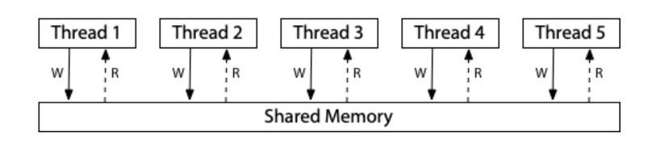
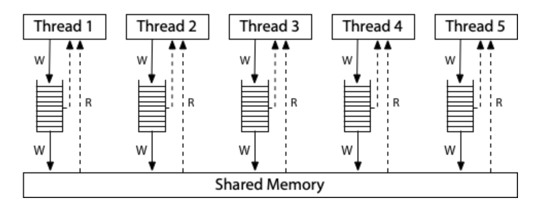

<!-- ## Go 内存模型 -->

### 1. 硬件内存模型
#### 1.1. 顺序一致性

**顺序一致性**：设计和证明这类计算机多进程算法正确性的惯用方法是假设满足以下条件：任何执行的结果都是相同的，就好像所有处理器的操作都是按某种顺序执行的，并且每个处理器的操作都是按其程序指定的顺序出现的。满足这个条件的多处理器具有顺序一致性。

顺序一致性通常被认为是理想的模型，它允许假设程序按照它们在页面上出现的顺序执行，并且各个线程的执行只是以某种顺序交错，而不是重新排列。

> 假设一个测试 *Litmus Test*<a id="litmus1"></a>：*Message Passing*，是否可以观察到 `r1 = 1, r2 = 0`？首先假设：
> - 所有共享变量开始时设置为零；
> - *rN* 表示一个线程本地寄存器，非共享变量。
> 
> <pre><code>
> // Thread1             // Thread2
> x = 1                  r1 = y 
> y = 1                  r2 = x 
> </code></pre>
> 
> 如果测试的执行是顺序一致的，那么只有六种可能的交织：
> 
> <pre><code>
> x = 1               |  x = 1               |  x = 1
> y = 1               |          r1 = y (0)  |          r1 = y (0)
>         r1 = y (1)  |  y = 1               |          r2 = x (1)
>         r2 = x (1)  |          r2 = x (1)  |  y = 1
> —————————————————————————————————————————————————————————————————
>          r1 = y (0) |          r1 = y (0)  |          r1 = y (0)
>  x = 1              |  x = 1               |          r2 = x (0)
>  y = 1              |          r2 = x (1)  |  x = 1             
>          r2 = x (1) |  y = 1               |  y = 1            
> </code></pre>
> 
> 在顺序一致的硬件上，由于没有交织，所以无法观察到 `r1 = 1, r2 = 0` 的结果。

对于顺序一致性，一个理想的模型是想象所有的处理器都直接连接到同一个共享内存，它可以一次为来自一个线程的读或写请求提供服务。由于不涉及缓存，因此每次处理器需要读取或写入时，该请求都会转向共享内存。单次使用的共享内存对所有内存访问的执行施加了一个顺序：顺序一致性。



>---
#### 1.2. x86 总存储顺序 (x86-TSO) 

现代 x86 系统的内存模型对应于此硬件图：



所有处理器仍然连接到一个共享内存，但每个处理器都将写入该内存的内容放入 *本地写入队列*。处理器继续执行新的指令，而写操作则进入共享内存。一个处理器上的内存读取在查询主存之前先查询本地写队列，但它无法看到其他处理器上的写队列。其效果是处理器在其他处理器之前看到自己的写入。但是所有的处理器都同意写入（存储）到达共享内存的（总）顺序，这给了这个模型一个名字：总存储顺序（TSO）。当一个写操作到达共享内存时，任何处理器上的任何未来读操作都将看到它并使用该值（直到它被后来的写操作覆盖，或者可能被来自另一个处理器的缓冲写操作覆盖）。

写队列是一个标准的先进先出队列：内存写入按照处理器执行它们的相同顺序应用于共享内存。由于写队列保留了写顺序，并且其他处理器会立即看到对共享内存的写入，因此对于先前的 [*Litmus Test*](#litmus1)，同样无法观察到 `r1 = 1, r2 = 0` 的结果。

> 假设一个测试 *Litmus Test*<a id="litmus2"></a>：*Write Queue*，是否可以观察到 `r1 = 0, r2 = 0`：
>
> <pre><code>
> // Thread1             // Thread2
> x = 1                  y = 1
> r1 = y                 r2 = x
> </code></pre>
>
> 在顺序一致的硬件上：不能
> 在 x86（或其他 TSO）：可以

在任何顺序一致的执行中，`x = 1` 或 `y = 1` 必须首先发生，然后另一个线程中的读取必须观察它，所以 `r1 = 0, r2 = 0` 是不可能的。但是在 TSO 系统中，可能会发生 Thread1 和 Thread2 都将其写入队列，然后在写入共享内存之前从内存中读取，因此两个读取都观察到零。

为了修复依赖于更强的内存排序的算法，非顺序一致的硬件提供了 *内存屏障*（或 *围栏*）的显式指令，可用于控制排序。


> 我们可以添加一个内存屏障，以确保每个线程在开始读取之前将其先前的写入刷新到内存中：
>  
> <pre><code>
> // Thread1             // Thread2
> x = 1                  y = 1
> barrier                barrier
> r1 = y                 r2 = x
> </code></pre>
>
> 随着屏障的添加，`r1 = 0, r2 = 0` 再次是不可能的。在于障碍的存在，并且给予程序员或语言实现者一种方法，在程序的关键时刻强制执行顺序一致的行为。


>---
#### 1.3. ARM/POWER 宽松内存模型

ARM 和 POWER 系统的概念模型是，每个处理器都从自己的完整内存副本中读取和写入，每个写入都独立地传播到其他处理器，并允许在写入传播时重新排序。ARM 和 POWER 处理器上的内存模型在实现级别上，这两个系统在许多方面都不同，但保证内存一致性模型大致相似。


这个模型中没有 *总存储顺序*，每个处理器被允许延迟读，直到它需要的结果（读取操作可以被延迟到随后的写入操作之后）。

对于测试 [*Message Passing*](#litmus1)，结果 `r1 = 1, r2 = 0` 可以在 ARM/POWER 的模型上观察到。Thread1 和 Thread2 都有自己独立的内存副本，写操作可以以任何顺序在内存之间传播。如果 Thread1 的内存在发送 `x` 的更新之前将 `y` 的更新发送到 Thread2，并且如果 Thread2 在这两个更新之间执行，则它确实会看到结果 `r1 = 1, r2 = 0`。

> 假设一个 *Litmus Test*<a id="litmus3"></a>：*Load Buffering*，是否可以观察到 `r1 = 1, r2 = 1`：
>
> <pre><code>
> // Thread1             // Thread2
> r1 = x                 r2 = y
> y = 1                  x = 1
> </code></pre>
>
> 在顺序一致的硬件上：不能
> 在 x86（或其他 TSO）：不能
> 在 ARM/POWER：可以

任何顺序一致的交织必须从 Thread1 的 `r1 = x` 或 Thread2 的 `r2 = y` 开始。该读取必须看到零，使得结果 `r1 = 1, r2 = 1` 不可能。然而，在 ARM/POWER 内存模型中，处理器被允许延迟读取，直到指令流中的写入之后，因此 `y = 1` 和 `x = 1` 在两次读取之前执行。

> 假设一个 *Litmus Test*<a id="litmus4"></a>：*Coherence*，是否可以观察到 `r1 = 1, r2 = 2, r3 =2, r4 =1`：
>
> <pre><code>
> // Thread1        // Thread2      // Thread3      // Thread4         
> x = 1             x = 2           r1 = x          r3 = x 
>                                   r2 = x          r4 = x 
> </code></pre>
>
> 在顺序一致的硬件上：不能
> 在 x86（或其他 TSO）：不能
> 在 ARM/POWER：不能

系统中的线程必须就写入单个内存位置的总顺序达成一致。也就是说，线程必须同意哪些写入会覆盖其他写入，这种特性被称为连贯性。如果没有连贯性属性，处理器要么不同意内存的最终结果，要么报告一个内存位置从一个值翻转到另一个值，然后返回到第一个值。很难对这样一个系统进行编程。

>---
#### 1.4. 弱序与无数据竞争顺序一致性

**弱序**：假设同步模型是一组内存访问的约束条件，这些约束条件指定了需要如何以及何时完成同步。硬件相对于同步模型是弱有序的，当且仅当它对服从同步模型的所有软件呈现顺序一致。

**无数据竞争**（Data-Race-Free，DRF）模型假设硬件具有与普通内存读写分离的内存同步操作。普通的内存读取和写入可以在同步操作之间重新排序，但是它们不能在同步操作之间移动。如果对于所有理想的顺序一致的执行中，来自不同线程的对相同位置的任何两个普通的内存访问要么都是读取，要么被同步操作分隔开，以使得一个操作在另一个操作之前发生，那么这样的程序被称为是 DRF。

> 单线程中不存在数据竞争的情况，程序按顺序执行。假设一个双线程程序中，存在一个竞争：
> <pre><code>
> // Thread1        // Thread2    
>     W(x)                 
>       ↓               W(x)
>     R(x)                          
> </code></pre>
>
> Thread2 的写与 Thread1 的读和写竞争。如果 Thread2 正在 *R*(*x*) 而不是 *W*(*x*)，则程序只有一个写和读的竞争。每个竞争都涉及至少一个写入，两个不协调的读取不会相互竞争。
> 
> 为了避免争用，我们必须添加同步操作，它强制共享同步变量的不同线程上的操作之间的顺序：
> <pre><code>
> // Thread1        // Thread2    
>     W(x)                 
>       ↓              
>     R(x) 
>       ↓
>     S(a)   ------->   S(a)
>                         ↓
>                       W(x)                        
> </code></pre>
>
> 如果 Thread2 只在读取，只需要与 Thread1 的写同步。这两个读取仍然可以同时进行：
> <pre><code>
> // Thread1        // Thread2    
>     W(x)                 
>       ↓              
>     S(a)   ------->   S(a)
>       ↓                 ↓
>     R(x)              R(x)
> </code></pre>
>
> 另一方面，同步变量的使用本身并不能消除竞争，有可能不正确地使用它们：
> <pre><code>
> // Thread1        // Thread2        // Thread3
>     W(x)                                 
>       ↓                                 W(x)
>     S(a)   ------->   S(a)               |
>                         ↓                ↓
>                       S(b)   <-------   S(b)
>                         ↓
>                       R(x)
> </code></pre>
>
> Thread2 的读操作与其他线程中的写操作正确地同步，但是这两个写操作本身并不同步，因此仍然存在竞争。

弱序被描述为 “软件和硬件之间的契约”。如果软件避免了数据竞争，那么硬件的行为就好像它是顺序一致的。硬件 “是弱有序的 DRF”，这意味着当它执行无数据竞争的程序时，行为就好像是执行一个顺序一致的命令。这种系统保证无数据竞争程序的顺序一致性的想法通常缩写为 DRF-SC。

DRF-SC 标志着硬件内存模型的一个转折点。但是高级编程语言的内存模型问题上并没有一个整洁的答案。

不同的体系结构允许不同数量的指令重新排序，因此在多处理器上并行运行的代码可以根据体系结构具有不同的允许结果。黄金标准是顺序一致性，其中任何执行都必须表现得好像在不同处理器上执行的程序只是以某种顺序交错到单个处理器上。

---
### 2. 编程语言内存模型

编程语言内存模型回答了并行程序可以依靠什么行为来在线程之间共享内存的问题。

> 考虑一个类 C 程序，其中 `x` 和 `done` 都是从零开始。各个线程运行在各自的专用处理器上，这个程序是否保证完成并打印 1？
> <pre><code>
> // Thread1                    // Thread2
> x = 1;                        while(done == 0){ /* loop */ }
> done = 1;                     print(x);
> </code></pre>
>
> 虽然每种编程语言在细节上都有所不同，但基本上所有现代多线程语言都有一些通用的答案，包括 C、C++、Go、Java、JavaScript、Rust 和 Swift：
> 
> 首先，如果 `x` 和 `done` 是普通变量，那么 Thread2 的循环可能不会停止。一个常见的编译器优化是第一次使用变量时将其加载到寄存器中，并尽可能长时间地重用它以访问该变量。若 Thread2 在 Thread1 执行之间将 `done` 复制到寄存器中，它可能会在整个循环中使用该寄存器而不会观察到 Thread1 后来修改了 `done`。
>
> 其次，即使 Thread2 在观察到 `done == 1` 之后循环停止了，它仍可以打印出 0。编译器经常依据优化算法对程序的读写进行重新排序。因此 Thread1 的编译代码可能在 `done` 之后结束写入 `x`，或者 Thread2 的编译代码在循环之前结束读取 `x`。
>
> 考虑到这个程序是多么的糟糕，显而易见的问题是如何修复它。

现代语言以原子变量或原子操作的形式提供了特殊的功能，允许程序同步其线程。如果将 `done` 作为一个原子变量（或原子操作它），那么上述的程序可以保证完成并打印 1。原子化的 `done` 有很多效果：

- Thread1 的编译代码必须确保对 `x` 的写入完成，并且在对 `done` 的写入可见之前对其他线程可见。
- Thread2 的编译代码必须在循环的每次迭代中（重新）读取 `done`。
- Thread2 的编译代码必须在从 `done` 读取之后从 `x` 读取。
- 编译后的代码必须做任何必要的事情来禁用可能重新引入这些问题的硬件优化。

使 `done` 原子化的最终结果是程序按照我们想要的方式运行，成功地将 `x` 中的值从 Thread1 传递到 Thread2。

在原始程序中，编译器的代码重新排序后，Thread1 可能在 Thread2 读取 `x` 的同时写入 `x`，这就是数据竞争。在修改后的程序中，原子变量 `done` 用于同步对 `x` 的访问：现在 Thread1 不可能在 Thread2 读取 `x` 的同时写入它，程序是无数据竞争的。一般来说，现代语言保证无数据竞争的程序总是以顺序一致的方式执行，就好像来自不同线程的操作在单个处理器上任意且未被重新排序地被交错执行。这是在编程语言上下文中采用的硬件内存模型 DRF-SC 特性。

编程语言内存模型指定了程序员和编译器所需的确切细节，作为他们之间的契约。但是语言之间在二阶问题上仍有很大的差异，包括：
- 原子变量本身的排序保证是什么？
- 一个变量可以同时被原子操作和非原子操作访问吗？
- 除了原子，还有同步机制吗？
- 是否存在不同步的原子操作？
- 对有竞争的程序有任何保证吗？

提供 DRF-SC 的处理器（现在所有的处理器）保证没有数据竞争的程序就像在顺序一致的架构上运行一样。这是在现代处理器上编写正确的多线程汇编程序的基本保证。


编译器在生成最终可执行代码的过程中可能会对输入程序中的操作进行重新排序。编译器重新排序读和写的能力使得普通编译程序的保证至少和 ARM/POWER 宽松内存模型一样弱。事实上，对编译程序的保证更弱。

> 对于先前 ARM/POWER 的一个测试 [*Litmus Test: Coherence*](#litmus4)，由于编译器可以对现有程序中的操作进行重新排序，因此在任何使用普通变量的现代编译语言中：可以观察到 `r1 = 1, r2 = 2, r3 = 2, r4 = 1`。
> 假设编译器重新排序 Thread4 中的两个读取，然后指令就像以这种顺序交错一样运行：
> 
> <pre><code>
> // Thread1        // Thread2      // Thread3      // Thread4         
> (1) x = 1                         (2) r1 = x      (3) r3 = x 
>                   (4) x = 2       (5) r2 = x      (6) r4 = x 
> </code></pre>
>
> 结果是 `r1 = 1, r2 = 2, r3 = 2, r4 = 1`，这在汇编程序中是不可能的，但在高级语言中是可能的。从这个意义上说，编程语言内存模型都比最宽松的硬件内存模型弱。

>----
#### 2.1. 原始 Java 内存模型（1996） 

Java 是第一个尝试写下它对多线程程序的保证的主流语言。它包括互斥锁，并定义了它们隐含的内存排序要求。它还包括 “volatile” 原子变量：volatile 变量的所有读写都需要直接在主存中按程序顺序执行，使得对 volatile 变量的操作以顺序一致的方式进行。

Java 还指定（或至少试图指定）具有数据竞争的程序的行为。其中一部分是要求普通变量具有某种形式的一致性。但是，在 Java 语言规范第一版（1996）中，这种尝试至少有两个严重的缺陷。

> 第一个缺陷是 volatile 原子变量是非同步的，因此它们不能帮助消除程序其余部分中的竞争。
> ```java
> int x;
> volatile int done;
> 
> // Thread1              // THread2
> x = 1;                  while(done == 0) {/* loop */}
> done = 1;               print(x);
> ```
> 
> 因为 `done` 被声明为 volatile，所以循环保证完成：编译器不能将其缓存在寄存器中并导致无限循环。但是，程序不保证打印 1。编译器不被禁止对 `x` 和 `done` 访问的重新排序，也不禁止硬件做同样的事情。因为 Java volatile 是非同步原子，所以不能使用它们来构建新的同步原语。
>
> 第二个缺陷是原始的 Java 内存模型也太强了，强制一致性：一旦线程读取了内存位置的新值，它就不能在以后读取旧值，即不允许基本的编译器优化。有一个更微妙的方式可能会被另一种优化破坏：公共子表达式消除。
>
> ```java
> // p and q may or may not point at the same object.
> int i = p.x;
> // ... maybe another thread writes p.x at this point ...
> int j = q.x;
> int k = p.x;
> ```
>
> 在这个程序中，公共子表达式消除会注意到 `p.x` 被计算了两次，并将最后一行优化为 `k = i`。但是，如果 `p` 和 `q` 指向同一个对象，并且另一个线程在读取 `i` 和 `j` 之间写入了 `p.x`，那么将旧值 `i` 重新用于 `k` 会违反一致性：读取到 `i` 中看到了旧值，读取到 `j` 中看到了新值，但是读取到 `k` 中重用 `i` 将再次看到旧值。如果不能优化掉冗余的读操作，会使大多数编译器步履蹒跚，从而使生成的代码变慢。


硬件比编译器更容易提供一致性，因为硬件可以应用动态优化：它可以根据给定的内存读写序列中涉及的确切地址来调整优化路径。相比之下，编译器只能应用静态优化：它们必须提前写出一个无论涉及什么地址和值都正确的指令序列。在上述这个例子中，编译器不能轻易地根据 `p` 和 `q` 是否指向同一个对象来改变所发生的事情，至少在不为这两种可能性编写代码的情况下是这样，这会导致大量的时间和空间开销。编译器对内存位置之间可能的别名的不完全了解意味着实际上提供了一致性但是需要放弃基本的优化。

>---
#### 2.2. 新的 Java 内存模型（2004）

新的 Java 内存模型遵行 DRF-SC 方法：保证无数据竞争的 Java 程序以顺序一致的方式执行。

要编写一个无数据竞争的程序，程序员需要同步操作，这些操作可以建立 *happens-before* 边，以确保一个线程不会在另一个线程读取或写入非原子变量时并发地写入该变量。在 Java 中，主要的同步操作是：
- 线程的创建发生在线程中的第一个操作之前。
- 互斥锁 *m* 的解锁 *happen before* 对它的任何后续锁定。
- 对 volatile 变量 *v* 的写入 *happen before* 对它的任何后续读取。

DRF-SC 仅保证程序的顺序一致行为，没有数据竞争。新的 Java 内存模型，定义了竞争程序的行为。新模型不再依赖于一致性，而是重用 *happens-before* 关系（用于决定程序是否存在竞争）来决定竞争读写的结果。

Java 的特定规则是，对于机器字大小或更小的变量，读取变量（或字段）*x* 必须观察到通过对 *x* 的单次写入存储的值。对 *x* 的写 *w* 可以被读 *r* 观察到，只要 *r* 不在 *w* 之前发生。这意味着 *r* 可以观察到在 *r* 之前发生的写入（但在 *r* 之前没有被覆盖），并且它可以观察到与 *r* 竞争的写入。

以这种方式使用 *happens-before*，结合同步原子（volatiles）可以建立新的 *happens-before* 边，这是对原始 Java 内存模型的重大改进。它为程序员提供了更有用的保证，并明确允许大量重要的编译器优化。这一工作至今仍是 Java 的内存模型。也就是说，它仍然不完全正确：使用 *happens-before* 来定义竞争程序的语义存在问题。

>---
#### 2.3. C++11 内存模型（2011）

与 Java 相比，C++ 在两个重要方面有所不同。首先，C++ 对具有数据竞争的程序没有任何保证，这似乎消除了对 Java 模型复杂性的需求。其次，C++ 提供了三种原子：强同步（*sequentially consistent*，顺序一致），弱同步（*acquire* / *release*，仅连贯性）和无同步（*relaxed*，用于隐藏竞争）。宽松的原子性重新引入了 Java 的所有复杂性，即定义什么是竞争程序。C++11 也定义了原子屏障作为原子变量的替代。

与 Java 不同，C++ 不保证程序会有竞争。任何在任意地方有竞争的程序都会落入 “未定义行为”。在程序执行的第一微秒内的竞争访问被允许在数小时或数天后导致任意错误行为。这通常被称为 “DRF-SC or *Catch Fire*”：如果程序是无数据竞争的，它将以顺序一致的方式运行，如果不是，它可以做任何事情，包括 *Catch Fire*。未定义的竞争语义允许实现检测和诊断竞争并停止执行。

C++ 采用了顺序一致的原子变量，很像（2004）Java 的 volatile 变量（与 C++ volatile 无关）。使用 `memory_order_seq_cst` 使显式调用等效于下方较短的调用。

```c++
// 我们可以将 done 声明为
atomic<int> done;

// 然后把 done 当作一个普通的变量来使用
atomic_store(&done, 1);
// 然后使用
while(atomic_load(&done) == 0) {/* loop */}
```

C++ 还添加了较弱的原子（*acquire* / *release atomics*，获取 / 释放原子），可以使用 `atomic_store_explicit` 和 `atomic_load_explicit` 以及额外的内存排序参数进行访问。

```c++
atomic_store(&done, 1, memory_order_release);

while(atomic_load(&done, memory_order_acquire) == 0) { /* loop */ }
```

顺序一致的原子要求程序中所有原子的行为，与执行的某种全局交错（总顺序）一致。*acquire* / *release atomics* 只需要在单个存储器位置上的操作是顺序一致的交错。也就是说，它们只需要连贯性。结果是，使用具有多个存储器位置的获取 / 释放原子的程序可能会观察到无法通过程序中所有获取 / 释放原子的顺序一致交织来解释的执行，可以说违反了 DRF-SC。

C++ 还引入了非同步原子，称为宽松原子（`memory_order_relaxed`），宽松原子读 / 写和普通读 / 写之间没有区别，只是宽松原子上的竞争不被认为是竞争。 

>---
#### 2.4. C、Rust、Swift 内存模型

C11 也采用了 C++11 内存模型，使其成为 C/C++11 内存模型。

2015 年的 Rust 1.0.0 和 2020 年的 Swift 5.3 都完全采用了 C/C++ 内存模型，包括 DRF-SC or *Catch Fire* 以及所有原子类型和原子围栏。这两种语言都采用 C/C++ 模型，是因为它们都构建在 C/C++ 编译器工具链（LLVM）上，并强调与 C/C++ 代码的紧密集成。

>---
#### 2.5. JavaScript 内存模型（2017）

最初 JavaScript 是一种单线程语言，当代码在多个处理器上并行运行时，它不需要担心内存模型。JavaScript 有 Web worker，它允许在另一个线程中运行代码。工作线程只通过显式的消息复制与主 JavaScript 线程通信。

ECMAScript 2017（ES2017）添加了 `SharedArrayBuffer` 对象，它允许主线程和工作线程共享一块可写内存。共享可写内存还需要定义同步的原子操作和内存模型。JavaScript 在三个重要方面偏离了 C++：
- 首先，它将原子操作限制为顺序一致的原子。其他原子可以被编译成顺序一致的原子，可能会损失效率，但不会损失正确性，并且只有一种原子可以简化系统的其余部分。
- 其次，JavaScript 不采用 *DRF-SC or Catch Fire*。相反，像 Java 一样，它明确定义了竞争访问的可能结果。基本原理与 Java 基本相同，特别是安全性。
- 第三，部分是因为 JavaScript 为竞争程序提供了语义，它定义了在同一个内存位置上使用原子和非原子操作时会发生什么，以及在同一个内存位置上使用不同大小的访问会发生什么。

>---
#### 2.6. 内存模型比较

C，C++，Java，JavaScript，Rust 和 Swift，我们可以做出以下观察：
- 它们都提供了顺序一致的同步原子，用于协调并行程序的非原子部分。
- 它们都旨在保证使用适当同步的无数据竞争程序的行为就像以顺序一致的方式执行一样。
- Java 拒绝添加弱（获取/释放）同步原子，直到 Java 9 引入 `VarHandle`。JavaScript 避免添加它们。
- 它们都为程序提供了一种方法来执行 “故意的” 数据竞争，而不会使程序的其余部分无效。在 C、C++、Rust 和 Swift 中，这种机制是宽松的非同步原子，一种特殊的内存访问形式。在 Java 中，这种机制是普通的内存访问或 Java 9 `VarHandle` “普通” 访问模式。在 JavaScript 中，这种机制是普通的内存访问。
- 这些语言都没有找到一种方法来正式地禁止像凭空出现的值这样的悖论，但是所有的语言都非正式地禁止它们。

---
### 3. Go 内存模型

Go 语言内存模型的形式化定义紧密遵循 Hans-J. Boehm 和 Sarita V. Adve 在 PLDI  2008 上发表的 “[Foundations of the C++ Concurrency Memory Model](https://rsim.cs.illinois.edu/Pubs/08PLDI.pdf)” 中提出的方法。无竞争程序的定义和无竞争程序的顺序一致性保证与该工作等价。

Go 内存模型规定了在哪些条件下，可以保证在一个 goroutine 中读取一个变量时，可以观察到在另一个 goroutine 中写入同一个变量时产生的值。修改被多个 goroutine 同时访问的数据的程序必须序列化这种访问。要序列化访问，例如使用通道操作或其他同步原语（如 `sync` 和 `sync/atomic` 包中的同步原语）来保护数据。

数据竞争被定义为对同一存储器位置的写入与另一个读取或写入同时发生，除非所涉及的所有访问都是由 `sync/atomic` 包提供的原子数据访问。在没有数据竞争的情况下，Go 程序的行为就好像所有的 goroutine 都被复用到一个处理器上，即 DRF-SC：无数据竞争的程序以顺序一致的方式执行。

内存模型描述了程序执行的需求，这些需求由 goroutine 执行组成，而 goroutine 执行又由内存操作组成。内存操作由四个细节建模：
- 操作的种类，指示其是普通数据读取、普通数据写入、同步操作（例如原子数据访问、互斥操作）或通道操作；
- 操作在程序中的位置；
- 被访问的内存位置或变量；
- 由操作读取或写入的值。

一些内存操作是 *read-like*，包括读、原子读、互斥锁和通道接收。一些内存操作是 *write-like*，包括写、原子写、互斥锁解锁、通道发送和通道关闭。有些如原子比较和交换，既 *read-like* 又 *write-like*。

一个 goroutine 执行被建模为一组由单个 goroutine 执行的内存操作。某些 Go 语言操作，如 goroutine 创建和内存分配，充当同步操作。

> **Requirement 1**：每个 goroutine 中的内存操作必须对应于该 goroutine 的正确顺序执行，给定从内存读取和写入内存的值。这种执行必须与 *sequenced before* 关系一致，*sequenced before* 关系定义为 Go 语言控制流结构设定的偏序要求以及表达式的求值顺序。
>
> Go 程序的执行被建模为一组 goroutine 执行，以及一个映射 *W*，*W* 指定了每个 *read-like* 操作从其中读取的 *write-like* 操作。（同一程序的多次执行可以有不同的程序执行。
>
> **Requirement 2**：对于给定的程序执行，映射 *W* 在限于同步操作时，必须通过与顺序一致的同步操作的某种隐式总顺序以及由这些操作读取和写入的值来解释。
>
> *synchronized before* 关系是关于同步内存操作的偏序，从 *W* 导出。如果同步的 *read-like* 内存操作 *r* 观察到同步的 *write-like* 内存操作 *w*（即 *W*(*r*) = *w*），则 *w* 在 *r* 之前同步。通俗地讲，*synchronized before* 关系是 *Requirement 2* 中提到的隐含总顺序的子集，仅限于 *W* 直接观察到的信息。
>
> *happens before* 关系被定义为 *sequenced before* 和 *synchronized before* 关系并集的传递闭包。
>
> **Requirement 3**：对于内存位置 *x* 上的普通（非同步）数据读取 *r*，*W*(*r*) 必须是对 *r* 可见的写入 *w*，其中可见意味着以下两者都成立：
> - *w* 发生在 *r* 之前。
> - *w* 不会发生在 *r* 之前发生的任何其他写操作 *w'*（写入到 *x*）之前。
>
> 内存位置 *x* 上的读-写数据竞争由 *x* 上的 *read-like* 内存操作 *r* 和 *write-like* 内存操作 *w* 组成，其中至少有一个是非同步的，*happens before* 无序（也就是说，*r* 不会发生在 *w* 之前，*w* 也不会发生在 *r* 之前）。
>
> 内存位置 *x* 上的 写-写数据竞争由 *x* 上的两个 *write-like* 内存操作 *w* 和 *w'* 组成，其中至少一个是非同步的，*happens before* 无序。
>
> 如果在内存位置 *x* 上没有读-写或写-写数据竞争，那么在 *x* 上的任何读 *r* 都只有一个可能的 *W*(*r*)：在 *happens before* 顺序中紧接在它之前的单个 *w*。

更一般地说，可以证明，任何无数据竞争的 Go 程序，也就是说它没有读写或写写数据竞争的程序执行，只能通过 goroutine 执行的某些顺序一致的交织来解释结果。

其他编程语言通常对包含数据竞争的程序采取两种方法之一。第一个，以 C 和 C++ 为例，是具有数据竞争的程序是无效的：编译器可能以任意令人惊讶的方式破坏它们。第二个以 Java 和 JavaScript 为例，是具有数据竞争的程序定义了语义，限制了竞争的可能影响，使程序更可靠，更容易调试。

Go 的方法介于这两者之间。具有数据竞争的程序是无效的，因为实现可能会报告竞争并终止程序。但除此之外，具有数据竞争的程序已经定义了具有有限数量结果的语义，使错误的程序更可靠，更容易调试。


>---
#### 3.1. 包含数据竞争的程序的实现限制


- 任何实现都可以在检测到数据竞争时报告该竞争并停止程序的执行。

+ 数组、结构体或复数的读取可以被实现为以任何顺序读取每个单独的子值（数组元素、结构体字段或实 / 虚分量）。类似地，数组、结构体或复数的写入可以被实现为以任何顺序写入每个单独的子值。

- 对内存位置（该位置的值保持不大于一个机器字）的每次读取操作 *r* 都必须观察由前一次或并发写入操作 *w* 写入的值。

+ 不允许观察非因果性和 “凭空” 写入。

- 鼓励读取大于单个机器字的内存位置，但不要求满足与机器字大小的内存位置相同的语义，观察单个允许的写入 *w*。出于性能原因，实现可以替代地将较大的操作视为以未指定的顺序的单个机器字大小的操作的集合。这意味着多字数据结构上的竞争可能导致不一致的值不对应于单个写入。当值依赖于内部的 `(pointer，length)` 或 `(pointer, type)` 对的一致性时，就像大多数 Go 实现中的接口值、映射、切片和字符串一样，这样的竞争反过来会导致任意内存损坏。

>---
#### 3.2. 同步

程序初始化在一个单独的 goroutine 中运行，但这个 goroutine 可以创建其他的 goroutine，它们可以同时运行。如果一个软件包 p 导入了软件包 q ，那么 q 的 `init` 函数的完成发生在任何一个 p 中的函数开始之前。所有 `init` 函数的调用完成在函数 `main.main()` 开始之前同步。

启动一个新的 goroutine 的 `go` 语句在 goroutine 的执行开始之前被同步。

> 调用 `hello` 将在将来的某个时候打印 `"hello, world"` （可能在 `hello` 返回之后）
> ```go
> var a string
> func f() {
>     print(a)
> }
> func hello() {
>     a = "hello world"
>     go f()
> }
> ```

一个 goroutine 的退出不能保证在程序中的任何事件在此之前同步。

> 对 `a` 的赋值没有任何同步事件跟随，因此不能保证它被任何其他 goroutine 观察到
> 
> ```go
> var a string
> func hello() {
> 	go func() { a = "hello" }()
> 	print(a)   // maybe print ""
> }
> ```
> 
> 除非使用同步机制，例如锁或通道通信来建立相对顺序。

通道通信是 goroutine 之间同步的主要方法。在一个特定通道上的每一个发送都与来自该通道的相应接收相匹配，尤其是在不同的 goroutine 中。通道上的发送在从该通道完成相应的接收之前同步。

> 对 `a` 的写入在 `c` 上的发送之前排序，在 `c` 上的相应接收完成之前同步，在 `print` 之前排序。
> 
> ```go
> var c = make(chan int, 10)
> var a string
> func f() {
> 	a = "hello, world"
> 	c <- 0
> }
> func main() {
> 	go f()
> 	<-c
> 	print(a)
> }
> ```
> 通道的关闭在接收之前同步，因为通道已关闭，所以接收返回零值。上述的例子用 `close(c)` 替换 `c <- 0` 会产生一个具有相同保证行为的程序。

来自无缓冲通道的接收在该通道上的相应发送完成之前同步。

> 对 `a` 的写入在 `c` 上的接收之前排序，在 `c` 上的相应发送完成之前同步，在 `print` 之前排序。
>
> ```go
> var c = make(chan int)
> var a string
> func f() {
>     a = "hello, world"
> 	<-c
> }
> func main() {
>     go f()
> 	c <- 0
> 	print(a)
> }
> ```
>
> 如果通道被缓冲（例如，`c = make(chan int, 1)` ），则程序将不能保证打印 `"hello, world"`。它可能会打印空字符串，崩溃或做其他事情。

在具有容量 *C* 的通道上的第 *k* 个接收在来自该通道的第 *k+C* 个发送完成之前被同步。此规则将前面的规则推广到缓冲通道。它允许一个计数信号量通过缓冲通道建模：通道中的项目数对应于活动使用的数量，通道的容量对应于同时使用的最大数量，发送一个项目获取信号量，接收一个项目释放信号量。这是限制并发性的常见习惯用法。

> 这个程序为工作列表中的每个条目启动一个 goroutine，但是 goroutine 使用 `limit` 通道进行协调，以确保一次最多有三个工作函数在运行。
> 
> ```go
> var limit = make(chan int, 3)
> 
> func main() {
> 	for _, w := range work {
> 		go func(w func()) {
> 			limit <- 1
> 			w()
> 			<-limit
> 		}(w)
> 	}
> 	select{}
> }
> ```

`sync` 包实现了两种锁数据类型，`sync.Mutex` 和 `sync.RWMutex`。对于任何 `sync.Mutex` 或 `sync.RWMutex` 变量 `l` 且 `n < m`，`l.Unlock()` 的调用 `n` 在 `l.Lock()` 的调用 `m` 返回之前同步。

对于在 `sync.RWMutex` 变量 `l` 上对 `l.RLock` 的任何调用，存在 `n` 使得对 `l.Unlock` 的第 `n` 个调用在从 `l.RLock` 返回之前被同步，并且对 `l.RUnlock` 的匹配调用在从调用 `n+1` 返回到 `l.Lock` 之前被同步。

成功调用 `l.TryLock` （或 `l.TryRLock`）相当于调用 `l.Lock` （或 `l.RLock`）。一个不成功的调用没有任何同步效果。就内存模型而言，`l.TryLock`（或 `l.TryRLock`）可以被认为即使当互斥锁 `l` 被解锁时也能够返回 `false`。

> 对 `l.Unlock()`（在 `f` 中）的第一次调用在对 `l.Lock()`（在 `main` 中）的第二次调用返回之前同步，第二次调用在 `print` 之前排序。
> 
> ```go
> var l sync.Mutex
> var a string
> 
> func f() {
> 	a = "hello, world"
> 	l.Unlock()
> }
> 
> func main() {
> 	l.Lock()
> 	go f()
> 	l.Lock()
> 	print(a)
> }
> ```

`sync` 包通过使用 `Once` 类型为多个 goroutine 的初始化提供了一个安全的机制。多个线程可以为特定的 `f` 执行 `once.Do(f)`，但只有一个会运行 `f()`，其他调用会阻塞，直到 `f()` 返回。

从 `once.Do(f)` 对 `f()` 的单个调用的完成在对 `once.Do(f)` 的任何调用的返回之前被同步。

> 调用 `twoprint` 将只调用 `setup` 一次。`setup` 函数将在调用 `print` 之前完成。结果是 `"hello, world"` 将被打印两次。
> 
> ```go
> var a string
> var once sync.Once
> 
> func setup() {
> 	a = "hello, world"
> }
> 
> func doprint() {
> 	once.Do(setup)
> 	println(a)
> }
> 
> func twoprint() {
> 	go doprint()
> 	go doprint()
> }
> ```

`sync/atomic` 包中的 API 是 “原子操作”，可以用来同步不同 goroutine 的执行。如果原子操作 *B* 观察到原子操作 *A* 的副作用，则 *A* 在 *B* 之前同步。在程序中执行的所有原子操作的行为就像是以某种顺序一致的排序执行。该定义与 C++ 的顺序一致原子和 Java 的 volatile 变量具有相同的语义。


`runtime` 包提供了一个 `SetFinalizer` 函数，该函数添加了一个终结器，当程序无法再访问特定对象时将调用该终结器。对 `SetFinalizer(x, f)` 的调用在对终结函数 `f(x)` 的调用之前同步。


>---
#### 4. Go 并发与 Goroutine

> **Goroutine**

*goroutine* 有一个简单的模型：它是一个在同一地址空间中与其他 *goroutine* 并发执行的函数。它是轻量级的，成本比堆栈空间的分配多一点。堆栈开始时很小，所以它们很便宜，并通过根据需要分配（和释放）堆存储来增长。

*goroutine* 被多路复用到多个 OS 线程上，所以如果一个线程阻塞，比如在等待 I/O 时，其他线程会继续运行。它们的设计隐藏了线程创建和管理的诸多复杂性。`go` 语句用于创建一个新的 *goroutine* 进行函数调用。当调用完成时，*goroutine* 会静默退出。

```go
go list.Sort()  // run list.Sort concurrently; don't wait for it.
```

函数文本（匿名函数）在 *goroutine* 调用中很便捷。

```go
func Announce(message string, delay time.Duration) {
    go func() {
        time.Sleep(delay)
        fmt.Println(message)
    }()  // Note the parentheses - must call the function.
}
```

> **Channels**

可以利用通道类型在多个 *goroutine* 之间进行通信。

```go
ci := make(chan int)            // unbuffered channel of integers
cj := make(chan int, 0)         // unbuffered channel of integers
cs := make(chan *os.File, 100)  // buffered channel of pointers to Files
```

无缓冲通道将通信（值的交换）与同步结合起来，无缓冲通道保证负责接收和发送的两个例程同步，以保证两个计算（*goroutine*）处于已知状态。例如，通道可以允许启动的 *goroutine* 等待排序完成。

```go
done := make(chan bool)  // Allocate a channel.

// Start the sort in a goroutine; when it completes, signal on the channel.
go func() {
    list.Sort()
    done <- true  // Send a signal; value does not matter.
}()
doSomethingForAWhile()
<-done   // Wait for sort to finish; discard sent value.
```

在有数据要接收之前，接收方始终处于阻塞状态。如果通道无缓冲，则发送方会阻塞，直到接收方收到该值。如果通道有缓冲区，则发送方仅在值被复制到缓冲区之前阻塞；如果缓冲区已满，则意味着等待某个接收方检索到值。

缓冲通道可以像信号量一样使用，例如限制吞吐量。在下面例子中，传入的请求被传递到 `handle`，它向通道发送一个值，处理请求，然后从通道接收一个值，为下一个消费者准备 “信号量”。通道缓冲区的容量将同时调用的数量限制为 `process`。

```go
var sem = make(chan int, MaxOutstanding)

func handle(r *Request) {
    sem <- 0    // Wait for active queue to drain.
    process(r)  // May take a long time.
    <-sem       // Done; enable next request to run.
}

func Serve(queue chan *Request) {
    for {
        req := <-queue
        go handle(req)  // Don't wait for handle to finish.
    }
}
```

>---
#### 4.3. 通过交流共享内存

传统的线程模型（例如，在编写 Java、C++ 和 Python 程序时通常使用）要求程序员使用共享内存在线程之间进行通信。通常，共享数据结构由锁保护，线程将争用这些锁来访问数据。在某些情况下，通过使用线程安全的数据结构（如 Python 的队列）会变得更容易。Go 语言的并发方法不同于传统的线程和共享内存。

Go 语言的并发原语（*goroutines* 和 *channels*）为构造并发软件提供了一种优雅而独特的方法。Go 语言鼓励使用通道在 *goroutine* 之间传递对数据的引用，而不是显式地使用锁来调解对共享数据的访问。这种方法确保在给定时间只有一个 *goroutine* 可以访问数据。

> 以下是一个轮询 URL 列表的简单程序，它检查这些 URL 的 HTTP 响应代码并定期打印它们的状态：

```go
package main

import (
	"log"
	"net/http"
	"time"
)

const (
	numPollers     = 2                   // number of Poller goroutines to launch
	pollInterval   = 60 * time.Second    // how often to poll each URL
	statusInterval = 10 * time.Second    // how often to log status to stdout
	errTimeout     = 10 * time.Second    // back-off timeout on error
)

var urls = []string{
	"https://golang.google.cn/doc/",
	"https://golang.google.cn/blog/codelab-share",
	"https://golang.google.cn/doc/codewalk/sharemem/",
}

// State 表示 URL 的状态，Pollers 将 State 值发送到 StateMonitor
// StateMonitor 维护每个 URL 的当前状态的映射。
type State struct {
	url    string
	status string
}

// StateMonitor 维护一个映射，该映射存储正在轮询的 url 的状态，并每隔 updateInterval 纳秒
// 打印当前状态。它返回一个 chan<- State，Resource 状态应该发送到该 State。
// 
// StateMonitor 在通道上接收 State 值，并定期输出程序轮询的所有 Resource 的状态。
func StateMonitor(updateInterval time.Duration) chan<- State {
    // 变量 updates 是 State 的一个通道，Poller goroutine 通过它发送 State 值。
	updates := make(chan State)
    
    // 变量 urlStatus 是保存 URL 最新状态的映射。
	urlStatus := make(map[string]string)
    
    // time.Ticker 是一个对象，它以指定的时间间隔在通道上重复发送一个值。
    // 在本例中，ticker 每隔 updateInterval 纳秒就会触发一次将当前状态打印到标准输出。
	ticker := time.NewTicker(updateInterval)
	
    // StateMonitor 将永远循环，select 两个通道：ticker.C 和 update。
    // select 语句会阻塞，直到它的一个通信准备好继续。
    // 
    // 当 StateMonitor 从 ticker.C 接收到一个 tick 时，它会调用 logState 来打印当前的映射
    // 状态。当它从 updates 接收到 State 更新时，它会在 urlStatus 映射中记录新的状态。
    // 
    // 这个 goroutine 拥有 urlStatus 数据结构，确保它只能被顺序访问。这可以防止对共享映射
    // 的并行读取和 / 或写入可能引起的内存损坏问题。
    go func() {
		for {
			select {
			case <-ticker.C:
				logState(urlStatus)
			case s := <-updates:
				urlStatus[s.url] = s.status
			}
		}
	}()
	return updates
}

// logState 打印当前 URL 状态映射。
func logState(s map[string]string) {
	log.Println("Current state:")
	for k, v := range s {
		log.Printf(" %s %s", k, v)
	}
}

// Resource 表示要轮询的 URL 的状态：URL 本身和自上次成功轮询以来遇到的错误次数。
// 当程序启动时，它为每个 URL 分配一个 Resource。main goroutine 和 Poller goroutine
// 在通道上相互发送 Resources
type Resource struct {
	url      string
	errCount int
}

// Poll 方法对 Resource 的 URL 执行 HTTP HEAD 请求，并返回 HTTP 响应的状态代码。
// 如果出现错误，Poll 会将消息记录为标准错误，并返回错误字符串。
func (r *Resource) Poll() string {
	resp, err := http.Head(r.url)
	if err != nil {
		log.Println("Error", r.url, err)
		r.errCount++
		return err.Error()
	}
	r.errCount = 0
	return resp.Status
}

// 睡眠调用时间。在发送 Resource 完成之前暂停睡眠。暂停将具有固定长度（pollInterval）
// 加上与连续错误数成比例的额外延迟（r.errCount）。
// 
// 这是一个典型的 Go 语言习惯用法的例子：一个在 goroutine 内部运行的函数需要一个通道
// 作为参数，它在通道上发送它的返回值（或其他完成状态的指示）。
func (r *Resource) Sleep(done chan<- *Resource) {
	time.Sleep(pollInterval + errTimeout*time.Duration(r.errCount))
	done <- r
}

// 每个轮询器 Poller 从输入通道 in 接收 Resource 指针。
// 在这个程序中，约定是在通道上发送 Resource 指针将底层数据的所有权从发送方传递给接收方。
// 因为这个约定，我们知道没有两个 goroutine 会同时访问这个资源。这意味着我们不必担心锁定
// 来阻止对这些数据结构的并发访问。
// 
// Poller 通过调用 Resource 的 Poll 方法来处理 Resource。它向 status 状态通道发送一个
// State 值，以通知 StateMonitor 轮询的结果。
// 
// 最后，它将 Resource 指针发送到 out 通道。这可以解释为 Poller 说 “我已经完成了这个资源”，
// 并将它的所有权返回给 main goroutine。
// 
// 多个 goroutine 运行 Pollers，并行处理资源。
func Poller(in <-chan *Resource, out chan<- *Resource, status chan<- State) {
	for r := range in {
		s := r.Poll()
		status <- State{r.url, s}
		out <- r
	}
}

// main 函数启动 Poller 和 StateMonitor goroutine，然后在适当的延迟后循环将完成
// 的 Resource 传递回 pending 挂起通道。
func main() {
	// 首先，main 创建两个 *Resource 通道，pending 和 complete。
    // 
    // 在 main 中，一个新的 goroutine 为每个 URL 发送一个 Resource 到 pending，
    // main goroutine 从 complete 接收完成的 Resource。
    // 
    // pending 和 complete 通道被传递给每个 Poller goroutine，在其中它们被称为 in 和 out。
	pending, complete := make(chan *Resource), make(chan *Resource)

	// StateMonitor 将初始化并启动一个存储每个 Resource 状态的 goroutine。
    // 它返回一个 State 通道，该通道保存为 status 并传递给 Poller goroutines。
	status := StateMonitor(statusInterval)

	// main 启动了一些 Poller goroutine，并将通道作为参数传递。
    // 这些通道提供了 main、Poller 和 StateMonitor goroutine 之间的通信方式。
	for i := 0; i < numPollers; i++ {
		go Poller(pending, complete, status)
	}

	// 为了将初始工作添加到系统中，main 启动一个新的 goroutine，它为每个 URL 分配
    // 并发送一个 Resource 到 pending。
	// 
    // 新的 goroutine 是必要的，因为无缓冲通道的发送和接收是同步的。这意味着这些
    // 通道发送将阻塞，直到 Pollers 准备好从 pending 读取。
    // 
    // 如果这些在 main goroutine 的 Pollers 中发送，并且发送量大于通道发送量，程序
    // 将陷入死锁，因为 main 还没有从 complete 接收。
    go func() {
		for _, url := range urls {
			pending <- &Resource{url: url}
		}
	}()

    // 当 Poller 完成一个 Resource 时，它在 complete 通道上发送它。此循环从 complete 
    // 接收这些 Resource 指针。对于每个接收到的 Resource，它启动一个新的 goroutine，
    // 调用 Resource 的 Sleep 方法，以确保 Sleep 可以并行发生。
    // 
    // 任何单个 Resource 指针在任何时候都只能在 pending 或 complete 上发送。这确保了
    // 一个 Resource 要么被 Poller goroutine 处理，要么处于睡眠状态，但绝不会同时被
    // 处理。通过这种方式，我们通过通信共享我们的 Resource 数据。
	for r := range complete {
		go r.Sleep(pending)
	}
}
```

---
### 5. Go 并发与模式

#### 5.1. [Pipelines](./codes/go%20concurrency/pipeline_test.go)

*Pipeline* 是由通道连接的一系列阶段（*stages*），其中每个阶段是一组运行相同函数的 *goroutine*。在每个阶段，*goroutine*：
- 通过 *inbound* 通道从 *upstream* 接收值；
- 对这些数据执行一些函数，通常会产生新值；
- 通过 *outbound* 通道向 *downstream* 发送值

每一阶段都有任意数量的 *inbound* 和 *outbound* 通道，但第一阶段和最后一阶段除外，它们分别只有 *outbound* 通道或 *inbound* 通道。第一个阶段有时被称为 *source* 或 *producer*；最后一个阶段，*sink* 或 *consumer*。

> 考虑一个具有三个阶段的 *pipeline*：求平方数。
> 
> ```go
> // first stage: producer
> func generate(nums ...int) <-chan int {
> 	out := make(chan int)
> 	go func() {
> 		for _, n := range nums {
> 			out <- n
> 		}
> 		close(out)
> 	}()
> 	return out
> }
> // second stage: receive & handle, and sent to downstream
> func sq(in <-chan int) <-chan int {
> 	out := make(chan int)
> 	go func() {
> 		for n := range in {
> 			out <- n * n
> 		}
> 		close(out)
> 	}()
> 	return out
> }
> // last stage: consumer
> func TestPipeline(t *testing.T) {
> 	dataChan := generate([]int{1, 2, 3, 4, 5, 66}...)
> 	for n := range sq(dataChan) {
> 		fmt.Println(n)
> 	}
> }
> ```

>---
#### 5.2. [Fan-out, Fan-in](./codes/go%20concurrency/fanInOut_withoutDone_test.go)

多个函数可以从同一个通道读取数据，直到该通道关闭；这称为 *fan-out*。这提供了一种在一组工作者之间分配工作的方法，以并行化 CPU 使用和 I/O。一个函数可以从多个输入读取数据，并通过将输入通道多路复用到一个通道上，当所有输入都关闭时，该通道就关闭了。这被称为 *fan-in*。

负责 *fan-in* 的函数通过为每个 *inbound* 通道启动一个 *goroutine*，将值复制到唯一的 *outbound* 通道，将通道列表转换为单个通道。一旦所有的 *output* *goroutine* 都被启动，*fan-in* 函数就会再启动一个 *goroutine* 来关闭 *outbound* 通道。

> 考虑一个求素数的程序，给定数字的数值越大，计算的过程越久。可以创建多个计算 goroutine 进行求值，最后将结果传递给单一的接收通道。 
>
```go
// ! 构造多个工作例程
func fanOut[T any](n int, in <-chan T, work func(in <-chan T) <-chan T) ([]<-chan T, error) {
	if n < 1 {
		return nil, fmt.Errorf("n(%d) is less than 1.", n)
	}
	if n > runtime.NumCPU() {
		n = runtime.NumCPU()
	}
	fanOutChs := make([]<-chan T, n)
	for i := 0; i < n; i++ {
		fanOutChs[i] = work(in)
	}
	return fanOutChs, nil
}

// ! 合并多个例程的 chan 通道为一个 chan
func fanIn[T any](cs ...<-chan T) <-chan T {
	var wg sync.WaitGroup
	wg.Add(len(cs))

	out := make(chan T)
	for _, c := range cs {
		go func(c <-chan T) {
			defer wg.Done() // 等待所有 c close 时
			for i := range c {
				out <- i
			}
		}(c)
	}
	go func() {
		wg.Wait()
		close(out)
	}()
	return out
}

func withoutDone_generate(start int, n int) <-chan int {
	out := make(chan int)
	go func() {
		for range n {
			out <- start
			start++
		}
		close(out)
	}()
	return out
}

// 素数查找
func primeFinder(in <-chan int) <-chan int {
	isPrime := func(num int) bool {
		for i := num - 1; i > 1; i-- {
			if num%i == 0 {
				return false
			}
		}
		return true
	}
	primes := make(chan int)
	go func() {
		var ok bool
		var randomInt int
		defer close(primes)
		for {
			if randomInt, ok = <-in; ok {
				if isPrime(randomInt) {
					primes <- randomInt
				}
			} else {
				return
			}
		}
	}()
	return primes
}

func TestFanInOut(t *testing.T) {
	intStream := withoutDone_generate(100, 100)
	// fan out
	fanOutChs, err := fanOut(16, intStream, primeFinder)
	if err != nil {
		log.Fatal(err)
	}
	// fan in
	outStream := fanIn(fanOutChs...)
	
	for r := range outStream {
		fmt.Println(r)
	}
}
```

>--- 
#### 5.3. [Explicit cancellation](./codes/go%20concurrency/fanInOut_withDone_test.go)

在 *Pipeline* 模式中的每个阶段中，当所有发送的操作完成时，会关闭它们的 *outbound* 通道；或该阶段保持从 *inbound* 通道接收值，直到那些通道被关闭。这种模式允许每个接收阶段被写为 `range` 循环，并确保一旦所有值都被成功发送到 *downstream*，所有的 *goroutine* 都会退出。

但在实际的 *pipeline* 中，这些阶段并不总是接收所有的 *inbound* 值。有时这是设计使然：接收方可能只需要一个值的子集就可以取得进展。更常见的情况是，一个阶段提前退出，是因为 *inbound* 值表示为早期阶段中的错误。在任何一种情况下，接收方都不应该等待剩余的值到达，我们希望前面的阶段停止产生后面阶段不需要的值。

如果一个阶段未能消耗所有 *inbound* 值，尝试发送这些值的 *goroutine* 将无限期阻塞：

```go
    // Consume the first value from the output.
    out := merge(c1, c2)
    fmt.Println(<-out) // 4 or 9
    return
    // Since we didn't receive the second value from out,
    // one of the output goroutines is hung attempting to send it.
```

这是一个资源泄漏：*goroutine* 消耗内存和运行时资源，并且 *goroutine* 堆栈中的堆引用防止数据被垃圾收集。*goroutine* 不是垃圾收集器，它们必须自己退出。

我们需要一种方法来告诉未知且无限数量的 *goroutine* 停止向 *downstream* 发送它们的值。可以通过关闭通道来实现这一点，在关闭的通道上的接收操作总是可以立即进行，从而产生元素类型的零值。

```go
func fanInWithDone[T any](done <-chan int, chans ...<-chan T) <-chan T {
	var wg sync.WaitGroup
	fannedInStream := make(chan T)
	transfer := func(c <-chan T) {
		defer wg.Done()
		for i := range c {
			select {
			case <-done:    // 结束时告知 transfer 例程停止发送自行退出
				return
			case fannedInStream <- i:
			}
		}
	}
	wg.Add(len(chans))
	for _, c := range chans {
		go transfer(c)
	}

	go func() {
		wg.Wait()
	}()
	return fannedInStream
}
```

---
### 6. *References*
 - [Hardware Memory Models](https://research.swtch.com/hwmm)
 - [Programming Language Memory Models](https://research.swtch.com/plmm)
 - [Updating the Go Memory Model](https://research.swtch.com/gomm)
  
---