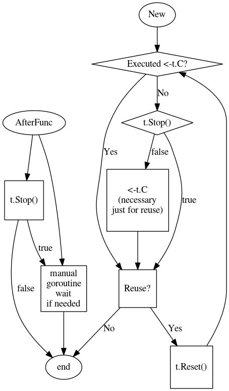

<a id="TOP"></a>

## Package time

<div id="top" style="z-index:99999999;position:fixed;bottom:35px;right:50px;float:right">
	<a href="./code/time_test.go" target="_blank"></img></a>
	<!-- <a href="#TOP" ></img></a>	 -->
	<a href="https://pkg.go.dev/time" ></img></a>
	<a href="..\README.md"></img></a>
</div>

包 `time` 提供测量和显示时间的功能。日历的计算总是采用公历，没有闰秒。

操作系统提供了一个 “*wall clock*” 和一个 “*monotonic clock*”，*wall clock* 会因为时钟同步而发生变化。一般来说，*wall clock* 是用来报时的，而 *monotonic clock* 是用来计时的。

```go
// now = 2024-06-01 03:14:30.7437863 +0800 CST m=+0.003134901
// wall clock      : 2024-06-01 03:14:30.7437863 +0800 CST
// monotonic clock : +0.003134901
```

包 `time/tzdata` 提供了一个嵌入的时区数据库副本。如果这个包被导入到程序中的任何地方，那么如果 `time` 包在系统上找不到 `tzdata` 文件，它将使用这个嵌入的信息。这个包通常应该由程序的 `main` 包导入，而不是由库导入。库通常不应该决定是否在程序中包含时区数据库。如果使用 `-tagesizdata` 构建，这个包将被自动导入。

```go
import _ "time/tzdata"
```

---
### Timer

`time.Timer` 注意事项：
 - `Stop` 只有在 `New` 和 `Reset` 之后才安全。
 - `Reset` 仅在 `Stop` 之后有效。
 - 仅当在每个 `Stop` 之后排空通道时，接收值才有效。
 - 当且仅当通道尚未被读取时，才应排空通道。
 - 不能使用 `Stop` 和 `Reset` 和并发地从其他例程中接收 `timer.C` 通道的值，`C` 应该在每个 `Reset` 之前明确被排出一次。

```go
if !t.Stop() {
	<-t.C
}
t.Reset(d)
```

以下是允许的转换、使用和调用计时器的流程图：




一个正确使用 `Timer` 的例子：

```go
func toChanTimed(t *time.Timer, ch chan int) {
	t.Reset(1 * time.Second)
	// No defer, as we don't know which
	// case will be selected

	select {
	case ch <- 42:
	case <-t.C:
		// C is drained, early return
		return
	}

	// We still need to check the return value
	// of Stop, because t could have fired
	// between the send on ch and this line.
	if !t.Stop() {
		<-t.C
	}
}
```

---
<a id="exam" ><a>

### Examples

- [TickFunc](./examples/tickFunc.go)

---