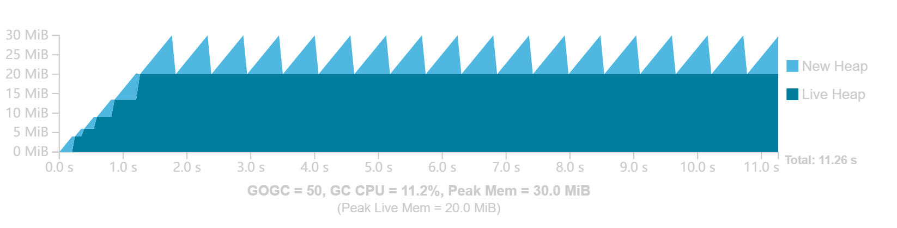
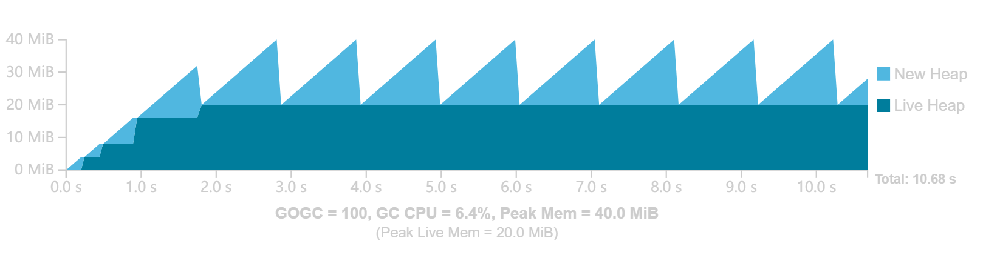
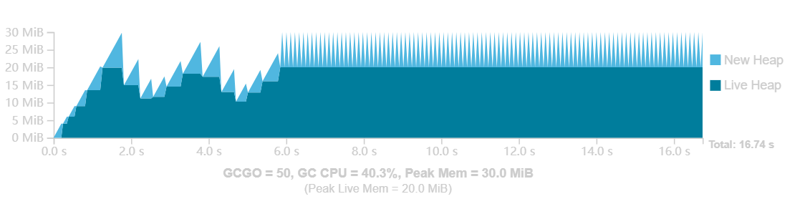
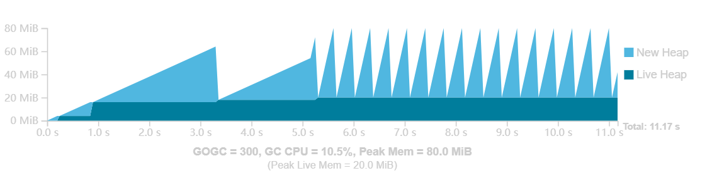
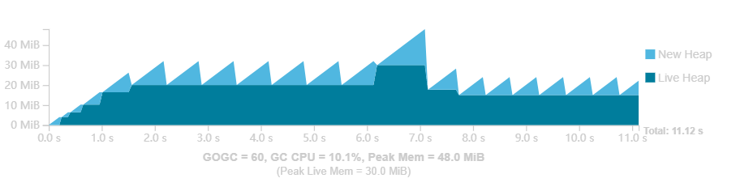
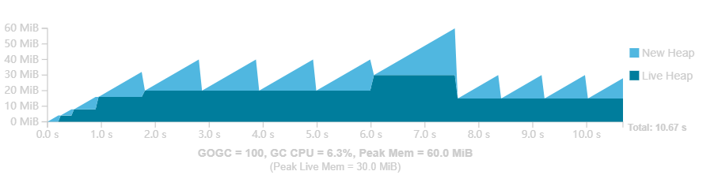
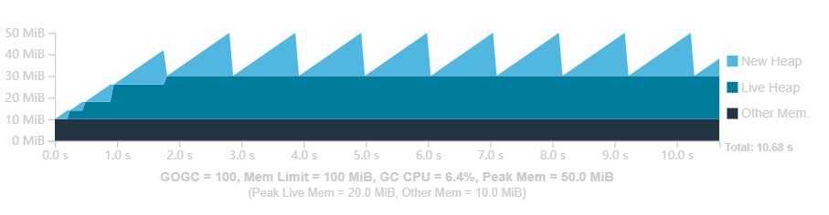
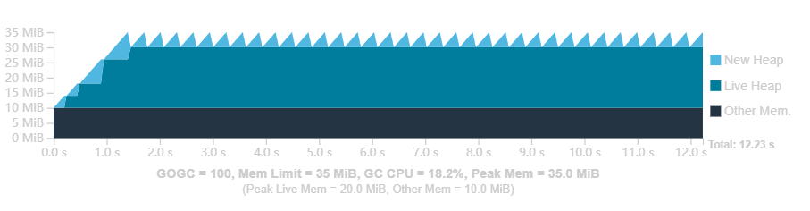
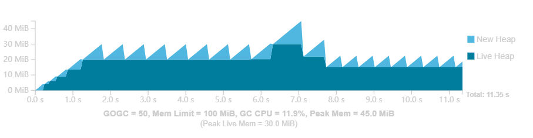
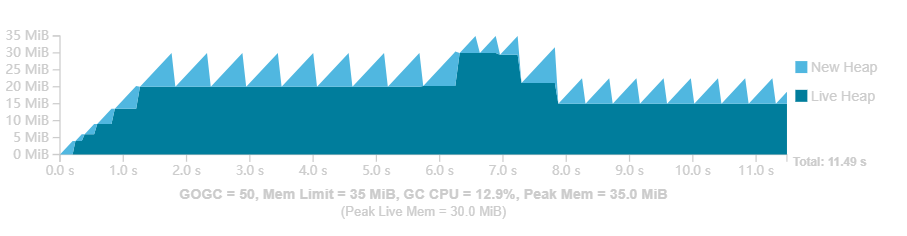

## Go 垃圾收集（Go 1.19）

> Reference
>
> - https://golang.google.cn/doc/gc-guide#Additional_notes_on_GOGC
> - https://github.com/golang/proposal/blob/master/design/48409-soft-memory-limit.md
> 

---
### Go 垃圾收集器简介

自动回收内存的另一个术语是垃圾收集。垃圾收集器（*garbage collection*，GC）是代表应用程序通过识别不再需要的内存部分来回收内存的系统。

存储在局部变量中的非指针值可能不由 Go GC 管理，Go 为这些值分配创建它的词法作用域绑定的内存。这种方式被称为 “堆栈分配”（*stack allocation*），即存储在 *goroutine* 堆栈上。

由于 Go 编译器无法确定某些值的生存期，因此无法在堆栈上分配内存的 Go 值被称为逃逸到堆（*heap*）。在堆上分配内存的行为通常被称为 “动态内存分配”，编译器和运行时都可以对如何使用这些内存以及何时可以清理这些内存做出最少的假设。GC 是一个专门识别和清理动态内存分配的系统。

Go 值需要逃逸到堆中的原因有很多。例如，它的大小是动态确定的；一个切片底层数组的初始大小由一个变量而不是一个常量决定。逃逸到堆必须是可传递的：如果一个 Go 值的引用被写入另一个已经确定要逃逸的 Go 值，那么这个值也必须逃逸。一个 Go 值是否逃逸取决于它的上下文和 Go 编译器的逃逸分析算法。

>---
#### 跟踪式垃圾收集

Go 垃圾收集是跟踪式垃圾收集，它通过跟随指针传递来标识正在使用（或活动，*live*）的对象。

- Object：对象是一个动态分配的内存片段，包含一个或多个 Go 值。
- Pointer：引用对象中任何值的内存地址。这也包括形式为 `*T` 的 Go 值和部分内置 Go 值。字符串、切片、通道、映射和接口值都包含 GC 必须跟踪的内存地址。

对象和指向其他对象的指针一起构成了对象图（*object* *graph*）。为了识别活动（*live*）内存，GC 从程序的根（*roots*）开始遍历扫描（*scanning*）对象图，这些根是标识程序明确使用的对象的指针。根的两个例子是局部变量和全局变量。

Go GC 使用标记 - 清除（*mark-sweep*）技术：GC 将它遇到的值标记为 *live* 以便追踪其进度。一旦跟踪完成，GC 就会遍历堆中的所有内存，并使所有未标记的可用内存用于分配。这一过程称为清除（*sweeping*）。

一种替代技术是将对象实际移动到内存的新部分，并留下一个转发指针，该指针稍后用于更新应用程序的所有指针。这种方式移动对象的 GC 称为移动（*moving*）GC；Go 有一个非移动（*non-moving*）GC。

---
### GC 循环

Go GC 大致分为两个阶段：标记阶段和清除阶段。在所有内存都被跟踪之前，不可能释放内存以进行分配，因为仍然可能有一个未扫描的指针保持对象活动。因此，清除行为必须与标记行为完全分开。此外，当没有 GC 相关工作要做时，GC 可能完全不活动。GC 在 GC 循环中不断地经历清除、关闭和标记这三个阶段。GC 周期从扫描开始，关闭，然后标记。

>---
#### GC 成本模型

GC 本质上是一个构建在更复杂系统上的复杂软件。
- GC 只涉及两个资源：CPU 时间和物理内存。
- GC 的内存开销包括活动堆内存、标记阶段之前分配的新堆内存和元数据空间。活动堆内存是指在前一个 GC 周期中被确定为活动的内存，而新堆内存是指在当前周期中分配的任何内存。
- GC 的 CPU 成本被建模为每个周期的固定成本，以及与活动堆的大小成比例的边际成本。

这个模型准确地分类了 GC 的主要成本，但没有说明这些成本的大小以及它们如何相互作用。为了对此进行建模，指定稳态（*steady-state*）。
- 应用程序分配新内存的速率（以每秒字节为单位）是恒定的。分配速率与新内存是否活动无关。
- 应用程序的对象图每次看起来大致相同（对象大小相似，指针数量大致恒定，图的最大深度大致恒定）。

稳态代表了应用程序在某些恒定工作负载下的行为。即使在应用程序执行时，工作负载也可能发生变化，但通常应用程序行为看起来像是一堆稳定状态，中间有一些瞬态行为。稳态没有对活动堆做任何假设。活动堆可能随着每个后续 GC 周期而增长，也可能缩小，或者保持不变。

在稳态下，当活动堆大小恒定时，只要 GC 在相同时间之后执行，每个 GC 周期在成本模型中看起来都是相同的。在固定时间内，应用程序以固定的分配速率分配固定数量的新堆内存。因此，使用活动堆大小常量和新堆内存常量，内存使用量始终相同。由于活动堆的大小相同，因此边际 GC CPU 成本也是相同的，固定成本将以一定的时间间隔产生。

假设 GC 决定将运行时间点向后移动，应用程序将分配更多的内存，但每个 GC 周期仍然会产生相同的 CPU 成本。但是在其他一些固定的时间窗口内，完成的 GC 周期会更少，从而降低整体 CPU 成本。但如果 GC 决定提前启动，则会出现相反的情况：分配的内存会更少，CPU 开销会更频繁。

这种情况表示了 GC 可以在 CPU 时间和内存之间做出的基本权衡，这由 GC 实际执行的频率（*frequency*）控制。在 Go 中，决定何时启动 GC 是用户可以控制的主要参数。

>---
#### GOGC

在高级别上，GOGC 决定 GC CPU 和内存之间的权衡。它的工作原理是确定每个 GC 周期后的目标堆大小，即下一个周期中总堆大小的目标值。GC 的目标是在总堆大小超过目标堆大小之前完成收集周期。总堆大小定义为上一个周期结束时的活动堆大小，加上应用程序自上一个周期以来分配的任何新堆内存。目标堆内存定义为：

<pre>
    目标堆 = 活动堆 + (活动堆 + GC roots) * GOGC / 100
</pre>

例如一个 Go 程序，其活动堆大小为 8 MiB，goroutine 堆栈为 1 MiB，全局变量中的指针为 1 MiB。如果 GOGC 值为 100，则在下一次 GC 运行之前分配的新内存量将为 10 MiB（= (8+1+1) * GOGC/100），因此总堆占用量为 18 MiB（=8+10）。如果 GOGC 值为 50，那么它将是 50%，即 5 MiB。如果GOGC值为200，则它将是200%，即20 MiB。

GOGC 可以通过 `GOGC` 环境变量或 `runtime/debug` 包中的 `SetGCPercent` 配置。GOGC 可以通过设置 `GOGC=off` 或调用 `SetGCPercent(-1)` 来完全关闭 GC（假设内存限制不适用）。从概念上讲，此设置相当于将 GOGC 设置为无穷大，因为触发 GC 之前的内存增量是无限的。

假设一个程序，该程序的非 GC 工作需要 10 秒的CPU时间才能完成。在第一秒，它在进入稳定状态之前执行一些初始化步骤（增长其活动堆）。应用程序总共分配 200 MiB，每次活动 20 MiB。它假设要完成的唯一相关 GC 工作来自活动堆。

GC 总是会引起一些 CPU 和峰值内存开销。随着 GOGC 的增加，CPU 开销会减少，但峰值内存会与活动堆大小成比例地增加。随着 GOGC 的减少，峰值内存需求也会减少，但会增加 CPU 开销。

假设一个更现实的例子，同样在没有 GC 的情况下，应用程序需要 10 个 CPU 秒才能完成，但在中途，稳态的分配速率会显著增加，并且活动堆大小在第一阶段会发生一点变化。更高的分配速率将导致更频繁的 GC 周期。

>---
#### 内存限制

在 Go 1.19 之前，GOGC 是唯一可以用来修改 GC 行为的参数，但它没有考虑到可用内存是有限的。当活动堆大小出现短暂峰值时，GOGC 必须针对峰值活动堆大小进行配置，GC 将选择与活动堆大小成比例的总堆大小。

如果示例工作负载运行在一个可用内存略高于 60 MiB 的容器中，那么 GOGC 不能增加到 100 以上，即使其余的 GC 周期有可用内存来利用这些额外的内存。此外在某些应用程序中，这些瞬态峰值可能很罕见，难以预测，从而导致偶尔的、不可避免的和潜在的代价高昂的内存不足情况。

自 Go 1.19 起，Go 添加了对设置运行时内存限制的支持。内存限制可以通过 `GOMEMLIMIT` 环境变量或 `runtime/debug` 包中的 `SetMemoryLimit` 函数来配置。这个内存限制设置了 Go 运行时可以使用的内存总量的最大值。

因为 Go GC 可以显式控制它使用多少堆内存，所以它会根据这个内存限制和 Go 运行时使用多少其他内存来设置堆的总大小。

假设在 GC 单阶段稳态工作负载中，Go 运行时增加了 10 MiB 额外开销和可调整的内存限制。当内存限制降低到低于 GOGC 确定的峰值内存（对于 100 的 GOGC，为 42 MiB）时，GC 会更频繁地运行，以将峰值内存保持在限制范围内。

在可调整内存限制的基础上，假设 GC 瞬态峰值的情况：

在稳态工作负载中，尝试关闭 GOGC，然后慢慢地降低内存限制，应用程序花费的总时间逐渐以无限的方式增长，这是因为 GC 在不断地执行以维持不可能的内存限制。程序由于恒定的 GC 周期而无法取得合理进展的情况，称为 *thrashing*。它特别危险，因为它显著地停顿了程序。更糟糕的是，足够大的瞬时堆峰值可能导致程序无限期地停止。

内存限制被定义为软限制。Go 运行时并不保证在所有情况下都能保持这个内存限制。这种内存限制的放宽对于避免 *thrashing* 行为至关重要，它为 GC 提供了一条出路：让内存使用超过限制，以避免在 GC 中花费太多时间。

GC 设置了一个在某个时间窗口内可以使用的 CPU 时间的上限（对于 CPU 使用中非常短的瞬时峰值有一些滞后）。此限制目前设置为大约 50%，具有 2*GOMAXPROCS CPU 秒窗口。限制 GC CPU 时间的后果是 GC 的工作被延迟，同时 Go 程序可能会继续分配新的堆内存，甚至超过内存限制。

50% GC CPU 限制是基于对具有充足可用内存的程序的最坏情况影响。在内存限制配置错误的情况下，例如它被错误设置得太低，程序最多会慢 2 倍，因为 GC 不能占用超过 50% 的 CPU 时间。

下面是一些关于内存限制在哪里最有用和最适用的建议：

- 当 Go 程序的执行环境在你的完全控制之下，并且 Go 程序是唯一可以访问某些资源集的程序（即某种内存预留，如容器内存限制）时，一定要利用内存限制。例如将 Web 服务部署到具有固定可用内存量的容器中。在这种情况下，一个很好的经验法则是留出额外的 5-10% 的空间来考虑 Go 运行时不知道的内存来源。

+ 随意可实时调整的内存限制，以适应不断变化的条件。例如一个 cgo 程序，其中 C 库暂时会需要使用更多的内存。

- 如果 Go 程序可能会与其他程序共享一些有限的内存，并且这些程序通常与 Go 程序解耦，则不要 GOGC 设置为关闭内存限制。相反要保持内存限制并将 GOGC 设置为某个较小、合理的值，因为它可能有助于抑制不希望的瞬态行为，以适应一般情况。

+ 在部署到无法控制的执行环境时，不要使用内存限制，特别是当程序的内存使用与其输入成比例时。一个例子是 CLI 工具或桌面应用程序。当不清楚程序可能会输入什么样的输入或者系统上有多少内存可用时，在程序中设置内存限制会导致混乱的崩溃和性能低下。

- 当程序已经接近其环境的内存限制时，不要设置内存限制，以避免出现内存不足的情况。这有效地将内存不足的风险替换为严重的应用程序减速的风险。在这种情况下，增加环境的内存限制或减少 GOGC 将更加有效。

>---
#### 延迟

实际的 Go GC 的大部分工作都是与应用程序并发进行的。这主要是为了减少应用程序延迟（*latency*），延迟是指单个计算单元（例如一个 Web 请求）的端到端持续时间。应用程序的吞吐量对于 Web 服务很重要（即每秒的查询次数），但通常每个请求的延迟更重要。

Go GC 避免了使任何全局应用程序暂停的长度与堆的大小成比例，并且在应用程序主动执行时执行核心跟踪算法。然而，更低的延迟并不意味着更低的吞吐量，随着时间的推移，Go 垃圾收集器的性能在延迟和吞吐量方面都得到了稳步提高。

GC 频率仍然是 GC 在 CPU 时间和内存之间权衡吞吐量的主要方式，降低 GC 频率可能导致延迟的改善。

延迟通常是程序每时每刻执行的产物，下面是一个可能的延迟来源列表：
- 当 GC 在标记和清除阶段之间转换时，会短暂暂停；
- 调度延迟是因为 GC 在标记阶段占用了 25% 的 CPU 资源；
- 用户 *goroutine* 协助 GC 响应高分配速率；
- 当 GC 处于标记阶段时，指针写入需要额外的工作；
- 运行中的 *goroutine* 必须被挂起，以便扫描它们的 *roots*。

---
### 虚拟内存

物理内存是大多数计算机中实际物理 RAM 芯片中的内存。虚拟内存是操作系统提供的物理内存的抽象，用于将程序彼此隔离。对于程序来说，保留不映射到任何物理地址的虚拟地址空间通常是可以接受的。

虚拟内存只是操作系统维护的一个映射，所以保留不映射到物理内存的大量虚拟内存通常非常便宜。Go 运行时通常以几种方式依赖于这种虚拟内存成本观点：

- Go 运行时永远不会删除它映射的虚拟内存。它使用大多数操作系统提供的特殊操作来显式释放与某些虚拟内存范围相关联的任何物理内存资源。这种技术显式地用于管理内存限制，并将 Go 运行时不再需要的内存返回给操作系统。
+ 在 32 位平台上，Go 运行时为堆预留了128 MiB 到 512 MiB 的地址空间，以限制碎片问题。
- Go 运行时在几个内部数据结构的实现中使用了大量的虚拟内存地址空间预留。在 64 位平台上，它们通常具有大约 700 MiB 的最小虚拟内存占用。在 32 位平台上，它们的占用空间可以忽略不计。

虚拟内存度量（如 top 中的 “VSS”）通常对于理解 Go 程序的内存占用并不十分有用。相反，应该关注 “RSS” 和类似的度量，它们更直接地反映物理内存使用情况。

---
### 优化指南

#### 确定运行成本

在尝试优化 Go 应用程序与 GC 的交互方式之前，首先要确定 GC 是一个主要的成本。

<!-- TODO -->

---
### 软著参考（temp）

- [The GC Handbook](https://gchandbook.org/) — 垃圾收集器设计方面的优秀通用资源和参考。

+ [TCMalloc](https://google.github.io/tcmalloc/design.html) — C/C++内存分配器 TCMalloc 的设计文档，Go内存分配器基于它。

- [Go 1.5 GC announcement](https://google.github.io/tcmalloc/design.html) — 发布 Go 1.5 并发 GC 的博客文章，更详细地描述了该算法。

+ [Getting to Go](https://google.github.io/tcmalloc/design.html) — 深入介绍Go的GC设计到2018年的演变。

- [Go 1.5 concurrent GC pacing](https://docs.google.com/document/d/1wmjrocXIWTr1JxU-3EQBI6BK6KgtiFArkG47XK73xIQ/edit#heading=h.xy314pvxblbm) — 用于确定何时开始并发标记阶段的设计文档。

+ [Smarter scavenging](https://github.com/golang/go/issues/30333) — 设计文档，用于修改 Go 运行时向操作系统返回内存的方式。

- [Scalable page allocator](https://github.com/golang/go/issues/35112) — 用于修改 Go 运行时管理从操作系统获取的内存的方式的设计文档。

+ [GC pacer redesign (Go 1.18)](https://github.com/golang/go/issues/44167) — 用于修订算法以确定何时开始并发标记阶段的设计文档。

- [Soft memory limit (Go 1.19)](https://golang.google.cn/issue/48409) — 软内存限制的设计文档。

---
### TODO