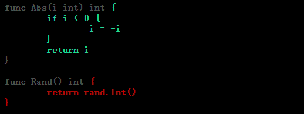

<div id="top" style="z-index:99999999;position:fixed;bottom:35px;right:50px;float:right">
	<a href="./code/testing_test.go" target="_blank"></img></a>
	<a href="#TOP" ></img></a>
	<a href="https://pkg.go.dev/io" ></img></a>
	<a href="..\README.md"></img></a>
</div>
<a id="TOP"></a>

## Package testing

包 `testing` 为 Go 包的自动化测试提供了支持，它与 [`go test`](https://pkg.go.dev/cmd/go#hdr-Test_packages) 命令一起使用。

```shell
go test [build/test flags] [packages] [build/test flags & test binary flags]
```

`go test` 命令期望在测试文件中找到与被测包对应的测试（`TextXxx`）、基准（`BenchmarkXxx`）、模糊测试（`FuzzXxx`）和示例（`ExampleXxx`）函数。

```go
func TestXxx(t *testing.T)          // 测试  `go test -run=^Test`
func BenchmarkXxx(b *testing.B)     // 基准测试 `go test -run=NONE -bench=Benchmark`
func FuzzXxx(f *testing.F)          // 模糊测试 `go test -run=NONE -fuzz=Fuzz`
func ExampleXxx()                   // 示例  `go test -run=Example`
```

测试文件以 `_test.go` 结尾，这类文件在常规包正常构建过程中被排除。测试文件可以与被测文件在同一个包中，也可以在后缀为 “*_test” 的独立包中（黑盒测试，不使用常规包的内部标识）。

---
### Testing Functions

#### TestXxx

```go
func TestXxx(t *testing.T) { ... }   //? go test
```

`go test` 命令自动执行 `TestXxx` 的任何函数。

```go
//? go test -v -run=^TestXxx$
func TestXxx(t *testing.T) {
	t.Log("Testing `TestXxx`")
}
```
```shell
$ go test -v -run=^TestXxx$
=== RUN   TestXxx
    testing_test.go:24: Testing `TestXxx`
--- PASS: TestXxx (0.00s)
ok      golib/testing/gostd_testing     0.205s
```

>---
#### BenchmarkXxx

```go
func BenchmarkXxx(b *testing.B) { ... }  //? go test -bench regexp
```

`BenchmarkXxx` 函数被认为是基准测试，由 `go test -bench regexp` 命令执行。基准测试按顺序运行。

```go
//? go test -run=NONE -bench=^BenchmarkXxx$ [-benchtime=3s] [-benchmem]
func BenchmarkXxx(b *testing.B) {
	//? 迭代足够次数或运行足够时长来计算单次操作 body 使用的近似时间
	for i := 0; i < b.N; i++ {
		// body
		doSomething(100)
	}
}
```
```shell
$ go test -run=NONE -bench=^BenchmarkXxx$   
...
BenchmarkXxx-32           170772              6999 ns/op
...
```

>---
#### ExampleXxx 

```go
func ExampleIdentifier() { ... }  // for Identifier
// 命名约定
func Example() { ... }      // for package
func ExampleF() { ... }     // for function F
func ExampleT() { ... }     // for type T
func ExampleT_M() { ... }   // for method T.M
```

`testing` 包可以运行并验证 `Example` 代码。`Example` 函数可以包括以 `"Output:"` 开始的结束行注释，并且在测试运行时与函数的标准输出进行比较。`"Unordered output:"` 注释可以忽略输出顺序。没有输出注释的示例函数被编译但不被执行。

```go
//? go test -v -run=Example
func ExampleIdentifier() { // for Identifier
	Println(Identifier)
	// output: Hello World
}
func Example() { // for package
	Println("Testing unordered output")
	for k, v := range M {
		Println(k, v)
	}
	// unordered output: Testing Example
	// 4 d
	// 3 c
	// 2 b
	// 1 a
}
func ExampleT_M() { // for method T.M
	T.M("Testing T_M")
	// output: Testing T_M
}
```

可以通过将不同的后缀（小写）附加到名称来提供用于包 / 类型 / 函数 / 方法的多个示例函数。

```go
func Example_suffix() { ... }
func ExampleF_suffix() { ... }
func ExampleT_suffix() { ... }
func ExampleT_M_suffix() { ... }
```

>---
#### FuzzXxx

```go
func FuzzXxx(f *testing.F) { ... }
```

`go test` 和 `testing` 包支持模糊测试，测试使用随机生成的输入调用函数，以查找单元测试未预料到的错误。

```go
//? go test -v -run=NONE -fuzz=^FuzzXxx$ [-parallel=8] [-fuzztime=5s] [-short]
func FuzzXxx(f *testing.F) {
	mlimit := debug.SetMemoryLimit(1000 * 100)
	mTreads := debug.SetMaxThreads(1000)
	f.Cleanup(func() {
		debug.SetMemoryLimit(mlimit)
		debug.SetMaxThreads(mTreads)
	}) //? 防止 Fuzzing abort

	f.Log("Fuzzing `FuzzXxx`")
	added := []int{1, 2, 3, 4, 5, 6, 7, 8, 9, 0}
	for _, v := range added {
		//? Add 添加种子用料
		f.Add(v)
	}
	//? Fuzz 运行模糊目标函数 ff
	f.Fuzz(func(t *testing.T, up int) {
		if up < 2 {
			t.SkipNow()
			return
		}
		// else i > 0, do something
		doSomething(up)
	})
}
```
```shell
$ go test -v -run=NONE -fuzz=Fuzz -fuzztime=5s -short   
...
=== RUN   FuzzXxx
    testing_test.go:37: Fuzzing `FuzzXxx`
fuzz: elapsed: 0s, gathering baseline coverage: 0/10 completed
fuzz: elapsed: 0s, gathering baseline coverage: 10/10 completed, now fuzzing with 32 workers
fuzz: elapsed: 3s, execs: 2819918 (938592/sec), new interesting: 2 (total: 12)
fuzz: elapsed: 5s, execs: 4764957 (928592/sec), new interesting: 2 (total: 12)
--- PASS: FuzzXxx (5.11s)
...
```

*Fuzzing* 是一种自动化测试，它不断地操纵程序的输入来发现 bug。Go *fuzzing* 使用覆盖率（*coverage*）指导来智能地遍历被模糊化的代码，以发现并向用户报告失败。

```go
func FuzzXxx(f *Testing.F) {
    f.Add(seed)  // add Seed to corpus
    f.Fuzz(fuzz_target)  // Fuzz target

    // fuzz_target : func(t *testing.T, fuzzing_args ...any)
    /*
        fuzz_target 模糊目标中除了 (*F).Failed, Name 函数，不能调用其他任何 *F 的方法。
        fuzzing_args 参数是要模糊化的类型，仅允许 []byte, string, bool,
          byte, rune, float32, float64, int, int8, int16, int32, int64, 
          uint, uint8, uint16, uint32, uint64
    */

    // seed 类型必须与 fuzzing_arg 类型相同且顺序相同
    /* 
        f.Fuzz(func(*testing.T, []byte, int64) {})
        f.Add([]byte{...}, int64(...))
    */
}
```

模糊测试维护一个种子语料库（*seed corpus*），或者一组默认运行的输入，并且可以生成种子输入。种子输入可以通过调用 `(*F).Add` 或通过将文件存储在包含模糊测试的包内的目录 `testdata/fuzz/<Name>`（其中 `<Name>` 是模糊测试的名称）中来注册。

传递给 `(*F).Fuzz` 的函数是模糊测试中的模糊目标 `fuzz`。模糊目标必须接受一个 `*T` 参数，后跟一个或多个随机输入参数。传递给 `(*F).Add` 的参数类型必须与这些参数的类型相同，顺序相同。`fuzz` 可能以与 Test 测试相同的方式发出发现问题的信号：例如通过调用 `T.Fail`（或任何调用它的方法，如 `T.Error` 或 `T.Fatal`）或通过 *panicking*。

如果模糊目标 `fuzz` 对于给定的输入失败，模糊引擎会将导致失败的输入写入包目录中的目录 `testdata/fuzz/<FuzzXxx>` 下的文件。模糊引擎将这个失败输入的文件添加到种子语料库进行模糊测试。如果无法在该位置写入文件（例如，因为该目录是只读的），则模糊引擎会将文件写入构建缓存内的模糊缓存目录。

>---
#### Sub-Test、Sub-Benchmark

`T` 和 `B` 的 `Run` 方法允许定义子测试和子基准测试，而不必为每个子测试和子基准定义单独的函数。每个子测试和子基准都有一个唯一的名称。

```go
func TestFoo(t *testing.T) {
    // <setup code>
    t.Run("A=1", func(t *testing.T) { ... })
    t.Run("A=2", func(t *testing.T) { ... })
    t.Run("B=1", func(t *testing.T) { ... })
    // <tear-down code>
}
```

`-run`、`-bench` 和 `-fuzz` 命令行标志的参数是一个匹配测试名称的非锚定正则表达式。使用反斜杠时表示匹配子测试名称。

```shell
go test -run ''        # Run all tests.
go test -run Foo       # Run top-level tests matching "Foo", such as "TestFooBar".
go test -run Foo/A=    # For top-level tests matching "Foo", run subtests matching "A=".
go test -run /A=1      # For all top-level tests, run subtests matching "A=1".
go test -fuzz FuzzFoo  # Fuzz the target matching "FuzzFoo"
```

子测试也可用于控制并行性。父测试仅在其所有子测试完成后才完成。

```go
func TestGroupedParallel(t *testing.T) {
    for _, tc := range tests {
        tc := tc // capture range variable
        t.Run(tc.Name, func(t *testing.T) {
            t.Parallel()
            ...
        })
    }
}

func TestTeardownParallel(t *testing.T) {
    // This Run will not return until the parallel tests finish.
    t.Run("group", func(t *testing.T) {
        t.Run("Test1", parallelTest1)
        t.Run("Test2", parallelTest2)
        t.Run("Test3", parallelTest3)
    })
    // <tear-down code>
}
```

>---
#### TestMain

```go
func TestMain(, *testing.M)
```

因如果测试文件包含 `TestMain` 函数，那么生成的测试将调用 `TestMain(m)` 而不是直接运行测试或基准测试。该函数在 *main goroutine* 中运行，可以在调用 `m.Run`（启动 *testings*）前执行任何必要的设置，或在结束测试时设置任何必要的拆卸。`m.Run` 返回将返回一个可以传递给 `os.Exit` 的退出代码。

当调用 `TestMain` 时，`flag.parse` 尚未运行。如果 `TestMain` 依赖于命令行标志，包括测试包的标志，它应该显式调用 `flag.parse`。命令行标志总是由测试或基准测试函数运行的时间来解析。

```go
//? go test [-v]
func TestMain(m *testing.M) {
	// call flag.Parse() here if TestMain uses flags
	os.Exit(m.Run())
}
// 示例
func TestMain(m *testing.M) {
	log.Println("Enter TestMain")
	//? 任何测试前的设置
		// ....
	//? 启动测试
	exitCode := m.Run()
	//? 测试结束后的拆卸
		// ....
    log.Println("Exit TestMain")
	//? 传递退出代码
	os.Exit(exitCode)
}
```

---
### `go test` flags

`go test` 命令同时接受应用于 `go test` 本身的标志和应用于结果测试二进制文件的标志<sup>[[↗]](https://pkg.go.dev/cmd/go#hdr-Testing_flags)</sup>。有几个标志控制分析并编写适合 `go tool pprof` 的执行配置文件。

| flag                          | description                                                                                                                                                                               |
| :---------------------------- | :---------------------------------------------------------------------------------------------------------------------------------------------------------------------------------------- |
| `-bench regexp`               | 运行匹配正则的基准测试，反斜杠（`/`）用于分割元素的测试（例如自测试）                                                                                                                     |
| `-benchtime t`                | 运行每个基准测试足够迭代的时长（`time.Duration`，默认 1s）或运行次数（`Nx`）                                                                                                              |
| `-count n`                    | 运行每个 test，benchmark，fuzz 的次数，默认 1                                                                                                                                             |
| `-cover`                      | 启用覆盖率分析                                                                                                                                                                            |
| `-covermode set,count,atomic` | 为测试的包设置覆盖率分析模式                                                                                                                                                              |
| `-coverpkg pattern1,pattern2` | 在每个测试中对匹配模式的包应用覆盖率分析                                                                                                                                                  |
| `-cpu 1,2,4`                  | 指定应该为其执行测试、基准测试或模糊测试的 GOMAXPROCS 值列表。`-cpu` 不适用于`-fuzz` 匹配的模糊测试                                                                                       |
| `-failfast`                   | 首次测试失败时，不执行新的测试                                                                                                                                                            |
| `-fullpath`                   | 在错误信息中显示完整文件名称                                                                                                                                                              |
| `-fuzz regexp`                | 运行匹配正则的模糊测试                                                                                                                                                                    |
| `-fuzztime t`                 | 运行每个模糊测试足够迭代的时长（`time.Duration`）或运行次数（`Nx`）                                                                                                                       |
| `-fuzzminimizetime t`         | 运行每个模糊测试足够迭代的最低限度的时长（`time.Duration`）或运行次数（`Nx`）                                                                                                             |
| `-json`                       | 以 JSON 形式记录详细输出和测试结果                                                                                                                                                        |
| `-list regexp`                | 列出匹配正则的 TestXxx、BenchmarkXxx、FuzzXxx 或 ExampleXxx，不会运行任何测试                                                                                                             |
| `-parallel n`                 | 允许并行执行调用 `t.Parallel` 测试函数，和运行种子语料库时调用 `t.Parallel` 的 fuzz targets。在进行 fuzzing 时，`n` 可以是同时调用模糊函数的子进程的最大数目（不管是否调用 `t.Parallel`） |
| `-run regexp`                 | 仅进行与正则匹配的 Test、Example、Fuzz 的测试函数                                                                                                                                         |
| `-short`                      | 告知长时间运行的测试缩短其运行时间                                                                                                                                                        |
| `-shuffle off,on,N`           | 随机化 Tests 和 Benchmarks 的执行顺序                                                                                                                                                     |
| `-skip regexp`                | 仅运行与正则不匹配的 Test、Example、Fuzz、Benchmark 测试函数                                                                                                                              |
| `-timeout d`                  | 测试超时时 *panic*，`d=0` 禁用超时                                                                                                                                                        |
| `-v`                          | 详细输出，在运行时记录所有测试，并打印 `Log` 和 `Logf` 调用中的所有文本                                                                                                                   |
| `-vet list`                   | 在 `go test` 期间配置 `go vet` 的调用                                                                                                                                                     |

以下标志用于在 `go test` 执行期间 *profile* 测试。

| flag                      | description                                                                        |
| :------------------------ | :--------------------------------------------------------------------------------- |
| `-benchmem`               | 打印基准测试时的内存分配统计信息                                                   |
| `-blockprofile block.out` | 当所有测试完成时，将运行 *goroutine* 阻塞 *profile* 写入指定文件                   |
| `-blockprofilerate n`     | 通过调用 `runtime.SetBlockProfileRate` 控制运行例程阻塞 *profile* 中提供的详细信息 |
| `-coverprofile cover.out` | 当所有测试通过后，将测试覆盖率 *profile* 写入指定文件                              |
| `-cpuprofile cpu.out`     | 退出前将 CPU *profile* 写入指定文件                                                |
| `-memprofile mem.out`     | 在所有测试通过后，将内存分配 *profile* 写入指定文件                                |
| `-memprofilerate n`       | 通过设置 `runtime.MemProfileRate` 来启用更精确（和昂贵）的内存分配 *profile* 文件  |
| `-mutexprofile mutex.out` | 当所有测试完成后，将互斥锁争用 *profile* 写入指定文件                              |
| `-mutexprofilefraction n` | 采样 goroutine 中持有争用互斥锁的 1/n 堆栈跟踪                                     |
| `-outputdir directory`    | 将概要 *profile* 的输出文件放在指定目录                                            |
| `-trace trace.out`        | 退出前将执行的追踪写入指定文件                                                     |

<!-- >---
#### Coverage tests

使用 `-cover` 启用测试覆盖率，`-coverprofile` 将覆盖率分析数据写入指定文件。

```shell
$ go test  -cover -coverprofile=coverage
...
coverage: 57.7% of statements
...
```

利用 `go tool cover` 指令在 web 显示覆盖测试数据。

```shell
$ go tool cover -html=coverage
``` 
-->


---